Basic Verification Statistics Review
====================================

**Introduction**

This session is meant as a brief introduction (or review) of basic statistical verification 
methods applied for various classifications of meteorological variables, and to guide new users 
toward their usage within the METplus system. It is by no means a comprehensive review 
of all of the available statistical verification methods available in the atmospheric 
sciences, nor every single verification method available within the METplus system. 
More complete details on many of the techniques discussed here can be found in Wilks’ 
“Statistical Methods In The Atmospheric Sciences” (2019), Jolliffe and 
Stephenson’s “Forecast Verification; A Practitioner's Guide in Atmospheric Science” (2012) and the 
`forecast verification web page <https://www.cawcr.gov.au/projects/verification/>`_
hosted by Australia’s Bureau of Meteorology.  Upon completion of this session you will have 
a better understanding of five of the common classification groupings for 
meteorological verification and have access to generalized METplus examples of creating 
statistics from those categories.

Attributes of Forecast Quality
------------------------------

Forecast quality attributes are the basic characteristics of forecast quality that 
are of importance to a user and can be assessed through verification. Different 
forecast evaluation approaches will measure different attributes of the quality 
of the forecasts. Some verification statistics can be decomposed into several attributes, 
providing more nuance to the quality information. It can be commonplace in operational 
and research settings to find and settle on one or two of these complex statistics that 
can provide meaningful guidance for adjustments to the model being evaluated. For example, 
if a given verification statistic shows that a model has a high bias and low reliability, 
that can seem to provide a researcher with all they need to know to make the next 
iteration of the model perform better, having no need for any other statistical input. 
However, this is an example of the law of the instrument: 
“If the only tool you have is a hammer, you tend to see every problem as a nail”. 
More complete, meaningful verification requires examining forecast performance from 
multiple perspectives and applying a variety of statistical approaches that measure a 
variety of verification attributes.

In most cases, one or two forecast verification attributes will not provide enough 
information to understand the quality of a forecast. In the previous example where 
one verification statistic showed a model had high bias and low reliability, it could 
have been a situation where a second verification measure would have shown that the 
accuracy and resolution of the model were good, and making the adjustments to the next 
model iteration to correct bias and reliability would degrade accuracy and resolution. 
To fully grasp how well a particular forecast is performing, it is important to select 
the right combination of statistics that give you the “full picture” of the forecasts’ 
performance, which may consist of a more complete set of attributes, measuring the 
overall quality of your set of forecasts.

The following forecast attribute list is taken from Wilks (2019) and summarized for 
your convenience. Note how statistics showing one of these attributes on their own 
will not tell you exactly how “good” a forecast is, but combined with statistics 
showcasing other attributes you can have a better understanding of the utility of the forecast.

* Accuracy – The level of difference (or agreement) between the individual values of a 
  forecast dataset and the individual values of the observation dataset. This should 
  not be confused with the informal usage of “accurate”, which is often used by the 
  general population to describe a forecast that has high quality.
* Skill – The accuracy of a forecast relative to a reference forecast. The reference 
  forecast can be a single or group of forecasts that are compared against, with common 
  choices being climatological values, persistence forecasts 
  (forecasts that do not change over time), and older numerical model versions.
* Bias – The similarity between the mean forecast and mean observation. 
  Note that this differs slightly from the accuracy attribute, which measures the 
  individual value’s similarity.
* Reliability – The agreement between conditional forecast values and the distribution 
  of the observation values resulting from that condition. Another way to think of reliability 
  is as a measure of all of the observational value distributions that could happen given a forecast value. 
* Resolution – In a similar thought as reliability, resolution is the measure of the 
  forecast’s ability to resolve different observational distributions given a change in 
  the forecast value. Simply put, if value X is forecast, what level of difference is there 
  in the resulting observation distributions than a forecast of value Y.
* Discrimination – A simpler definition could be considered the inverse of resolution: 
  discrimination is the measure of a forecast’s distribution given a change in the observation 
  value. For example, if a forecast is just as likely to predict a tornado regardless of the 
  actual observation of a tornado occurring, that forecast would have a low discrimination ability for tornadoes.
* Sharpness – This property pertains only to the forecast with no consideration of its 
  observational pair. If the forecast does not deviate from a consistent  (e.g., climatological) 
  distribution, and instead sticks close to a “climatological value”, it exhibits low 
  sharpness. If the forecast has the ability to produce values different from climatology that change the distribution, then it 
  demonstrates sharpness.

.. _bin_cat_fcst:

Binary Categorical Forecasts
----------------------------

The first group of verification types to consider is one of the more basic, 
but most often used. Binary categorical forecast verification seeks to 
answer the question “did the event happen”. Some variables (e.g., rain/no rain) 
are by definition binary categorical, but every type of meteorological 
variable can be evaluated in the context of a binary forecast 
(e.g., by applying a threshold): Will the temperature exceed 86 degrees 
Fahrenheit? Will wind speeds exceed 15 knots? These are just some examples 
where the observations fall into one of only two categories, yes or no, 
which are created by the two categories of the forecast 
(e.g. the temperature will exceed 86 degrees Fahrenheit, 
or it will stay at or below 86 degrees Fahrenheit).

Imagine a simplified scenario where the forecast calls for rain.

A *hit* occurs when a forecast predicts a rain event and the observation 
shows that the event occurred. In the scenario, a *hit* would be counted 
if rain was observed. A *false alarm* would be counted when the forecast 
predicted an event, but the event did not occur (i.e., in the scenario, 
this would mean no rain was observed). As you may have figured out, there 
are two other possible scenarios to cover for when the forecast says 
an event will not occur.

To describe these, imagine a second scenario where the forecast says 
there will be no rain.

*Misses* count the occasions when the forecast does not predict the event to 
occur, but it is observed. In this new scenario, a *miss* would be counted 
if rain was observed. Finally, *correct rejections* are those times that a 
forecast says the event will not occur, and observations show this to be true. 
Thus, in the rainfall scenario a correct rejection would be counted if no 
rain was forecasted *and* no rain was observed.

Because forecast verification is rarely performed on one event, a 
contingency table can be utilized to quickly convey the results of multiple 
events that all used the same binary event conditions. An example 
contingency table is shown here:

.. list-table:: Example Contingency Table
  :widths: auto

  * -  
    - **Observation "Yes"**
    - **Observation "No"**
  * - **Forecast "Yes"**
    - Hits
    - False Alarms
  * - **Forecast "No"**
    - Misses
    - Correct Rejections

Each of the paired categorical forecasts and observations can be assigned to 
one of the four categories of the contingency table. The statistics that are 
used to describe the categorical forecasts’ scalar attributes 
(accuracy, bias, reliability, etc.) are computed using the total 
counts in these categories.

It is important not to forget the total number of occurrences 
and non-occurrences, *n*, 
that are contained in all four categories. If *n* is too small, it can 
be easy to arrive at a misleading conclusion. For example, if a forecaster 
claims 100% accuracy in their rain forecast and produces a contingency table 
where the forecast values were all hits but *n* = 4, the conclusion is technically 
correct, but not very scientifically sound!

Verification Statistics for Binary Categorical Forecasts
^^^^^^^^^^^^^^^^^^^^^^^^^^^^^^^^^^^^^^^^^^^^^^^^^^^^^^^^

Most meteorological forecasts would be described as non-probabilistic, meaning 
the forecast value given is provided with no additional information of certainty 
in that value. Another term for this type of forecast is deterministic and will 
be the focus of the verification statistics in this section. For more information 
on probabilistic forecasts and their corresponding statistics please refer to 
the probabilistic section. When verifying binary categorical forecasts, the 
only important factor is whether or not the event occurred: The assumed certainty 
in the forecast is 100%.

Numerous computationally-easy (and very popular) scalar statistics are within 
reach without too much manipulation of a contingency table’s counts.

**ACCURACY (ACC)**
The scalar attribute of Accuracy is measured as a simple ratio between the 
forecasts that correctly predicted the event and the total number of occurrences 
and non-occurrences, n. In equation format,

.. math:: \text{Accuracy } = \frac{{Hits} + {Correct\ Rejections}}{n}

This measure (often called “Percent Correct”) is very easily computed and addresses 
how often a forecast is correctly predicting an event and non-event. As most 
verification resources will warn you, however, this measure should be used with 
caution, especially for an event that happens only rarely. The Finley tornado 
forecast study (1884) is an excellent example of the need for caution, with 
Finley reporting a 96.6% Accuracy for predicting a tornado due to the overwhelming 
count of correct negatives. Peers were quick to point out that a higher 
Accuracy (98.2%) could have been achieved with a persistence forecast of No Tornado! 
:ref:`See how to use this statistic in METplus <METplus-solutions_bin_cat_for_verif>`!

**PROBABILITY OF DETECTION (POD)**

Probability of Detection (POD), also referred to as the Hit Rate, measures the 
frequency that the forecasts were correct given that the forecast predicts an 
occurrence. Rather than computing the ratio of the correct forecasts to the entire 
occurrence and non-occurrence count (i.e., as in Accuracy), POD only focuses on the 
times the forecast predicted an event would occur. Thus, this measure is categorized 
as a discrimination statistic. POD is computed as

.. math:: \text{POD} = \frac{Hits} {{Hits} + {Misses}}

This measure is useful for rare events (tornadoes, 100-year floods, etc.) as it 
will penalize (i.e. go toward 0) the forecasts when there are too many missed 
forecasts. 
:ref:`See how to use this statistic in METplus <METplus-solutions_bin_cat_for_verif>`!

**PROBABILITY OF FALSE DETECTION (POFD)**

A countermeasure to POD is the probability of false detection (POFD). 
POFD (also called false alarm rate), measures the frequency of false alarm 
forecasts relative to the frequency that an event does not occur.

.. math:: \text{POFD} = \frac{False\ Alarms} {{Correct\ Rejections} + {False\ Alarms}}

Together, POD and POFD measure forecasts’ ability to discriminate between 
occurrences and non-occurrences of the event of interest. 
:ref:`See how to use this statistic in METplus <METplus-solutions_bin_cat_for_verif>`!

**FREQUENCY BIAS (BIAS)**

Frequency bias (a measure of, you guessed it, bias!) compares the count of “yes” 
forecasts to the count of “yes” events observed.

.. math:: \text{Bias} = \frac{{Hits} + {False\ Alarms}} {{Hits} + {Misses}}

This ratio does not provide specific information about the performance of individual 
forecasts, but rather is a measure of over- or under-forecasting of the event. 
:ref:`See how to use this statistic in METplus <METplus-solutions_bin_cat_for_verif>`!

**FALSE ALARM RATIO (FAR)**

The False Alarm Ratio (FAR) provides information about both the reliability and 
resolution attributes of forecasts. It computes the ratio of “yes” forecasts 
that did not occur to the total number of times a “yes” forecast was made 
(i.e., the proportion of “yes” forecasts that were incorrect).

.. math:: \text{FAR} = \frac{False\ Alarms} {{Hits} + {False\ Alarms}}

FAR also is the first statistic covered in this session that has a negative 
orientation: A FAR of 0 is desirable, while a FAR of 1 shows the worst possible 
ratio of “yes” forecasts that were not observed relative to total “yes” forecasts. 
:ref:`See how to use this statistic in METplus <METplus-solutions_bin_cat_for_verif>`!

**CRITICAL SUCCESS INDEX (CSI)**

The Critical Success Index (CSI), also commonly known as the Threat Score, i
s a second measure of the overall accuracy of forecasts 
(e.g., like the Accuracy measure mentioned earlier). Accuracy pertains to the 
agreement of individual forecast-observation pairs, and CSI can be calculated as

.. math:: \text{CSI} = \frac{Hits} {{Hits} + {Misses} + {False\ Alarms}}

Note that by definition CSI can be described as the ratio between the times the 
forecast correctly called for an event and the total times the forecast called 
for an event or the event was observed. Thus, CSI ignores correct negatives, 
which differentiates it from percent correct. A CSI of 1 indicates a highly 
accurate forecast, while a value of 0 indicates no accuracy. 
:ref:`See how to use this statistic in METplus <METplus-solutions_bin_cat_for_verif>`!

.. _binary-cat-skill-score:

Binary Categorical Skill Scores
^^^^^^^^^^^^^^^^^^^^^^^^^^^^^^^

Skill scores can be a more meaningful way of describing  a forecast’s quality. 
By definition, skill scores compare the performance of the forecasts to some 
standard or “reference forecast” (e.g., climatology, persistence, perfect 
forecasts, random forecasts). They often combine aspects of the previously-listed 
scalar statistics and can serve as a starting point for creating your own 
skill score that is better suited to your forecasts’ properties. Skill 
scores create a summary view of the contingency table, which is in contrast 
to the scalar statistics’ focus on one attribute at a time. 

Three of the most popular skill statistics for categorical variables are the 
Heidke Skill Score (HSS), the Hanssen-Kuipers Discriminant (HK), and the 
Gilbert Skill Score (GSS). These measures are described here.

**HEIDKE SKILL SCORE (HSS)**

The HSS measures the proportion correct relative to the expected proportion 
correct that would be achieved by a “reference” forecast, denoted by C2 
in the equation. In this instance, the reference forecast denotes a 
forecast that is completely independent of the observation dataset. 
In practice, the reference forecast often is based on a random, 
climatology, or persistence forecast. By combining the probability 
of a correct “yes” forecast (i.e., a hit) with the probability of a 
correct “no” forecast (i.e. a correct rejection) the resulting equation is

.. math:: \text{HSS} = \frac{{Hits} + {Correct\ Rejections} - {C_{2}}} {{n} - {C_{2}}}

HSS can range from -1 to 1, with a perfect forecast receiving a score 
of 1. The equation presented above is a compact version which uses a 
sample climatology, C2 based on the counts in the contingency table. 
The C2 term expands to

.. math:: C_2 = \frac{(Hits + Misses) (Hits + FA) + (CR + Misses) (CR + FA)}{n}

| where 
| FA = False Alarms
| CR = Correct Rejections

This is a basic “traditional” version of HSS. METplus also calculates 
a modified HSS, that allows users to control how the C2 term is defined. 
This additional control allows users to apply an alternative standard 
of comparison, such as another forecast or a basic standard such as a 
persistence forecast or climatology. 
:ref:`See how to use this statistic in METplus <METplus-solutions_bin_cat_for_verif>`!

**HANSSEN-KUIPERS DISCRIMINANT (HK)**

HK is known by several names, including the Peirce Skill Score and 
the True Skill Statistic. This score is similar to HSS 
(ranges from -1 to 1, perfect forecast is 1, etc.). HK is formulated 
relative to a random forecast that is constrained to be unbiased. 
In general, the focus of the HK is on how well the forecast discriminates 
between observed “yes” events and observed “no” events. The equation for HK is

.. math:: \text{HK } = \frac{(Hits * Correct\ Rejections) - (False\ Alarms * Misses)}{(Hits + Misses) (False\ Alarms + Correct Rejections)}

which is equivalent to “POD minus POFD”. Because of its dependence on POD, 
HK can be similarly affected by infrequent events and is suggested as a 
more useful skill score for frequent events. 
:ref:`See how to use this statistic in METplus <METplus-solutions_bin_cat_for_verif>`!

**GILBERT SKILL SCORE (GSS)**

Finally, GSS measures the correspondence between forecasted and observed 
“yes” events. Sometimes called the Equitable Threat Score (ETS), GSS is 
a good option for those forecasted events where the observed “yes” 
event is rare. In particular, the number of correct negatives 
(which for a rare event would be large) are not considered in the 
GSS equation and thus do not influence the GSS values. The GSS is given as

.. math:: \text{GSS } = \frac{Hits - C_1}{Hits + False\ Alarms + Misses - C_1}

GSS ranges from -1 to 1, with a perfect forecast receiving a score of 1. 
Similar to HSS, a compact version of GSS is presented using the C1 term. This term expands to

.. math:: C_1 = \frac{(Hits + False\ Alarms) (Hits + Misses)}{n}

:ref:`See how to use this statistic in METplus <METplus-solutions_bin_cat_for_verif>`!

.. _METplus-solutions_bin_cat_for_verif:

METplus Solutions for Binary Categorical Forecast Verification
^^^^^^^^^^^^^^^^^^^^^^^^^^^^^^^^^^^^^^^^^^^^^^^^^^^^^^^^^^^^^^

Now that you know a bit more about dichotomous, deterministic forecasts and 
how to extract information on the scalar attributes through statistics, it’s 
time to show how you can access those same statistics in METplus!

In order to better understand the delineation between METplus, MET, and METplus 
wrappers which are used frequently throughout this tutorial but are NOT 
interchangeable, the following definitions are provided for clarity:

* METplus is best visualized as an overarching framework with 
  individual components. It encapsulates all of the repositories: 
  MET, METplus wrappers, METdataio, METcalcpy, and METplotpy.
* MET serves as the core statistical component that ingests the 
  provided fields and commands to compute user-requested statistics and 
  diagnostics.
* METplus wrappers is a suite of Python wrappers that provide 
  low-level automation of MET tools and plotting capability. While there 
  are examples of calling METplus wrappers without any underlying 
  MET usage, these are the exception rather than the rule.

**MET SOLUTIONS**

The MET User’s Guide provides an
`Appendix that dives into all of the statistical measure that MET calculates <https://metplus.readthedocs.io/projects/met/en/latest/Users_Guide/appendixC.html>`_.
METplus groups statistics together by application
and type and makes them available to METplus users via several line types. 
For example, many of the statistics that were discussed above can be found 
in the Contingency Table Statistics (CTS) line type, which logically groups 
together statistics based directly on contingency table counts. In fact, 
MET allows users to directly access the contingency table counts through 
the aptly named Contingency Table Counts (CTC) line type.

The line types that are output by MET depend on your selection of the appropriate 
line type using the 
`output_flag dictionary <https://metplus.readthedocs.io/projects/met/en/latest/Users_Guide/config_options.html#output-flag>`_. 
Note that certain line types may 
or may not be available in every tool: for example, both Point-Stat and 
Grid-Stat produce CTS line types, which allow users to access the various 
contingency table statistics for both point-based observations and gridded 
observations. In contrast, Ensemble-Stat is the only tool that can generate a 
`Ranked Probability Score (RPS) line type, <https://metplus.readthedocs.io/projects/met/en/latest/Users_Guide/ensemble-stat.html#ensemble-stat-output>`_ 
which provides statistics relevant 
to the analysis of ensemble forecasts. If you don’t see your desired statistic in 
the line type or tool you’d expect it to be in, be sure to 
`check the Appendix <https://metplus.readthedocs.io/projects/met/en/latest/Users_Guide/appendixC.html>`_ 
to see if the statistic is available in MET and which line type it’s currently grouped with.

As for the categorical statistics that were just discussed, here’s a link to the 
User’s Guide Appendix entry that discusses their use in MET:

* `Accuracy <https://met.readthedocs.io/en/latest/Users_Guide/appendixC.html#accuracy>`_
* `POD <https://met.readthedocs.io/en/latest/Users_Guide/appendixC.html#probability-of-detection-pod>`_
* `POFD <https://met.readthedocs.io/en/latest/Users_Guide/appendixC.html#probability-of-false-detection-pofd>`_ 
* `Bias <https://met.readthedocs.io/en/latest/Users_Guide/appendixC.html#frequency-bias>`_ 
* `FAR <https://met.readthedocs.io/en/latest/Users_Guide/appendixC.html#false-alarm-ratio-far>`_ 
* `CSI <https://met.readthedocs.io/en/latest/Users_Guide/appendixC.html#critical-success-index-csi>`_ 
* `HSS <https://met.readthedocs.io/en/latest/Users_Guide/appendixC.html#heidke-skill-score-hss>`_  
* `HSS_EC <https://met.readthedocs.io/en/latest/Users_Guide/appendixC.html#heidke-skill-score-expected-correct-hss-ec>`_ (HSS Expected Correct)
* `HK <https://met.readthedocs.io/en/latest/Users_Guide/appendixC.html#hanssen-kuipers-discriminant-hk>`_  
* `GSS <https://met.readthedocs.io/en/latest/Users_Guide/appendixC.html#gilbert-skill-score-gss>`_

Remember that for categorical statistics, including those that are associated with 
probabilistic datasets, you will need to provide an appropriate threshold that divides 
the observations and forecasts into two mutually exclusive categories. For more 
information on the available thresholding options, please review 
`this section of the MET User’s Guide <https://metplus.readthedocs.io/projects/met/en/latest/Users_Guide/config_options.html#configuration-file-overview>`_.

**METPLUS WRAPPER SOLUTIONS**

The same statistics that are available in MET are also available with 
the METplus wrappers. To better understand how MET configuration options 
for the selection of statistics translate to METplus wrapper configuration 
options, you can utilize the 
`Statistics and Diagnostics Section of the METplus wrappers User’s Guide <https://metplus.readthedocs.io/en/latest/Users_Guide/statistics_list.html#metplus-statistics-diagnostics>`_, 
which lists all of the available statistics through the wrappers, including 
which tools can output particular statistics. To access the line types 
through the tool, select your desired tool and 
`use this page to view a list of all available commands for that tool, <https://metplus.readthedocs.io/en/latest/Users_Guide/wrappers.html#python-wrappers>`_
Once you do, you’ll see that the tool will include several options that 
contain **_OUTPUT_FLAG_**. These options will exhibit the same behavior 
and accept the same settings as the line types in MET’s output_flag 
dictionary, so be sure to review the available settings to get the line type output you want.

METplus Examples of Binary Categorical Forecast Verification
^^^^^^^^^^^^^^^^^^^^^^^^^^^^^^^^^^^^^^^^^^^^^^^^^^^^^^^^^^^^
The following two examples show a generalized method for calculating binary 
categorical statistics: one for a MET-only usage, and the same example 
but utilizing METplus wrappers. These examples are not meant to be completely 
reproducible by a user: No input data is provided, commands to run the 
various tools are not given, etc. Instead, they serve as a general guide o
f one possible setup among many that produce binary categorical statistics.

If you are interested in reproducible, step-by-step examples of running the 
various tools of METplus, you are strongly encouraged to review the 
`METplus online tutorial <https://metplus.readthedocs.io/projects/metplus-training/en/feature_69_drupal2rtd/Tutorial/v5.0/grid_to_grid.html>`_
that follows this statistical tutorial, where data is made 
available to reproduce the guided examples.

In order to better understand the delineation between METplus, MET, and 
METplus wrappers which are used frequently throughout this tutorial but 
are NOT interchangeable, the following definitions are provided for clarity:

* METplus is best visualized as an overarching framework with individual 
  components. It encapsulates all of the repositories: MET, METplus wrappers, 
  METdataio, METcalcpy, and METplotpy.
* MET serves as the core statistical component that ingests the provided 
  fields and commands to compute user-requested statistics and diagnostics.
* METplus wrappers is a suite of Python wrappers that provide low-level 
  automation of MET tools and plotting capability. While there are examples 
  of calling METplus wrappers without any underlying MET usage, 
  these are the exception rather than the rule.

**MET Example of Binary Categorical Forecast Verification**

This example demonstrates categorical forecast verification in MET.

For this example, let’s examine Grid-Stat. Assume we wanted to verify a binary 
temperature forecast of greater than 86 degrees Fahrenheit. Starting with the 
`general Grid-Stat configuration file <https://github.com/dtcenter/MET/blob/main_v11.1/data/config/GridStatConfig_default>`_, 
the following would resemble the minimum necessary settings/changes for 
the **fcst** and **obs** dictionaries:

.. code-block:: ini

  fcst = {
  field = [
  {
  name = "TMP";
  level = [ "Z0" ];
  cat_thresh = [ >86.0 ];
  }
  ];

  }

  obs = fcst;

We can see that the forecast field name in the forecast input file is 
named TMP, and is set accordingly in the **fcst** dictionary. Similarly, 
the Z0 level is used to grab the lowest (0th) vertical level the TMP 
variable appears on. Finally, **cat_thresh**, which controls the categorical 
threshold that the contingency table will be created with, is set to greater 
than 86.0. This assumes that the temperature units in the file are in Fahrenheit. 
The **obs** dictionary is simply copying the settings from the fcst dictionary, 
which is a method that can be used if both the forecast and observation input 
files share the same variable structure (e.g. both inputs use the TMP variable 
name, in Fahrenheit, with the lowest vertical level being the desired verification level).

Now all that’s necessary would be to adjust the **output_flag** dictionary settings to 
have Grid-Stat print out the desired line types:

.. code-block:: ini

  output_flag = {
  fho = NONE;
  ctc = STAT;
  cts = STAT;
  mctc = NONE;
  mcts = NONE;
  cnt = NONE;
  …

In this example, we have told MET to output the CTC and CTS line types, which will 
contain all of the scalar statistics that were discussed in this section. Running this 
set up would produce one .stat file with the two line types that were selected, CTC and 
CTS. The CTC line would look something like:

.. code-block:: ini

  V11.0.1 MODEL NA 120000 20230807_120000 20230807_120000 000000 20230807_120000 20230807_120000 TMP F Z0 TMP F Z0 NA FULL NEAREST 1 
  >86.0 >86.0 NA NA CTC 5287 3055 1155 342 735 0.5

While the stat file full header column contents are discussed in the 
`User’s Guide <https://metplus.readthedocs.io/projects/met/en/latest/Users_Guide/point-stat.html#id7>`_, 
the CTC line types are the final 6 columns of the line, beginning after 
the “CTC” column. The first value is MET’s TOTAL column which is the 
“total number of matched pairs”. You might better recognize this value 
as *n*, the summation of every cell in the contingency table. In fact, 
the following four columns of the CTC line type are synonymous with 
the contingency table terms, which have their corresponding MET terms 
provided in this table for your convenience:

.. list-table:: Contingency and MET Table Terms
  :widths: auto
  :header-rows: 1

  * - Contingency Table Term
    - MET's CTC Column Name
  * - Hit
    - FY_OY
  * - False Alarm
    - FY_ON
  * - Miss
    - FN_OY
  * - Correct Rejection
    - FN_ON

Further descriptions of each of the CTC columns can be found in the 
`MET User’s Guide <https://metplus.readthedocs.io/projects/met/en/latest/Users_Guide/point-stat.html#id7>`_. 
Note that the final column of the CTC line type, EC_VALUE, is only 
relevant to users verifying probabilistic data with the 
:ref:`HSS_EC skill score <binary-cat-skill-score>`.

The CTS line type is also present in the .stat file and is the second row. 
It has many more columns than the CTC line, where all of the scalar statistics 
and skill scores discussed previously are located. Focusing on the first few 
columns of the example output, you would find:

.. code-block:: ini

  V11.0.1 MODEL NA 120000 20230807_120000 20230807_120000 000000 20230807_120000 20230807_120000 TMP F Z0 TMP F Z0 NA FULL NEAREST 1 
  >86.0 >86.0 NA 0.05 CTS 5287 0.6425194 0.6317458 0.6601522 NA NA 0.7962928 0.790018 0.8124981 NA NA 0.7168527 0.7009421 0.7403918 NA 
  NA 0.7920635 NA NA 0.8993230 0.8856721 0.9185127 NA NA 0.3888888 0.3687421 0.4002371 NA NA 0.6111111 0.5986821 0.6276488 NA NA 
  0.2743468 0.2664871 0.2953748 NA NA 0.6711336 0.6479211 0.7001821 NA NA 0.01894965 NA NA 0.2882119 0.2594331 0.3170842 NA NA 
  0.3186132 …

These columns can be understood by reviewing the MET User’s Guide 
`guidance for CTS line type <https://metplus.readthedocs.io/projects/met/en/latest/Users_Guide/point-stat.html#id8>`_. 
After the familiar TOTAL or *n* column, we find statistics such as 
Base Rate, forecast mean, Accuracy, plus many more, all with their appropriate 
lower and upper confidence intervals and the bootstrap confidence intervals. 
Note that because the bootstrap library’s n_rep variable was kept at its default 
value of 0, bootstrap methods were not used and appear as NA in the stat file. 
While all of these statistics *could* be obtained from the CTC line type values 
with additional post-processing, the simplicity of having all of them already 
calculated and ready for additional group statistics or to advise forecast a
djustments is one of the many advantages of using the METplus system.

**METplus Wrapper Example of Binary Categorical Forecast Verification**

To achieve the same outcome as the previous example but utilizing METplus 
wrappers instead of MET, very few changes would need to be made. Starting with the 
`standard GridStat configuration file <https://github.com/dtcenter/METplus/blob/main_v5.1/parm/use_cases/met_tool_wrapper/GridStat/GridStat.conf>`_, 
we would need to set the _VAR1 settings appropriately:

.. code-block:: ini

  BOTH_VAR1_NAME = TMP
  BOTH_VAR1_LEVELS = Z0
  BOTH_VAR1_THRESH = gt86.0

Note how the BOTH option is utilized here (as opposed to individual FCST\_ and OBS\_ settings) 
since the forecast 
and observation datasets utilize the same name and level information. 
Because the loop/timing information is controlled inside the configuration 
file for METplus wrappers (as opposed to MET’s non-looping option), that 
information must also be set accordingly:

.. code-block:: ini

  LOOP_BY = INIT
  INIT_TIME_FMT = %Y%m%d%H
  INIT_BEG=2023080700
  INIT_END=2023080700
  INIT_INCREMENT = 12H
  LEAD_SEQ = 12

Finally, the desired line types need to be selected for output. 
In the wrappers, that looks like this:

.. code-block:: ini

  GRID_STAT_OUTPUT_FLAG_CTC = STAT
  GRID_STAT_OUTPUT_FLAG_CTS = STAT

After a successful run of METplus, the same .stat output file that 
was created in the MET example would be produced here, complete with 
CTC and CTS line type rows.

Multicategorical Forecasts
--------------------------

In practical applications of forecast verification, it’s often of interest 
to look at more than two categories and cannot be reduced to a binary, 
“did the event happen or not, and was the event forecasted or not”. 
Restricting forecast and observation datasets to binary options leads 
to the loss of important information about how the forecast performed 
(e.g., when multiple categories are combined into just two categories). 
For example, if the forecast called for rain but snow was observed instead, 
it can be useful to analyze how “good” the forecast was at delineating 
between rain, snow, and any other precipitation type. Luckily, the 
transformation of statistics from supporting binary categorical forecasts 
to the second group of forecasts, multi-category, is fairly straightforward.

.. _ver_stat_multicat_fcst:

Verification Statistics for Multicategorical Forecasts
^^^^^^^^^^^^^^^^^^^^^^^^^^^^^^^^^^^^^^^^^^^^^^^^^^^^^^
In order to make sense of how the statistics are modified when evaluating 
multiple categories, it will help to look at how the contingency table changes. 
The generalized contingency table for a three category table will look like 
the following:

.. list-table:: Generalized Contingency Table
  :widths: auto

  * -  
    - Observation Category 1
    - Observation Category 2
    - Observation Category 3
  * - Forecast Category 1
    - 
    - 
    - 
  * - Forecast Category 2
    - 
    - 
    - 
  * - Forecast Category 3
    - 
    - 
    - 

A similar table could be constructed for comparisons of four, 
five, six, and so on, categories. Some statistical calculations are 
more easily computed when forecasts and observations are restricted to 
two options (as was the case in binary categorical forecasts), so one 
less common approach for a multi-category contingency table is to 
process the full table  into multiple instances of 2x2 grids,  
focusing on one forecast category at a time. This way, each forecasted 
event or category can have scalar attributes calculated, as well as 
skill scores that reflect the entire forecast’s quality across the 
multiple categories. This is not a valid approach for calculating, 
among others, Heidke Skill Score and Gilbert Skill Score, but is 
considered here for a well-rounded approach to multicategorical verification.

To demonstrate how scalar attributes are calculated for a multicategory 
forecast, imagine a scenario where the forecast can call for three 
separate precipitation types: rain, snow, and ice pellets. For this 
scenario, forecasts and observations of no precipitation are ignored 
(i.e., this evaluation is conditioned on some type of precipitation both occurring and being forecasted).

The contingency table would look like the following:

.. list-table:: Contingency Table
  :widths: auto

  * -  
    - Observe Rain
    - Observe Snow
    - Observe Ice Pellets
  * - Forecast Rain
    -  
    -  
    -  
  * - Forecast Snow
    -  
    -  
    -  
  * - Forecast Ice Pellets
    -  
    -  
    -  

To extract the scalar attributes for rain, the simplified, 2x2 contingency table would look like this:

.. list-table:: 2xw Contingency Table
   :widths: auto

   * -
     - Observe Rain
     - Observe Snow or Ice Pellets
   * - Forecast Rain
     -
     -
   * - Forecast Snow or Ice Pellets
     -
     -

The same simplification can be done for snow and ice pellets. As this 
new 2x2 contingency table demonstrates, by reducing the multicategorical 
options to the binary choices of each forecasted event (e.g., did the 
forecast predict rain rather than snow or ice pellets, did the forecast 
predict snow rather than rain or ice pellets, did the forecast predict 
ice pellets rather than rain or snow) and evaluating the corresponding 
observations, scalar statistics such as POD, Bias, etc. can be calculated 
in the same method as the :ref:`binary categorical forecasts <bin_cat_fcst>`. 

One of the unique scalar statistics that does not need a contingency table 
simplification is Accuracy (Acc). This is due to its definition, which,
when presented in its general format, becomes:

.. math::

   Acc = \frac{1}{n} \sum t(F_i O_i)

Note that t(FiOi) is the number of forecasts in category i of the 
multicategory contingency table that had an observation of Oi and *n* 
is the total number of occurrences and non-occurrences.

With this general format of Accuracy, essentially we seek to answer the 
question “how capable was the forecast at selecting the exact category?” 
To demonstrate how this would look in a 3x3 contingency table, let’s return 
to the previous scenario of a three precipitation type forecast. A perfect 
Accuracy forecast would have nonzero values only in the “Forecast Rain, Observation Rain”, 
“Forecast Snow, Observation Snow”, and “Forecast Ice Pellets, Observation Ice Pellets”  
cells, with the remaining cells being zero. The same top-left corner to 
lower-right corner of nonzero cells pattern would exist in the simplified 2x2 
contingency table. Because no information about the forecast’s Accuracy is 
lost for the full count of forecast categories, Accuracy is the only scalar 
statistic that METplus will calculate from the full multicategory contingency table. 
:ref:`See how to use this statistic in METplus! <METplus-solutions_bin_cat_for_verif>`

Multicategorical Skill Scores
^^^^^^^^^^^^^^^^^^^^^^^^^^^^^

While some statistics for multicategorical forecasts require simplifying the contingency 
table to two-categories, and therefore only show the forecast’s quality in respect to 
the individual category, certain skill scores are designed to evaluate forecasts with 
multiple categories, allowing the skill score to reflect the quality of the entire 
forecast spectrum.

**HEIDKE SKILL SCORE (HSS)**

HSS has a general form to accommodate multicategory forecasts. While more computationally 
intense than the 
:ref:`two-category equation provided <binary-cat-skill-score>`, 
the multi-category formulation is 
also based on comparison of the percent correct in the forecast relative to the proportion 
correct that would be achieved by a “random” forecast. The relative comparison is often 
with sources other than a “random” forecast, including older versions of a model and 
climatology. This general form is

.. math::

   HSS = \frac{\frac{1}{n}\sum t(F_i O_i) - \frac{1}{n^2}\sum t(F_i) t(O_i)}{1 - \frac{1}{n^2}\sum t(F_i) t(O_i)}

Note that t(FiOi) is the number of forecasts in category i of the multicategory contingency 
table that had an observation of Oi, t(Fi) is the total number of forecasts in category i, 
and *n* is the total number of occurrences and non-occurrences.

**HANSSEN-KUIPERS DISCRIMINANT (HK)**

Similarly, HK is generalized to

.. math::

   HK = \frac{\frac{1}{n}\sum t(F_i O_i) - \frac{1}{n^2}\sum t(F_i) t(O_i)}{1 - \frac{1}{n^2}\sum (t(O_i))^2}

**GERRITY SKILL SCORE**

The Gerrity Skill Score is designed specifically for multicategory forecasts. While it 
is not as easily calculated as HSS and HK, it is useful for demonstrating the ability of 
the forecasts to delineate the correct event category when compared to random chance. 
The Gerrity Skill Score properly penalizes a forecast that has more than two options 
for an event, something not captured in the generalized forms of HSS or HK. This is 
achieved through the use of weights, sj,j, which correspond to correct forecasts, and 
sj,i, which represent weights for incorrect forecasts. These weights are given as

.. math::

   s_{j,j} = \frac{1}{J-1}\left[\sum \frac{1}{D(r)} + \sum D(r)\right]

and

.. math::

   s_{i,j} = \frac{1}{J-1}\left[\sum \frac{1}{D(r)} + \sum D(r) - (j - i)\right]

where D(r) is the likelihood ratio using dummy summation index r, calculated using

.. math::

   D(j) = \frac{1 - \sum p(o_r)}{\sum p(o_r)}

where p(or) is the probability of a sample climatology.

Finally, the Gerrity Skill Score is computed through summing the product of the 
scoring weights and their corresponding joint probability distribution. That distribution 
is found by taking each count of the contingency table cell and dividing it by the 
total number of occurrences and non-occurrences across all cells, *n*. 
:ref:`See how to use these statistics in METplus! <metplus_sol_multicat_fore_verif>`

.. _metplus_sol_multicat_fore_verif:

METplus Solutions for Multicategorical Forecast Verification
^^^^^^^^^^^^^^^^^^^^^^^^^^^^^^^^^^^^^^^^^^^^^^^^^^^^^^^^^^^^

One important note regarding how to define multicategorical thresholds within the MET and METplus wrapper configuration files should be discussed. METplus requires that when multiple thresholds are listed using the **cat_thresh** variable to calculate any multicategorical line types, the thresholds must be monotonically increasing and use the same inequality type. This is done in order to ensure that the thresholds create unique and discrete bins of values, rather than overlapping thresholds that do not provide any sound statistical value. In practice, this means that the following two examples would result in a METplus error:

Example 1.

.. admonition:: Sample Output

   cat_thresh = [&lt;18.5, &lt;14.2, &lt;10.2];

Example 2.

.. admonition:: Sample Output

   cat_thresh = [&lt;10.5, &lt;13.7, &gt;=15.5];

In example 1, the thresholds decrease with each entry which violates the requirement of monotonically increasing. With a simple reordering of the thresholds, example 1 can use the same thresholds and run with success:

.. admonition:: Sample Output

   cat_thresh = [&lt;10.2, &lt;14.2, &lt;18.5];

In example 2, the final threshold uses a different inequality than the other two thresholds which violates the requirement that all multicategorical thresholds use the same inequality type. This rewrite of example 2 will provide the same information desired from the original thresholds, but will now successfully run in METplus:

.. admonition:: Sample Output

   cat_thresh = [&lt;10.5, &lt;13.7, &lt;15.5];

This time, the rewrite changed the final inequality to match the first two while also keeping the final bin of values that METplus will calculate, >=15.5, consistent with the desired information. More information on how MET creates the value bins from multicategory thresholds is provided in the :ref:`MET Example of Multicategorical Forecast Verification <met_ex_multicat_fcst_verif>`.

Now that you know a bit more about verification measures for multicategorical, deterministic forecasts, it’s time to show how you can access those same statistics in METplus!

In order to better understand the delineation between METplus, MET, and METplus wrappers which are used frequently throughout this tutorial but are NOT interchangeable, the following definitions are provided for clarity:

* METplus is best visualized as an overarching framework with individual components. It encapsulates all of the repositories: MET, METplus wrappers, METdataio, METcalcpy, and METplotpy.
* MET serves as the core statistical component that ingests the provided fields and commands to compute user-requested statistics and diagnostics.
* METplus wrappers is a suite of Python wrappers that provide low-level automation of MET tools and plotting capability. While there are examples of calling METplus wrappers without any underlying MET usage, these are the exception rather than the rule

**MET SOLUTIONS**

The MET User’s Guide provides an `Appendix that dives into all of the statistical measure that MET calculates <https://metplus.readthedocs.io/projects/met/en/latest/Users_Guide/appendixC.html>`_, as well as the line type it is a part of. Statistics are grouped together by application and type and are available to METplus users in line types. To delineate between the calculation method for binary categorical and multicategorical forecast skill scores, METplus has two pairs of separate, but similar line types. As discussed in detail in the :ref:`Binary Categorical forecasts section <bin_cat_fcst>`, the Contingency Table Statistics (CTS) line type and Contingency Table Counts (CTC) line type are for users who want single category forecast statistics. It’s important to note that the CTS line type must also be utilized by users who want scalar statistics from multicategorical forecasts, except for Accuracy. To accomplish this, simply follow the guidance listed in the :ref:`Verification Statistics section for Multicategorical Forecasts <ver_stat_multicat_fcst>`. The complements to CTS and CTC in the multicategory group are the aptly named Multicategory Contingency Table Statistics (MCTS) line type and Multicategory Contingency Table Counts (MCTC) line type. Similar to the CTC, MCTC allows direct access to each of the counts from the contingency table of multicategorical forecasts. MCTS contains all of the skill scores that were discussed in the Multicategorical Verification statistics section, as well as the scalar statistic Accuracy, which are linked to their appendix description here for your convenience (except for Gerrity, which does not appear in the appendix):

* `Acc <https://metplus.readthedocs.io/projects/met/en/latest/Users_Guide/appendixC.html#accuracy>`_
* `HK <https://metplus.readthedocs.io/projects/met/en/latest/Users_Guide/appendixC.html#hanssen-kuipers-discriminant-hk>`_
* `HSS <https://metplus.readthedocs.io/projects/met/en/latest/Users_Guide/appendixC.html#heidke-skill-score-hss>`_
* Gerrity

**METPLUS WRAPPER SOLUTIONS**

The same statistics that are available in MET are also available with the METplus wrappers. To better understand how MET configuration options for statistics translate to METplus wrapper configuration options, you can utilize the `Statistics and Diagnostics Section of the METplus wrappers User’s Guide <https://metplus.readthedocs.io/en/latest/Users_Guide/statistics_list.html#metplus-statistics-diagnostics>`_, which lists all of the statistics available through the wrappers, including which tools can output which statistics. To access the line type through the tool, find your desired tool in the `list of available commands for that tool <https://metplus.readthedocs.io/en/latest/Users_Guide/wrappers.html#python-wrappers>`_. Once you do, you’ll see the tool will have several options that contain _OUTPUT_FLAG_, which will exhibit the same behavior and accept the same settings as the line types in MET’s output_flag dictionary, so be sure to review the available settings to get the line type output you want.

METplus Examples for Multicategorical Forecast Verification
^^^^^^^^^^^^^^^^^^^^^^^^^^^^^^^^^^^^^^^^^^^^^^^^^^^^^^^^^^^

The following two examples show a generalized method for calculating multicategorical statistics: one for a MET-only usage, and the same example but utilizing METplus wrappers. These examples are not meant to be completely reproducible by a user: no input data is provided, commands to run the various tools are not given, etc. Instead, they serve as a general guide of one possible setup among many that produce multicategorical statistics.

If you are interested in reproducible, step-by-step examples of running the various tools of METplus, you are strongly encouraged to review the :ref:`METplus online tutorial <grid_to_grid>` that follows this statistical tutorial, where data is made available to reproduce the guided examples.

In order to better understand the delineation between METplus, MET, and METplus wrappers which are used frequently throughout this tutorial but are NOT interchangeable, the following definitions are provided for clarity:

* METplus is best visualized as an overarching framework with individual components. It encapsulates all of the repositories: MET, METplus wrappers, METdataio, METcalcpy, and METplotpy.
* MET serves as the core statistical component that ingests the provided fields and commands to compute user-requested statistics and diagnostics.
* METplus wrappers is a suite of Python wrappers that provide low-level automation of MET tools and plotting capability. While there are examples of calling METplus wrappers without any underlying MET usage, these are the exception rather than the rule.

.. _met_ex_multicat_fcst_verif:

**MET Example of Multicategorical Forecast Verification**

Here is an example that demonstrates multicategorical forecast verification in MET.

For this example, let’s use Point-Stat. Assume we wanted to verify a multicategory forecast of wind speeds over the ocean. Specifically of interest are speed thresholds of near gale force (13.9 m/s), gale force (17.2 m/s), tropical storm (24.5 m/s), and hurricane (32.7 m/s). Starting with the `general Point-Stat configuration file <https://github.com/dtcenter/MET/blob/main_v11.1/data/config/PointStatConfig_default>`_, the following would resemble minimum necessary settings/changes for the **fcst** and **obs** dictionaries:

.. code-block::

   fcst = {
      field = [
     
   {     
   name    = "WIND";
        level   = [ "Z10" ];     
   cat_thresh = [ &gt;=13.9, &gt;=17.2, &gt;=24.5, &gt;=32.7 ];
     
   }
      ];
   }
   obs = fcst;

In this example, the forecast field name in the forecast input file is named WIND, and is set accordingly in the **fcst** dictionary. Wind speed is one of the unique variables in METplus that can be calculated from the u and v components of a grib1 or grib2 file if wind speed is not present in the file. Assuming the input file is in a grib1 or grib2 format, MET will first check if a variable field WIND is present; if it is, MET will use the values in that field for analysis. If not, MET will check for the u-component (UGRD) and v-component (VGRD) fields and if found, compute the wind speed field for analysis. A **level **of Z10 is used to grab the vertical level of 10 that WIND appears on, which for this input file corresponds to the 10 meter level. Finally, **cat_thresh**, which controls the categorical threshold used to create the multicategory contingency table, is set to four separate thresholds, with each value corresponding to one of the wind speed thresholds of interest. The example’s chosen thresholds assume that the wind speed units in the file are in meters per second. All of the additional **fcst** field entries from the general Point-Stat configuration file were removed. Note how MET uses four thresholds to creates five unique, discrete bins of wind speeds with a contingency table that would look like the following:

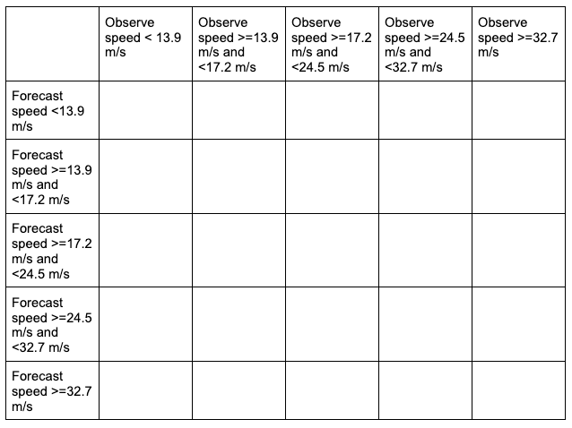

The table includes a “hidden” bin containing wind speeds less than 13.9 m/s that is not explicitly listed by a threshold in the MET settings, but rather implied: each of these bins is mutually exclusive and together they entail the complete real number line. This is why it is important to remember the “monotonically increasing and same inequality type” requirement when setting multicategorical forecast thresholds in METplus. For more discussion on this, review the :ref:`METplus Solutions for Multicategorical Forecast Verification section <metplus_sol_multicat_fore_verif>`.

The **obs** dictionary is simply copying the settings from the **fcst** dictionary, which is a method that can be used if both the forecast and observation input files share the same variable structure and file type (e.g. both inputs use the WIND variable name, in m/s, with the Z10 level corresponding to the 10 meter level).

Now all that’s necessary is to adjust the **output_flag** dictionary settings to have Point-Stat print out the desired line types:

.. code-block::

   output_flag = {
      fho = NONE;
      ctc = NONE;
      cts = NONE;
      mctc   = STAT;
      mcts   = STAT;
      cnt = NONE;
   …

In this example, we have told MET to output the MCTC and MCTS line types, which will produce one .stat file with the two line types that were selected. The MCTC line would look something like:

.. admonition:: Sample Output

   V11.1.1 MODEL   NA   120000 20230807_120000 20230807_120000 000000   20230807_120000 20230807_120000 WIND  m/s  Z10   WIND m/s    Z10   NA FULL NEAREST     1        &gt;=13.9,&gt;=17.2,&gt;=24.5,&gt;=32.7    &gt;=13.9,&gt;=17.2,&gt;=24.5,&gt;=32.7   NA         NA MCTC    162015 5        161912        11 0 0 0 71 22 0 0 0 0 0 0 0 0 0 0 0 0 0 0 0 0 0 0     0.2

While the stat file full header column contents are discussed in the `User’s Guide <https://metplus.readthedocs.io/projects/met/en/latest/Users_Guide/point-stat.html#id7>`_, 
??? Julie, is this the correct link???
the MCTC line types are the final columns of the line beginning after the “MCTC” column. The first value is MET’s TOTAL column which is the “total number of matched pairs”. You might better recognize this value as *n*, the summation of every cell in the contingency table. The following value is the number of dimensions or bins of the contingency table. As discussed above, providing four categorical thresholds creates a 5x5 contingency table. That means that we expect, and receive, 25 cells of data that make up the contingency table. They are listed starting with the lowest forecast and observation threshold pair, with increasing observation thresholds starting first. For the contingency table provided in this example, it would look like the following:

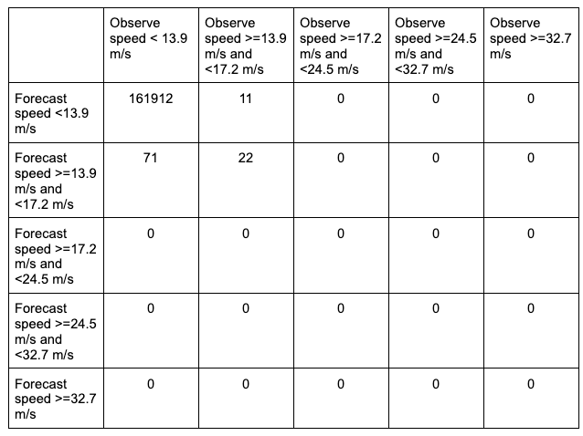

Note that the final column of the MCTC line type, EC_VALUE, is only relevant to users verifying probabilistic data with the :ref:`HSS_EC skill score <binary-cat-skill-score>`.

The MCTS line type is also present in the .stat file as the second row. In this example, the contents would be:

.. admonition:: Sample Output

   V11.1.1 MODEL   NA   120000 20230807_120000 20230807_120000 000000   20230807_120000 20230807_120000 WIND  m/s Z10   WIND m/s    Z10   NA FULL NEAREST     1        &gt;=13.9,&gt;=17.2,&gt;=24.5,&gt;=32.7    &gt;=13.9,&gt;=17.2,&gt;=24.5,&gt;=32.7   NA         0.05  MCTS 162016 5   0.99949  0.99937 0.99959 NA NA  0.66623 NA NA 0.34901 NA NA NA NA NA 0.99937 NA NA 0.2

Compared to the statistics available in the CTC line type for dichotomous categorical forecasts, fewer verification statistics can be applied to a multicategorical contingency table, since most of the  contingency table verification statistics require a simplified 2x2 contingency table. The columns that are available in the MCTS line type are listed in the `MET User’s Guide guidance for the MCTS line type <https://metplus.readthedocs.io/projects/met/en/latest/Users_Guide/point-stat.html#id13>`_. After the declaration of the line type (MCTS), the familiar TOTAL or *n* column, and the number of bins created from the thresholds provided, we find Accuracy, HK, HSS, the Gerrity Skill Score, and HSS_EC, all with their appropriate lower and upper confidence intervals and the bootstrap confidence intervals. Accuracy has an additional two columns that give the normal confidence limits in addition to the bootstrap confidence limits. Note that because the bootstrap library’s **n_rep** variable was kept at its default value of 0, bootstrap methods were not used and appear as NA in the stat file. While all of these statistics *could* be obtained from the MCTC line type values with additional post-processing, the simplicity of having all of them already calculated and ready for additional group statistics or to advise forecast adjustments is one of the many advantages of using the METplus system.

**METplus Wrapper Example of Multicategorical Forecast Verification**

To achieve the same success as the previous example but utilizing METplus wrappers instead of MET, very few adjustments would need to be made. Starting with the standard PointStat configuration file, we would need to set the **_VAR1** settings appropriately:

.. code-block::

   BOTH_VAR1_NAME = WIND
   BOTH_VAR1_LEVELS = Z10
   BOTH_VAR1_THRESH = ge13.9, ge17.2, ge24.5, ge32.7

Note how the BOTH option is utilized here (as opposed to individual FCST\_ and OBS\_ settings) since the forecast and observation datasets utilize the same name and level information. Because the loop/timing information is controlled inside the configuration file for METplus wrappers (as opposed to MET’s non-looping option), that information must also be set accordingly:

.. code-block::

   LOOP_BY = INIT
   INIT_TIME_FMT = %Y%m%d%H
   INIT_BEG=2023080700
   INIT_END=2023080700
   INIT_INCREMENT = 12H
   LEAD_SEQ = 12

Finally, the desired line types need to be selected for output. In the wrappers, that looks like this:

.. code-block::

   GRID_STAT_OUTPUT_FLAG_MCTC = STAT
   GRID_STAT_OUTPUT_FLAG_MCTS = STAT

With a proper setting of the input and output directories, file templates, and a successful run of METplus, the same .stat output file that was created in the MET example would be produced here, complete with MCTC and MCTS line type rows.

Continuous Forecasts
--------------------

When considering a forecast, one of the essential aspects is the actual value predicted by the forecast. For example, a forecast for 2 meter maximum air temperature of 75 degrees Fahrenheit is explicitly calling for one value to occur as the highest recorded temperature value for the entire day for that single point in space. If the maximum observed 2 meter air temperature was 77 degrees Fahrenheit for that point instead, then the forecast was incorrect: some might consider this the end of the story, another “blown” forecast. However, if the entire spectrum of 2-meter air temperature forecasts that *could have* been forecasted is considered, however, we can ask the question “how good or bad was that forecast, really”? After all, wasn’t the forecast only 2 degrees Fahrenheit off from what was observed? Continuous forecast verification is a category of verification that considers the entire real value spectrum that a forecast variable can take on, rather than individual discrete points or categories as is the case with dichotomous and multicategorical verification.

Verification Statistics for Continuous Forecasts
^^^^^^^^^^^^^^^^^^^^^^^^^^^^^^^^^^^^^^^^^^^^^^^^

The nature of continuous forecast verification is a direct comparison of the forecast and observed values and measurement of the relationship of those two values over the real number range. We can easily infer that the scalar statistics and skill scores used for these kinds of forecasts will be different from those used for binary and multi-categorical forecasts. In fact many of the statistics that are used as “introductory statistics” are derived for continuous verification along the real number range, as continuous verification is a natural way we look at forecasts (i.e., how close or far the forecast and observed values are from each other).

**MEAN ERRORS**

The simplest continuous measure is the mean error (ME), which is the average difference between two groups of data. So when you see “error” it is simply a measure of a difference. ME is calculated as

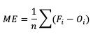

ME can range over the real numbers and has the obvious advantage of providing immediate insight into how far away, on average, the forecast values are from their corresponding observations. It is extremely easy to calculate, with a perfect forecast (i.e., a forecast that exactly corresponds to the observations) characterized by an ME of 0. ME serves as an important measurement of arithmetic bias. As a measure of bias,  ME does not include a method for compensating for the magnitude of the differences between the forecast-observation pairs, and a forecast that has compensating errors could receive a mean error of 0. Essentially, ME provides an indication of whether a forecast has errors that - on average - are centered on zero; or if it is overforecasting or underforecasting on average. Consider the following scenario for wind speed forecasts at the same location for four different times: 

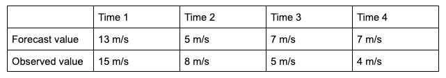

You’ll find the ME computed with these data equals 0, even though the difference between forecast and observation values for all of the times are non-zero. That’s because those errors that are positive (the forecast was greater than the observed value) are exactly negated by those errors that are negative (the forecast was less than the observed value). As noted earlier, ME is a good measure of bias; however, it is not a measure of accuracy.

This ability to effectively “hide” errors calls for a more robust error calculation to understand the forecasts’ accuracy. To that end, a few additional choices for measuring error are available. 

Mean absolute error (MAE), while similar to ME, examines the absolute values of the errors, which are summed and averaged, providing a measure of accuracy as opposed to bias. Examining the absolute values of the errors restricts MAE’s range from zero to positive infinity, with a perfect score of zero:

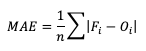

MAE also differs from ME in that it measures forecast accuracy, while ME measures bias. MAE provides a summary of the average magnitudes of the errors, but does not provide information about the direction (positive or negative) of the error magnitude.

Mean Squared Error (MSE) is another statistic focused on the characteristics of the forecast errors that measures forecast accuracy. In particular, MSE summarizes the squared differences between the forecast and observed values:

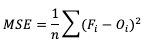

This measure has the same limits and perfect score as MAE, but squaring the differences does more than remove the sign of the differences: by squaring the error values, differences greater than one are penalized more severely than those that are less than one, with the penalty increasing at a squared rate. Using MSE, a forecast that over-forecasts temperature by two degrees from the observed value consistently over six time steps will have a smaller MSE than a forecast that over-forecasts temperature from the observed value by three degrees for three time steps and matched the observed value for the remaining three time steps.

The final error statistic to discuss is Root Mean Squared Error (RMSE). One of the most familiar statistical measures, RMSE is simply the square root of MSE, and has the same units as the forecasts and observations, providing an average error with a square-weight:

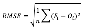

Similar to MSE, RMSE penalizes larger error magnitudes than smaller ones, and like MSE, RMSE provides no information on the sign (positive or negative) of the errors. It has the same range of values as MSE and a perfect forecast score would be an RMSE of zero. `See how to use these statistics in METplus! `_

**STANDARD DEVIATIONS**

Unlike the family of mean error statistics, standard deviation focuses more on the individual groups of value sources; namely, the forecasts and observations. Standard deviations are a measure of how the variability of the values in a dataset differs from the average of their respective group. So keep in mind the general equation provided below can be applied to both observations and forecasts (and in some cases it may be meaningful to compare the standard deviation of the forecasts to the standard deviation of the observations):

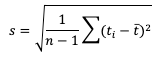

`See how to use this statistic in METplus! `_

**MULTIPLICATIVE BIAS**

Like some of the other verification statistics for continuous forecasts, multiplicative bias (MBIAS) measures the ratio of the average forecast to the average observation. MBIAS is the ratio between these two averages, calculated using the following formula and has a range of all real numbers:

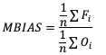

MBIAS has some of the same drawbacks as ME. In particular, MBIAS does not indicate the magnitudes of the forecast errors, which allows a perfect score of 1 to be achieved if the forecast errors compensate for each other (see the example for ME above for more information). It is recommended that any variable fields that utilize MBIAS contain all the same value signs (e.g. positive or negative) as mixing value signs together (for example, temperatures) would result in strange or unusable MBIAS results that included even more value compensation. `See how to use this statistic in METplus! `_

**CORRELATION COEFFICIENTS (PEARSON, SPEARMAN RANK, AND KENDALL'S TAU)**

Because continuous forecasts and observations exist on the same real value spectrum, measurements of the linear association of the forecast-observation pairs create a vital foundation for verification statistics. Three measures of correlation (Pearson, Spearman Rank, and Kendall's Tau) measure this relationship in different ways.

Beginning with Pearson correlation coefficient, PR_CORR, the linear association of the forecast-observation pairs is measured using a sample covariance (e.g. the summed squared anomalies of two groups) and dividing by the product of the same two group’s standard deviations. In forecast verification, these two groups are the forecast and observation datasets and appear as

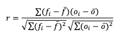

with r as the typical notation for the PR_CORR outside of METplus. From a visual perspective, PR_CORR measures the closeness of pairs of points, (i.e., representing the forecast and corresponding observation values) corresponding to a diagonal line. More generally these scatter plots can suggest the apparent relationship of any two variable fields, but for the purpose of this tutorial we will stay focused on the forecast-observation comparison. PR_CORR can range from negative one to positive one with either extreme of the range representing a perfect positive or negative linear association between the forecasts and observations. The PR_CORR remains sensitive to outliers and can produce a good correlation value for a poor forecast if that forecast has compensative errors.

Another way to estimate the linear association between forecasts and their corresponding observations involves ranking the forecast values when compared to the forecast group’s total range, do the same for the observation group, and then compute the correlation values. Spearman Rank correlation coefficient (SP_CORR) takes this approach while utilizing the same equation as PR_CORR. Because the rank values of both the forecast and observation datasets used to calculate SP_CORR are restricted to the integer values of 1 to n (the total number of matched forecast-observation pairs), the equation of SP_CORR can be simplified to

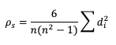

where di denotes the difference in ranking between the pair of datafields. 

What does ranking  of matched pairs look like with actual data? Let’s use the following scenario of rainfall forecasts and the observed rainfall over a five hour period for a set location:

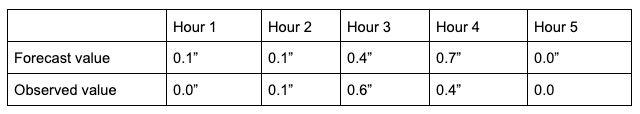

 Using a ranking system for the datasets where 0.0” is assigned 1 and everything greater than that value is assigned a value that is integer-based, monotonically increasing by 1, the data table above would be transformed into the following ranks:

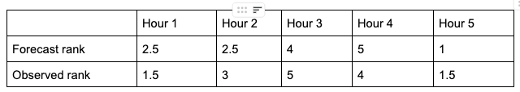

It is important that the forecast-observation pairs stay paired together, even when transformed into their rank values. Note the case when there is a tie in the ranks (i.e. a value appears more than once), all of the values receive the same average rank, keeping the total average rank for the number of values (in this scenario, five) consistent with the SP_CORR equation assumption. The next step is calculating the differences between the forecast ranks and the observed ranks, squaring the differences and summing them. After that, apply the rest of the equation and you should find ρ_s =0.825, a strong correlation value.

The Kendall’s Tau statistic (𝝉) is a variation on the SP_CORR equation ranking method. While all of the variable field values are ranked as was the case with SP_CORR, it’s the relationship between a pair of ranks and the pairs of ranks that follow, rather than the ranks within a given pair, that constitute 𝝉. To better understand, let’s first look at the equation for 𝝉:

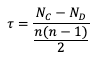

In the equation, N_C is a count of the concordant pairs, and N_D is a count of the discordant pairs. Simply put, a concordant pair is when a reference pair has rank values that are both larger or both smaller than a comparison pair. For example, consider the two pairs (3, 5) and (6, 8). Regardless of which pair is treated as the reference pair, the comparison pair will have both of the larger rank values (the case where (3, 5) is the reference pair) or both of the smaller rank values (the case where (6, 8) is the reference pair). A concordant pair is the complement to this: each pair in the comparison has one value that is bigger and one that is smaller. In the case of (3, 5) and (6, 2) the comparisons are considered discordant. In the case where the compared pairs are identical, there are multiple methods to choose: N_C and N_D can be incremented by ½ each, the tie can be ignored, or the tie can be penalized. For simplicity in counting, it is recommended to arrange one of the datasets in ascending or descending order (being careful to keep the matched pairs together) so that fewer comparisons need to be made.

To show how 𝝉 is calculated, let’s return to the previous example used to calculate SP_CORR. Because we’re using the same rainfall values, the rankings of those values will also be the same. For the simplicity of counting concordant and discordant pairs, the forecast ranks have been arranged in increasing order (which explains why Hour 5 is now proceeding Hour 1):

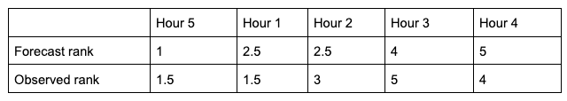

From this small change in the ordering, we see that two of the observed ranks do not increase (going from left to right): between Hour 5 and Hour 1 (they match at 1.5), and between Hour 3 and Hour 4 (5 compared to 4). Additionally, the forecast ranks between Hour 1 and Hour 2 do not increase (they match). In order to account for these ties, a “penalty” will be calculated using the following equation:

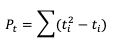

Where ti is the number of ranks that are involved in a given tie.  Because both the forecast and observed ranks have a tie of two ranks, both will receive a Pt penalty of 2. As a result of this new handling of ties, an alternate form of 𝝉 sometimes referred to as 𝝉b must be used:

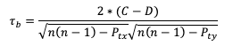

Using this slightly modified equation, we find a 𝝉b value of 0.56. As 𝝉 has the same range as SP_CORR (-1 to 1), a value of 0.56 shows some positive correlation between the two datasets. `See how to use these statistics in METplus! `_

**ANOMALY CORRELATION**

While similar to the traditional correlation coefficient, anomaly correlation is a somewhat different formulation: rather than directly comparing the pairs of forecast and observation values relative to the respective group averages, as is the case in PR_CORR, anomaly correlation is a measure of the deviations of forecast and observation values from climatological averages. Utilizing this third independent dataset for comparisons highlights any pattern of departures from the climatology, a correspondence of the forecast anomalies to the observed anomalies.

There are two widely used versions of anomaly correlation. The first is the centered anomaly correlation, which includes the mean error relative to the climatology. This version is calculated using

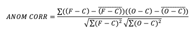

If it is not desirable to include the errors, the uncentered anomaly correlation is the better choice:

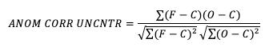

While there is an added effort required to find the matching climatology reference dataset for this statistic, it remains a highly resourceful statistic to use, especially with spatial verification, and is commonly used in operational forecasting centers. Anomaly correlation has a range from -1 to 1. `See how to use this statistic in METplus! `_

METplus Solutions for Continuous Forecast Verification
^^^^^^^^^^^^^^^^^^^^^^^^^^^^^^^^^^^^^^^^^^^^^^^^^^^^^^

Now that you know a bit more about continuous, deterministic forecasts and the related statistics, it’s time to show how you can access those same statistics in METplus!

Unsurprisingly METplus requires a slightly different approach to continuous variables and the thresholds that are used on these datasets. Rather than the cat_thresh arrays that are used for categorical variable fields, METplus uses cnt_thresh for filtering data prior to computing continuous statistics. Keep that in mind if you end up with a blank continuous line type file output; you may have not applied the correct thresholds!

In order to better understand the delineation between METplus, MET, and METplus wrappers which are used frequently throughout this tutorial but are NOT interchangeable, the following definitions are provided for clarity:

* METplus is best visualized as an overarching framework with individual components. It encapsulates all of the repositories: MET, METplus wrappers, METdataio, METcalcpy, and METplotpy.
* MET serves as the core statistical component that ingests the provided fields and commands to compute user-requested statistics and diagnostics.
* METplus wrappers is a suite of Python wrappers that provide low-level automation of MET tools and plotting capability. While there are examples of calling METplus wrappers without any underlying MET usage, these are the exception rather than the rule

**MET SOLUTIONS**

The MET User’s Guide provides an `Appendix that dives into each and every statistical measure that it calculates `_, as well as the line type it is a part of. Statistics are grouped together by application and type and are available to METplus users in line types. For example, many of the statistics that were discussed above can be found in the `Continuous Statistics (CNT) line type `_, which logically groups together statistics based on continuous variable fields.

For MET, which line types are output depends on your selection of the appropriate line type using the output_flag dictionary. Note that certain line types may or may not be available in every tool: for example, both Point-Stat and Grid-Stat produce CNT line types, which allows users access to the various continuous statistics for both point-based observations and gridded observations. But Ensemble-Stat is the only tool that can generate a Ranked Probability Score (RPS) line type which contains statistics relevant to the analysis of ensemble forecasts. If you don’t see your desired statistic in the line type or tool you’d expect it to be in, be sure to check `the Appendix `_ to see if the statistic is available in MET and which line type it’s currently grouped with.

As for the previous statistics that were discussed, here’s a link to the User’s Guide Appendix entry that discusses its use in MET:

* ME
* MAE
* MSE
* RMSE
* S (note that the linked s is for forecast; the observation s2 is just below it)
* MBIAS
* PR_CORR
* SP_CORR
* 𝝉 or KT_CORR
* ANOM_CORR

**METPLUS WRAPPER SOLUTIONS**

The same statistics that are available in MET are also available with the METplus wrappers. To better understand how MET configuration options for statistics translate to METplus wrapper configuration options, you can utilize the S`tatistics and Diagnostics Section of the METplus wrappers User’s Guide `_, which lists all of the available statistics through the wrappers, including what tools can output what statistics. To access the line type through the tool, find your desired tool in the `list of available commands for that tool `_. Once you do, you’ll see the tool will have several options that contain _OUTPUT_FLAG_. These will exhibit the same behavior and accept the same settings as the line types in MET’s output_flag dictionary, so be sure to review the available settings to get the line type output you want.

METplus Examples for Continuous Forecast Verification
^^^^^^^^^^^^^^^^^^^^^^^^^^^^^^^^^^^^^^^^^^^^^^^^^^^^^

The following two examples show a generalized method for calculating continuous statistics: one for a MET-only usage, and the same example but utilizing METplus wrappers. These examples are not meant to be completely reproducible by a user: no input data is provided, commands to run the various tools are not given, etc. Instead, they serve as a general guide of one possible setup among many that produce continuous statistics.

If you are interested in reproducible, step-by-step examples of running the various tools of METplus, you are strongly encouraged to review the `METplus online tutorial `_ that follows this statistical tutorial, where data is made available to reproduce the guided examples.

In order to better understand the delineation between METplus, MET, and METplus wrappers which are used frequently throughout this tutorial but are NOT interchangeable, the following definitions are provided for clarity:

* METplus is best visualized as an overarching framework with individual components. It encapsulates all of the repositories: MET, METplus wrappers, METdataio, METcalcpy, and METplotpy.
* MET serves as the core statistical component that ingests the provided fields and commands to compute user-requested statistics and diagnostics.
* METplus wrappers is a suite of Python wrappers that provide low-level automation of MET tools and plotting capability. While there are examples of calling METplus wrappers without any underlying MET usage, these are the exception rather than the rule.

**MET EXAMPLE OF CONTINUOUS FORECAST VERIFICATION**

Here is an example that demonstrates deterministic forecast verification in MET.

For this example, let’s examine two tools, PCP-Combine and Grid-Stat. Assume we wanted to verify a 6 hour period of precipitation forecasts over the continental United States. Using these tools, we will first combine the forecast files, which are hourly forecasts, into a 6 hour summation file with PCP-Combine. Then we will use Grid-Stat to place both datasets on the same verification grid and let MET calculate the continuous statistics available in the CNT line type. Starting with PCP-Combine, we need to understand what the desired output is first to know how to properly run the tool from the command line, as PCP-Combine does not use a configuration file. As stated previously, this scenario assumes the precipitation forecasts are hourly files and need to match the 6 hour observation file time summation. `Of the four commands available in PCP-Combine `_, two seem to provide potential paths forward: sum and add.

While there are multiple methods that may work to successfully summarize the forecast files from these two commands, let’s assume that our forecast data files contain a time reference variable that is not CF-compliant {link to CF compliant time table in MET UG here}. As such, MET will be unable to determine the initialization and valid time of the files (without being explicitly set in the field array). Because the “add” command only relies on a list of files passed by the user to determine what is being summed, that is the command we will use.

With the information above, we construct the command line argument for PCP-Combine to be:

.. code-block::

   pcp_combine -add \
   hrefmean_2017050912f018.nc \
   hrefmean_2017050912f017.nc \
   hrefmean_2017050912f016.nc \
   hrefmean_2017050912f015.nc \
   hrefmean_2017050912f014.nc \
   hrefmean_2017050912f013.nc \
   -field 'name="P01M_NONE"; level="(0,*,*)";' -name "APCP_06" \
   hrefmean_2017051006_A06.nc

The command above displays the required arguments for PCP-Combine’s “add” command as well as an optional argument. When using the “add” command it is required to pass a list of the input files to be processed. In this instance we used a list of files, but had the option to pass an ASCII file that contained all of the files instead. Because each of the input forecast files contain the exact same variable fields, we utilize the “-field” argument to list exactly one variable field to be processed in all files. Alternatively we could have listed the same field information (i.e. 'name="P01M_NONE"; level="(0,*,*)";') after each input file. Finally, the output file name is set to “hrefmean_2017051006_A06.nc”, which contains references to the valid time of the file contents as well as how many hours the precipitation is accumulated over. The optional argument “-name” sets the output variable field name to “APCP_06”, following GRIB standard practices.

After a successful run of PCP-Combine we now have a six hour accumulation field forecast of precipitation and are ready to set our Grid-Stat configuration file. Starting with the general Grid-Stat configuration file {provide link here}, the following would resemble minimum necessary settings/changes for the fcst and obs dictionaries:

.. code-block::

   fcst = {
    
      field = [
      {
        name    = "APCP_06";
        level   = [ "(*,*)" ];
      }
      ];
    
   }
   obs = {
    
     field = [
           {
           name  = “P06M_NONE”;
           level = [“(@20170510_060000,*,*)”];
          }
      ];
   }

Both input files are netCDF format and so require the asterisk and parentheses method of level access. The observation input file level required a third dimension as more than one observation time is available. We used the “@” symbol to take advantage of MET’s ability to parse time dimensions by the user-desired time, which in this case was the verification time. Note how the variable field name that was set in PCP-Combine’s output file is used in the forecast field information. Because the two variable fields are not on the same grid, an independent grid is chosen as the verification grid. This is set using the in-tool method for regridding:

.. code-block::

   regrid = {
      to_grid = "CONUS_HRRRTLE.nc";
   …

Now that the verification is being performed on our desired grid and the variable fields are set to be read in, all that’s left in the configuration file is to set the output. This time, we’re interested in the CNT line type and set the output flag library accordingly:

.. code-block::

   output_flag = {
      fho = NONE;
      ctc = NONE;
      cts = NONE;
      mctc   = NONE;
      mcts   = NONE;
      cnt = STAT;
      sl1l2  = NONE;
      …

And as a sanity check we can see the input fields the way MET is ingesting them by selecting the desired nc_pairs_flag library settings:

.. code-block::

   nc_pairs_flag = {
      latlon    = TRUE;
      raw       = TRUE;
      diff      = TRUE;
      climo     = FALSE;
      climo_cdp = FALSE;
      seeps     = FALSE;
      weight    = FALSE;
      nbrhd     = FALSE;
      fourier   = FALSE;
      gradient  = FALSE;
      distance_map = FALSE;
      apply_mask   = FALSE;
   }

All that’s left is to run MET with a command line prompt:

.. code-block::

   grid_stat hrefmean_2017051006_A06.nc 2017050912_st4.nc GridStatConfig_precipAcc

The resulting two files have a wealth of information and statistics. The netCDF output contains our visual confirmation that the forecast and observation input fields were interpreted correctly by MET, as well as the difference between the two fields which is provided below:

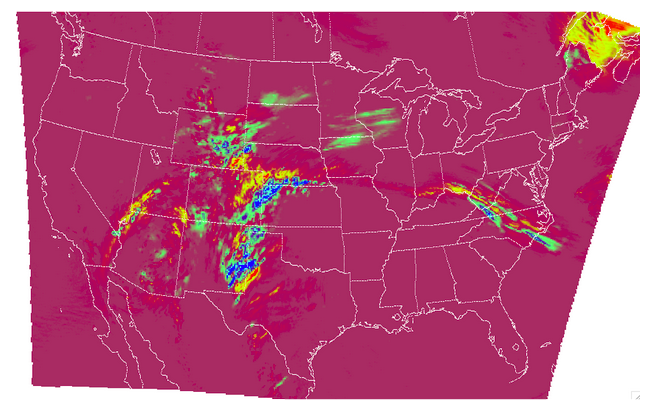

 For the CNT line type output we review the .stat file and find something similar to the following:

.. admonition:: Sample Output

   VERSION MODEL DESC FCST_LEAD FCST_VALID_BEG  FCST_VALID_END  OBS_LEAD OBS_VALID_BEG   OBS_VALID_END   FCST_VAR FCST_UNITS FCST_LEV OBS_VAR   OBS_UNITS OBS_LEV           OBTYPE VX_MASK INTERP_MTHD INTERP_PNTS FCST_THRESH OBS_THRESH COV_THRESH ALPHA LINE_TYPE

.. admonition:: Sample Output

   V11.1.1 HREF  NA   000000 20170510_060000 20170510_060000 000000   20170510_060000 20170510_060000 APCP_06  kg.m-2  0,*,* P06M_NONE kg.m-2 @20170510_060000,*,* STAGE4 FULL NEAREST  1        NA       NA      NA      0.05  CNT    1624714 0.48482 0.48218 0.48745 NA NA 1.71512 1.71326 1.71699 NA NA 0.36816 0.36495 0.37138 NA NA 2.09026 2.08799 2.09254 NA NA 0.44686 0.44563 0.44809 NA NA NA NA 0 0 0 0.11665 0.11354 0.11977 NA NA 2.02652 2.02432 2.02873 NA NA 1.31686 NA NA 0.57844 NA NA 4.1204 NA NA 4.10679 NA NA 2.02988 NA NA -0.065204 NA NA -0.065204 NA NA -0.065204 NA NA -0.057391 NA NA 0.73485 NA NA 0.0078125 NA NA 0.0078125 NA NA NA NA NA NA NA 0.013608 NA NA 0.056945 NA NA NA NA NA NA NA NA NA NA NA 5.51354 NA NA

The columns that are available in the CNT line type are listed in the MET User’s Guide guidance for CNT line type {provide link here}. After the declaration of the line type (CNT), the familiar TOTAL or matched pairs column, we find a wealth of statistics including the forecast and observation means, the forecast and observation standard deviations, ME, MSE, along with all of the other statistics discussed in this section, all with their appropriate lower and upper confidence intervals and the bootstrap confidence intervals. Note that because the bootstrap library’s n_rep variable was kept at its default value of 0, bootstrap methods were not used and appear as NA in the stat file. You’ll also note that the ranking statistics (SP_CORR and KT_CORR) are listed as NA because we did not set rank_corr_flag to TRUE in the Grid-Stat configuration file. This was done intentionally; in order to calculate ranking statistics MET needs to assign each and every matched pair a rank and then perform the calculations. With a large dataset with numerous matched pairs this can significantly increase runtime and be computationally intensive. Given our example had over 1.5 million matched pairs, these statistics are best left to a smaller domain. Let’s create that smaller domain in a METplus wrappers example!

**METPLUS WRAPPER EXAMPLE OF CONTINUOUS FORECAST VERIFICATION**

To achieve the same success as the previous example but utilizing METplus wrappers instead of MET, very few adjustments would need to be made. Because METplus wrappers have the helpful feature of chaining multiple tools together, we’ll start off by listing all of the tools we want to use. Recall that for this example, we want to include a smaller verification area to enable the rank correlation statistics as well. This results in the following process list:

.. code-block::

   PROCESS_LIST = PCPCombine, GridStat, GridStat(rank)

The second listing of GridStat uses `the instance feature `_ to allow a second run of Grid-Stat with different settings. Now we need to set the _VAR1 settings appropriately:

.. code-block::

   FCST_VAR1_NAME = {FCST_PCP_COMBINE_OUTPUT_NAME}
   FCST_VAR1_LEVELS = "(*,*)"
   OBS_VAR1_NAME = P06M_NONE
   OBS_VAR1_LEVELS = "({valid?fmt=%Y%m%d_%H%M%S},*,*)"

We’ve utilized a different setting, FCST_PCP_COMBINE_OUTPUT_NAME, to control what forecast variable name is verified. This way if a different forecast variable were to be used in a later run (assuming it had the same level dimensions as the precipitation), the forecast variable name would only need to be changed in one place instead of multiple. We also utilize METplus wrappers' ability to set an index based on a time, behaving similarly to the “@” usage in the MET example. Now we need to create all of the settings for PCPCombine:

.. code-block::

   FCST_PCP_COMBINE_METHOD = ADD
    &lt;\br&gt; FCST_PCP_COMBINE_INPUT_DATATYPE = NETCDF
    
   FCST_PCP_COMBINE_CONSTANT_INIT = true
    
   FCST_PCP_COMBINE_INPUT_ACCUMS = 1
   FCST_PCP_COMBINE_INPUT_NAMES = P01M_NONE
   FCST_PCP_COMBINE_INPUT_LEVELS = "(0,*,*)"
    
   FCST_PCP_COMBINE_OUTPUT_ACCUM = 6
   FCST_PCP_COMBINE_OUTPUT_NAME = APCP_06

From these settings, we see that all of the arguments from the command line for PCP-Combine are present: we will use the “add” method to loop over six netCDF files, each containing a variable field name of P01M_NONE and accumulation times of one hour. The output variable should be named APCP_06 and will be stored in the location as directed by FCST_PCP_COMBINE_OUTPUT_DIR and FCST_PCP_COMBINE_OUTPUT_TEMPLATE (not shown above).

Because the loop/timing information is controlled inside the configuration file for METplus wrappers (as opposed to MET’s non-looping option), that information must also be set accordingly, paying close attention that both instances of GridStat and PCPCombine will behave as expected:

.. code-block::

   LOOP_BY = INIT
   INIT_TIME_FMT = %Y%m%d%H
   INIT_BEG=2017050912
   INIT_END=2017050912
   INIT_INCREMENT=12H
    
   LEAD_SEQ = 18

Recall that we need to perform the verification on an alternate grid for one of the instances, and a small subset of the larger area in the other. So in the first instance configuration file area (anywhere outside of the [rank] instance configuration file area) we add 

.. code-block::

   GRID_STAT_REGRID_TO_GRID = CONUS_HRRRTLE.nc
   GRID_STAT_REGRID_METHOD = NEAREST

And set the [rank] instance up as follows:

.. code-block::

   [rank]
   GRID_STAT_REGRID_TO_GRID = 'latlon 40 40 33.0 -106.0 0.1 0.1'
   GRID_STAT_MET_CONFIG_OVERRIDES = rank_corr_flag = TRUE;
   GRID_STAT_OUTPUT_TEMPLATE = {init?fmt=%Y%m%d%H%M}_rank

For this instance of GridStat, we’ve set our own verification area using the grid definition option {link grid project here}, and utilized the OVERRIDES option {link to the OVERRIDES discussion here} to set the rank_corr_flag option, which is currently not a METplus wrapper option, to TRUE. Because both GridStat instances will create CNT output, the [rank] instance CNT output would normally overwrite the first GridStat instance. To avoid this, we create a new output template for the [rank] instance of GridStat to follow, preserving both files.

Finally, the desired line types and nc_pairs_flag settings need to be selected for output. This can be done outside of the [rank] instance, as any setting that is not overwritten by an instance further down the configuration file will be propagated to all applicable tools in the configuration file:

.. code-block::

   GRID_STAT_OUTPUT_FLAG_CNT = STAT
    
   GRID_STAT_NC_PAIRS_FLAG_LATLON = TRUE
   GRID_STAT_NC_PAIRS_FLAG_RAW = TRUE
   GRID_STAT_NC_PAIRS_FLAG_DIFF = TRUE

With a proper setting of the input and output directories, file templates, and a successful run of METplus, the same .stat output and netCDF file that were created in the MET example would be produced here, complete with CNT line type. However this example would result in two additional files: one .stat file that contains values for the rank correlation statistics and a netCDF file with the smaller area that was used to calculate them. The contents of that second .stat file would look something like the following:

.. admonition:: Sample Output

   VERSION MODEL  DESC FCST_LEAD FCST_VALID_BEG  FCST_VALID_END  OBS_LEAD OBS_VALID_BEG   OBS_VALID_END   FCST_VAR FCST_UNITS FCST_LEV OBS_VAR   OBS_UNITS OBS_LEV          OBTYPE VX_MASK INTERP_MTHD INTERP_PNTS FCST_THRESH OBS_THRESH COV_THRESH ALPHA LINE_TYPE

.. admonition:: Sample Output

   V11.1.1 HREF_MEAN NA   000000 20170510_060000 20170510_060000 000000   20170510_060000 20170510_060000 APCP_06  kg.m-2  0,*,* P06M_NONE kg.m-2 20170510_060000,*,* STAGE4 FULL NEAREST  1        NA       NA      NA      0.05  CNT    1600 4.21464 4.0413 4.38798 NA NA 3.53756 3.41909 3.66458 NA NA 7.73156 7.2679 8.19523 NA NA 9.46267 9.14579 9.80246 NA NA 0.21747 0.17028 0.26366 NA NA 0.41127 0.28929 1600 1043 537 -3.51693 -3.97526 -3.05859 NA NA 9.35399 9.04076 9.68988 NA NA 0.54512 NA NA 5.86758 NA NA 99.81122 NA NA 87.44245 NA NA 9.99056 NA NA -14.67874 NA NA -6.29429 NA NA -0.65883 NA NA 0.89349 NA NA 4.32403 NA NA 7.18778 NA NA 2.80197 NA NA NA NA NA NA NA 12.36877 NA NA -0.11468 NA NA NA NA NA NA NA NA NA NA NA 1.29218 NA NA

We can see the smaller verification area resulted in only 1,600 matched pairs, which is much more reasonable for rank computations. SP_CORR was 0.41127 showing a positive correlation, while KT_CORR was 0.28929, a slightly weaker positive correlation. METplus goes the additional step and also shows that of the 1,600 ranks that were used to calculate KT_CORR, it found 1,043 forecast ranks that were tied and 537 observation ranks that were tied. Not something that would be easily computed without the help of METplus!

Probabilistic Forecasts
-----------------------

When reviewing the other forecast types in this tutorial, you’ll notice that all of them are deterministic (i.e., non-probabilistc) values. They have a quantitative value that can be verified with observations. Probabilistic forecasts on the other hand, do not provide a specific value relating directly to the variable (precipitation, wind speed, etc.). Instead, probabilistic forecasts provide, you guessed it, a probability of a certain event occurring. The most common probabilistic forecasts are for precipitation. Given the spatial and temporal irregularities any precipitation type could display during accumulation, probabilities are a better option for numerical models to provide for the general public. It allows the general public to decide for themselves if a 60% forecasted chance of rain is enough to warrant bringing an umbrella to the outdoor event, or if a 40% forecasted chance of snow is too much to consider going for a long hike. Consider the alternative where deterministic forecasts were used for precipitation: would it be more beneficial to hear a forecast of no precipitation for any probability less than 20% and precipitation forecasted for anything greater than 20% (i.e. a categorical forecast)?  Or maybe a scenario where the largest amount of precipitation is presented as the precipitation a given area will experience with no other information (i.e. a continuous forecast)? While they have other issues which will be explored in this section, probabilistic forecasts play an important part in weather verification statistics. Moreover, they require special measures for verification.

Verification Statistics for Probabilistic Forecasts
^^^^^^^^^^^^^^^^^^^^^^^^^^^^^^^^^^^^^^^^^^^^^^^^^^^

The forecast types we’ve examined so far focused on dichotomous predictions of binary events (e.g.,. the tornado did or did not happen and the forecast did or did not predict the event); application of one or more thresholds; or specification of the value itself for the forecasted event (e.g.,. the observed temperature compared to a forecast of 85 degrees Fahrenheit). These forecast types determined how the verification statistics were calculated. But how are probabilistic datasets handled? When there is an uncertainty value attached to a meteorological event, what statistical measures can be used?

A common method to avoid dealing directly with probabilities is to convert forecasts from probabilistic space into deterministic space using a threshold. Consider an example rainfall forecast where the original forecast field is issued in tens values of probability (0%, 10%, 20% ... 80%, 90%, 100%). This could be converted to a deterministic forecast by establishing a threshold such as “the probability of rainfall will exceed 60%”. This threshold sets up a binary forecast (probabilities at or below 60% are “no” and probabilities above 60% are “yes”) and two separate observation categories (rain was observed or rain did not occur) that all of the occurrences and non-occurrences can be placed in. While the ability to access `categorical statistics and scores `_ is an obvious benefit to this approach, there are clear drawbacks to this method. The loss of probability information tied to the particular forecast value removes an immensely useful aspect of the forecast. As discussed previously, the general public may desire probability space information to make their own decisions: after all, what if someone’s tolerance for rainfall is lower than the 60% threshold used to calculate the statistics (e.g., the probability of rainfall will exceed 30%)?

**BRIER SCORE**

One popular score for probability forecasts is the Brier Score (BS). Effectively a Mean Squared Error calculation, it is a scalar value of forecast accuracy that conveys the magnitude of the probability errors in the forecast.

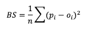

Here, pi is the forecast probability while oi is the binary representation of the observance of the event (1 if the event occurred, 0 if the event did not occur). This summation score is negatively oriented, with a 0 indicating perfect accuracy and 1 showing complete inaccuracy. The score is sensitive to the frequency of an event and should only be used on forecast-observation datasets that boast a substantial number of event samples.

Through substitutions, BS can be decomposed into three terms that describe the reliability, resolution, and uncertainty of the forecasts (more on these attributes can be found in the `Attributes of Forecast Quality section `_). This decomposition is given as
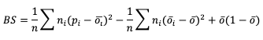

where the three terms are reliability, resolution, and uncertainty, respectively. ni is the count of probabilistic forecasts that fall into each probabilistic bin. See how to use this statistic in METplus!

**RANKED PROBABILITY SCORE**

A second statistical score to use for probabilistic forecasts is the Ranked Probability Score (RPS). This score differs from BS in that it allows the verification of multicategorical probabilistic forecasts where BS strictly pertains to binary probabilistic forecasts. While the RPS formula  is based on a squared error at its core (similar to BS), it remains sensitive to the distance between the forecast probability and the observed event space (1 if the event occurred, 0 if it did not) by calculating the squared errors in cumulative probabilistic forecast and observation space. This formulation is represented in the following equation

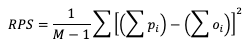

Note how RPS reduces to BS when there are only two forecast categories evaluated. In the equation, M denotes the number of categories the forecast is divided into. Because of the squared error usage, RPS is negative orientated with a 0 indicating perfect accuracy and 1 showing complete inaccuracy. See how to use this statistic in METplus!

**CONTINUOS RANKED PROBABILITY SCORE**

Similar to the RPS’s approach to provide a probabilistic evaluation of multicategorical forecasts and the BS formulation as a statistic for binary probabilistic forecasts, the Continuous Ranked Probability Score (CRPS) provides a statistical measure for forecasts in the continuous probabilistic space. Theoretically this is equivalent to evaluating multicategorical forecasts that extend across an infinite number of categories that are infinitesimally small. When it comes to application, however, it becomes difficult to express mathematically a closed form of CRPS. Due to this restriction, CRPS often utilizes an assumption of a Gaussian (i.e. normal) distribution in the dataset and is presented as

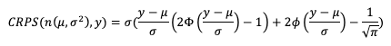

In this equation we use μ and σ to denote the mean and standard deviation of the forecasts, respectively, ɸ to represent the cumulative distribution function (CDF ) and 𝚽 to represent the probability density function (PDF) of the normal distribution. If you’ve previously evaluated meteorological forecasts, you know that the assumption that the dataset can be described by a Gaussian distribution is not always correct. Temperature and pressure variable fields, among others, can usually take advantage of this CRPS definition as they often are well fitted by a Gaussian distribution. But other important meteorological fields, such as precipitation, do not. Using statistics that are created with an incorrect assumption will produce, at best, misleading results. Be sure that your dataset follows a Gaussian distribution before relying on the above definition of CRPS!

The CRPS is negatively oriented with a 0 indicating perfect accuracy and 1 showing complete inaccuracy. See how to use this statistic in METplus!

Probabilistic Skill Scores
^^^^^^^^^^^^^^^^^^^^^^^^^^

Some of the previously mentioned verification statistics for probabilistic forecasts can be used to compute skill scores that are regularly used. All of these skill scores use the same general equation format of comparing their respective score results to a base or reference forecast, which can be climatology, a “random” forecast, or any other comparison that could provide useful information.

**BRIER SCORE**

The Brier Skill Score (BSS) measures the relative skill of the forecast compared to a reference forecast. It’s equation is simple and follows the general skill score format:

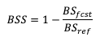

Compared to the BS equation, the range of values for BSS differs: the range is from negative infinity to 1, with 1 showing a perfect skill and 0 showing no discernable skill compared to a reference forecast. See how to use this skill score in METplus!

**RANKED PROBABILITY SKILL SCORE**

Similar to the BSS, the Ranked Probability Skill Score (RPSS) follows the general skill score equation formulation, allowing a comparison between a chosen reference forecast and the forecast of interest:

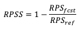

RPSS measures the improvement/degradation of the ranked probability forecasts compared to the skill of a reference forecast. As with BSS, RPSS ranges from negative infinity to 1, with a perfect score of 1, and a score of zero indicating no improvement of forecast performance relative to the reference forecast. See how to use this skill score in METplus!

METplus Solutions for Probabilistic Forecast Verification
^^^^^^^^^^^^^^^^^^^^^^^^^^^^^^^^^^^^^^^^^^^^^^^^^^^^^^^^^

If you utilize METplus verification capabilities to evaluate probabilistic forecasts, you may find that your final statistical values are not exactly the same as when you compute the same statistic by pencil and paper or in a separate statistical program. These very slight differences are due to how METplus handles probabilistic information. 

MET is coded to utilize categorical forecasts, creating contingency tables and using the counts in each of the contingency table cells (hits, misses, false alarms, and correct rejections) to calculate the desired verification statistics. This use extends to probabilistic forecasts as well and aids in the decomposition of statistics such as Brier Score (BS) into reliability, resolution, and uncertainty (more information on that `decomposition can be found here `_). 

MET requires users to provide three conditions for probabilistic forecasts. The first of these conditions is an observation variable that is either a 0 or 1 and a forecast variable that is defined on a scale from 0 to 1. In MET, this boolean is **prob** and METplus Wrappers utilizes the variable FCST_IS_PROB. In MET **prob** can also be defined as a dictionary with more information on how to process the probabilistic field; `please review this section of the User’s Guide for information. `_ 

The second condition is the thresholds to evaluate the probabilistic forecasts across. Essentially this is where METplus turns the forecast probabilities into a binned, categorical evaluation. At its most basic usage in a MET configuration file, this looks like

cat_thresh = ==0.1; 

which would create 10 bins of equal width. Users have multiple options for setting this threshold and should review `this section of the User’s Guide for more information `_. It’s important to note that when it comes to evaluating a statistic like BS, METplus does not actually use the forecasts’ probability value; instead, it will use the midpoint of the bin width between the thresholds for the probabilistic forecasts. To understand what this looks like in METplus, let's use the previous example where 10 bins of equal width were created. When calculating BS, METplus will evaluate the first probability bin as 0.05, the midway point between the first bin (0.0 to 0.1). The next probability value would be 0.15 (the midway point between 0.1 and 0.2), and so on. MET utilizes an equation of BS that is `described in more detail in the MET Appendix `_ which evaluates to the same result as the BS equation provided in the Verification Statistics for Probabilistic Forecasts section of this guide {provide link to previous section here} if the midpoints of the bins are used as the probability forecast values. All of this is to stress that a proper selection of bin width (and the accompanying mid-point of those bins) will ultimately determine how meaningful your resulting BS value is; after all, what would the result be if the midpoint of a bin was 0.1 and many of the forecasts values were 0.1? What contingency table bin will they count towards?

The final condition users need to provide to MET for probabilistic forecasts is a threshold for the observations. As alluded to in the second condition, users can create any number of thresholds to evaluate the probabilistic forecasts. Combined with the observation threshold which determines an event observation from non-event observation, an Nx2 contingency table will be created, where N is the number of probabilistic bins for the forecasts and 2 is the event, non-event threshold set on the observations.

Now that you know a bit more about probabilistic forecasts and the related statistics as well as how MET will process them, it’s time to show how you can access those same statistics in METplus!

In order to better understand the delineation between METplus, MET, and METplus wrappers which are used frequently throughout this tutorial but are NOT interchangeable, the following definitions are provided for clarity:

* METplus is best visualized as an overarching framework with individual components. It encapsulates all of the repositories: MET, METplus wrappers, METdataio, METcalcpy, and METplotpy.
* MET serves as the core statistical component that ingests the provided fields and commands to compute user-requested statistics and diagnostics.
* METplus wrappers is a suite of Python wrappers that provide low-level automation of MET tools and plotting capability. While there are examples of calling METplus wrappers without any underlying MET usage, these are the exception rather than the rule.

**MET SOLUTIONS**

The MET User’s Guide provides an `Appendix that dives into statistical measures that it calculates, as well as the line type it is a part of `_. Statistics are grouped together by application and type and are available to METplus users in line types. For the probabilistic-related statistics discussed in this section of the tutorial, MET provides the `Contingency Table Counts for Probabilistic forecasts (PCT) line type `_, and the `Contingency Table Statistics for Probabilistic forecasts (PSTD) line types `_. The PCT line type is critical for checking if the thresholds for the probabilistic forecasts and observations produced contingency table counts that reflect what the user is looking for in probabilistic verification. Remember that these counts are ultimately what determine the statistical values found in the PSTD line type.

As for the statistics that were discussed in the Verification Statistics section, the following are links to the User’s Guide Appendix entry that discusses their use in MET. Note that Continuous Ranked Probability Score (CRPS) and Continuous Ranked Probability Skill Score (CRPSS) appear in `the Ensemble Continuous Statistics (ECNT) line type `_ and can only be calculated from the Ensemble-Stat tool, while Ranked Probability Score (RPS) and Ranked Probability Skill Score (RPSS) appear in their own `Ranked Probability Score (RPS) line type output `_ that is also only accessible from Ensemble-Stat. RPSS is not discussed in the MET USer’s Guide Appendix and is not linked below, while discussion of CRPSS is provided to users in the existing documentation in the MET User’s Guide Appendix:

* BS
* RPS
* CRPS
* BSS
* CRPSS

**METPLUS WRAPPER SOLUTIONS**

The same statistics that are available in MET are also available with the METplus wrappers. To better understand how MET configuration options for statistics translate to METplus wrapper configuration options, you can utilize the `Statistics and Diagnostics Section of the METplus wrappers User’s Guide `_, which lists all of the available statistics through the wrappers, including what tools can output what statistics. To access the line type through the tool, find your desired tool in the `list of available commands for that tool `_. Once you do, you’ll see the tool will have several options that contain _OUTPUT_FLAG_. These will exhibit the same behavior and accept the same settings as the line types in MET’s output_flag dictionary, so be sure to review the available settings to get the line type output you want.

METplus Examples for Probabilistic Forecast Verification
^^^^^^^^^^^^^^^^^^^^^^^^^^^^^^^^^^^^^^^^^^^^^^^^^^^^^^^^

The following two examples show a generalized method for calculating probabilistic statistics: one for a MET-only usage, and the same example but utilizing METplus wrappers. These examples are not meant to be completely reproducible by a user: no input data is provided, commands to run the various tools are not given, etc. Instead, they serve as a general guide of one possible setup among many that produce probabilistic statistics.

If you are interested in reproducible, step-by-step examples of running the various tools of METplus, you are strongly encouraged to review the `METplus online tutorial `_ that follows this statistical tutorial, where data is made available to reproduce the guided examples.

In order to better understand the delineation between METplus, MET, and METplus wrappers which are used frequently throughout this tutorial but are NOT interchangeable, the following definitions are provided for clarity:

* METplus is best visualized as an overarching framework with individual components. It encapsulates all of the repositories: MET, METplus wrappers, METdataio, METcalcpy, and METplotpy.
* MET serves as the core statistical component that ingests the provided fields and commands to compute user-requested statistics and diagnostics.
* METplus wrappers is a suite of Python wrappers that provide low-level automation of MET tools and plotting capability. While there are examples of calling METplus wrappers without any underlying MET usage, these are the exception rather than the rule.

**MET EXAMPLE OF PROBABILISTIC FORECAST VERIFICATION**

Here is an example that demonstrates probabilistic forecast verification using MET.

For this example, we will use two tools: Gen-Ens-Prod, which will be used to create uncalibrated probability forecasts, and Grid-Stat, which will verify the forecast probabilities against an observational dataset. The “uncalibrated” term means that the probabilities gathered from Gen-Ens-Prod may be biased and will not perfectly reflect the true probabilities of the forecasted event. To avoid complications with assuming gaussian distributions on non-gaussian variable fields (i.e. precipitation), we’ll verify the probability of a CONUS 2 meter temperature field from a global ensemble with 5 members with a threshold of greater than 10 degrees Celsius.

Starting with the `general Gen-Ens-Prod configuration file `_, the following would resemble the minimum necessary settings/changes for the ens dictionary:

.. code-block::

   ens = {
     
     ens_thresh = 0.3;
     vld_thresh = 0.3;
     convert(x) = K_to_C(x)
     field = [
       {
         name       = "TMP";
         level      = “Z2";
         cat_thresh = [ &gt;10 ];
       }
     ];
   }

We can see right away that Gen-Ens-Prod is different from most MET tools; it utilizes only one dictionary to process fields (as opposed to the typical forecast and observation fields). This is by design and follows the guidance that Gen-Ens-Prod generates ensemble products, rather than verifying ensemble forecasts (which is left for Ensemble-Stat). Even with this slight change, the name and level entries are still set the same as they would be in any MET tool; that is, according to the information in the input files (e.g., a variable field named TMP on the second vertical level). The cat_thresh entry reflects an interest in 2 meter temperatures greater than 10 degrees Celsius. We’ve also included a convert function which will convert the field from its normal output of Kelvin to degrees Celsius. If you’re interested in learning more about this tool, including in-depth explanations of the various settings, please review the `MET User’s Guide entry for Gen-Ens-Prod `_ or get a hands-on experience with the tool in `the METplus online tutorial `_. 

Let’s also utilize the regrid dictionary, since we are only interested in CONUS and the model output is global:

.. code-block::

   regrid = {
      to_grid = "G110";
      method  = NEAREST;
      width   = 1;
      vld_thresh = 0.5;
      shape   = SQUARE;
   }

More discussion on how to properly use the regrid dictionary and all of its associated settings can be found in `the MET User’s Guide `_.

All that’s left before running the tool is to set up the ensemble_flag dictionary correctly:

.. code-block::

   ensemble_flag = {
      latlon = TRUE;
      mean   = FALSE;
      stdev  = FALSE;
      minus  = FALSE;
      plus   = FALSE;
      min    = FALSE;
      max    = FALSE;
      range  = FALSE;
      vld_count = FALSE;
      frequency = TRUE;
      nep    = FALSE;
   …

In the first half of this example, we have told MET to create a CONUS 2 meter temperature field count from 0.0 to 1.0 at each grid point representing how many of the ensemble members forecast a temperature greater than 10 degrees Celsius. So with this configuration file we’ll create a probability field based on ensemble member agreement and disagreement.

The output from Gen-Ens-Prod is a netCDF file whose content would contain a variable field as described above. It should look something like the following:

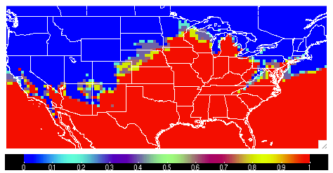

With this new MET field output, we can verify this uncalibrated probabilistic forecast for 2 meter temperatures greater than 10 degrees Celsius against an observation dataset in Grid-Stat.

Now for the actual verification and statistical generation we turn to Grid-Stat. Starting with the `general Grid-Stat configuration file `_, let’s review how we might set the fcst dictionary:

.. code-block::

   fcst = {
      field = [
      {
        name    = "TMP_Z2_ENS_FREQ_gt10";
        level   = [ "(*,*)" ];
        prob = TRUE;
        cat_thresh = [ ==0.1 ];
      }
      ];
   }

In this example we see the name of the variable field from the Gen-Ens-Prod tool’s netCDF output file, TMP_Z2_ENS_FREQ_gt10, set as the forecast field name. The prob setting informs MET to process the field as probabilistic data, which requires an appropriate categorical threshold creation. Using “==0.1” means MET will create 10 bins from 0 to 1, each with a width of 0.1. Recall from `previous discussion on how MET evaluates probabilities `_ that MET will use the midpoints of each of these bins to evaluate the forecast. Since the forecast data probabilistic resolution is 0.1, the use of 0.05 as the evaluation increment is reasonable. 

Now let’s look at a possible setup for the obs dictionary:

.. code-block::

   obs = {
      field = [
      {
         convert(x) = K_to_C(x);
         name = "TMP";
         level = "Z2";
         cat_thresh = [&gt;10];
      }

Notice that we’ve used the convert function again to change the original Kelvin field to degrees Celsius, along with the appropriate variable field name and second vertical level request. For the threshold we re-use the same value that was originally used to create the forecast probabilities, greater than 10 degrees Celsius. This matching value is important as any other comparison would mean an evaluation between two inconsistent fields.

Since the forecast and observation fields are on different grids, we’ll utilize the regrid dictionary once again to place everything on the same evaluation gridspace:

.. code-block::

   regrid = {
      to_grid = FCST;
      method  = NEAREST;
      width   = 1;
      vld_thresh = 0.5;
      shape   = SQUARE;
   }

Finally, we choose the appropriate flags in the output_flag dictionary to gain the probabilistic statistics:

.. code-block::

   output_flag = {
    pct = STAT;
    pstd   = STAT;
   …

With a successful run of MET, we should find a .stat file with two rows of data; one for the PCT line type that will provide information on the specific counts of observations that fell into each of the forecast’s probability bins, and one for the PSTD line type which has some of the probabilistic measures we discussed in this chapter. The content might look similar to the following:

.. admonition:: Sample Output

   … FCST_THRESH OBS_THRESH COV_THRESH ALPHA LINE_TYPE

.. admonition:: Sample Output

   ==0.10000   &gt;10     NA      NA PCT    103936 11 0    368    45240   0.1    0  0    0.2  424     872     0.3    0  0  0.4 824 848    0.5 0   0   0.6 936   368   0.7 0   0   0.8 1392 160 0.9 52168 336 1

.. admonition:: Sample Output

   ==0.10000   &gt;10     NA      0.05  PSTD   103936 11 0.53987   0.53684  0.5429 0.0019261 0.231 0.24841 0.99209   0.019338   0.013009 0.025667 NA NA NA NA   0.92215 0   0.1 0.2 0.3   0.4   0.5 0.6 0.7 0.8 0.9 1

Note that the rows have been truncated and would normally hold more information to the left of the FCST_THRESH entry. But from this snippet we see that there were 103,936 matched pairs for the comparison, with PCT line type showing many of the observations falling in the “no” category of the 0 to 0.1 bin and the “yes” category of the 0.9 to 1.0 bin. In fact, less than seven percent of the matched pairs fell into categories outside of these two. This distribution tells us that the model was very confident in its probabilities, supported by the observations. This is reflected in the outstanding statistical values of the PSTD line type, including a 0.0019261 Reliability value (recall that a zero is ideal and indicates less differences between the average forecast probability and the observed average frequency) and a near-perfect Brier score of 0.019338 (0 being a perfect score). There is some room for improvement, as reflected in a 0.231 Resolution value (remember that this is the measure of the forecast’s ability to resolve different observational distributions given a change in the forecast value, and a larger value is desirable). For a complete list of all of the statistics given in these two line types, review the MET User’s Guide entries for the `PCT `_ and `PSTD `_ line types.

**METPLUS WRAPPER EXAMPLE OF PROBABILISTIC FORECAST VERIFICATION**

To achieve the same success as the previous example, but utilizing METplus wrappers instead of MET, very few adjustments would need to be made. In fact, approaching this example utilizing the wrappers simplifies the problem, as one configuration file can be used to generate the desired output from both tools. 

Starting with variable fields, we would need to set the _VAR1 settings appropriately. Since we are calling two separate tools, it would be best practice to utilize the individual tool’s variable field settings, as seen below:

.. code-block::

   ENS_VAR1_NAME = TMP
   ENS_VAR1_LEVELS = Z2
   ENS_VAR1_OPTIONS = convert(x) = K_to_C(x);
   ENS_VAR1_THRESH = &gt;10
   GEN_ENS_PROD_ENS_THRESH = 0.3
   GEN_ENS_PROD_VLD_THRESH = 0.3
    
   FCST_GRID_STAT_VAR1_NAME = TMP_Z2_ENS_FREQ_gt10
   FCST_GRID_STAT_VAR1_LEVELS = “(*,*)”
   FCST_GRID_STAT_VAR1_THRESH = ==0.1
   FCST_GRID_STAT_IS_PROB = True
   OBS_GRID_STAT_VAR1_NAME = TMP
   OBS_GRID_STAT_VAR1_LEVELS = Z2
   OBS_GRID_STAT_VAR1_THRESH = &gt;10
   OBS_GRID_STAT_VAR1_OPTIONS = convert(x) = K_to_C(x);

You can see how the GenEnsProd field variables start with the prefix ENS_, and the GridStat wrapper field variables have _GRID_STAT_ in their name. Those GridStat field settings are also clearly separated into forecast (FCST_) and observation (OBS_) options. Note how from the MET-only approach we have simply changed what the setting name is, but the same values are utilized, all in one configuration file.

To recreate the regridding aspect of the MET example, we would call the wrapper-appropriate regridding options:

.. code-block::

   GRID_STAT_REGRID_TO_GRID = FCST;
    
   GEN_ENS_PROD_REGRID_TO_GRID = “G110”;

Because the loop/timing information is controlled inside the configuration file for METplus wrappers (as opposed to MET’s non-looping option), that information must also be set accordingly. This is also an appropriate time to set up the calls to the wrappers in the desired order:

.. code-block::

   PROCESS_LIST = GenEnsProd, GridStat
    
   LOOP_BY = INIT
   INIT_TIME_FMT = %Y%m%d%H
   INIT_BEG=2024030300
   INIT_END=2024030300
   INIT_INCREMENT = 12H
    
   LEAD_SEQ = 24

Now a one time loop will be executed with a forecast lead time of 24 hours, matching the forecast and observation datasets’ relationship.

One part that needs to be done carefully is the input directory and file name template for GridStat. This is because we are relying on the output from the previous wrapper, GenEnsProd, and need to set the variable accordingly. As long as the relative value is used, this process becomes much simpler, as shown:

.. code-block::

   FCST_GRID_STAT_INPUT_DIR = {GEN_ENS_PROD_OUTPUT_DIR}
   FCST_GRID_STAT_INPUT_TEMPLATE = {GEN_ENS_PROD_OUTPUT_TEMPLATE}

These commands will tie the input for GridStat to wherever the output from GenEnsProd was set.

Finally we set up the correct output requests for each of the tools:

.. code-block::

   GEN_ENS_PROD_ENSEMBLE_FLAG_LATLON = TRUE
   GEN_ENS_PROD_ENSEMBLE_FLAG_FREQUENCY = TRUE
   GRID_STAT_OUTPUT_FLAG_PSTD = STAT
   GRID_STAT_OUTPUT_FLAG_PCT = STAT

And with a successful run of METplus we would arrive at the same output as we obtained from the MET-only example. This example once again highlights the usefulness of METplus wrappers in chaining multiple tools together in one configuration file.

