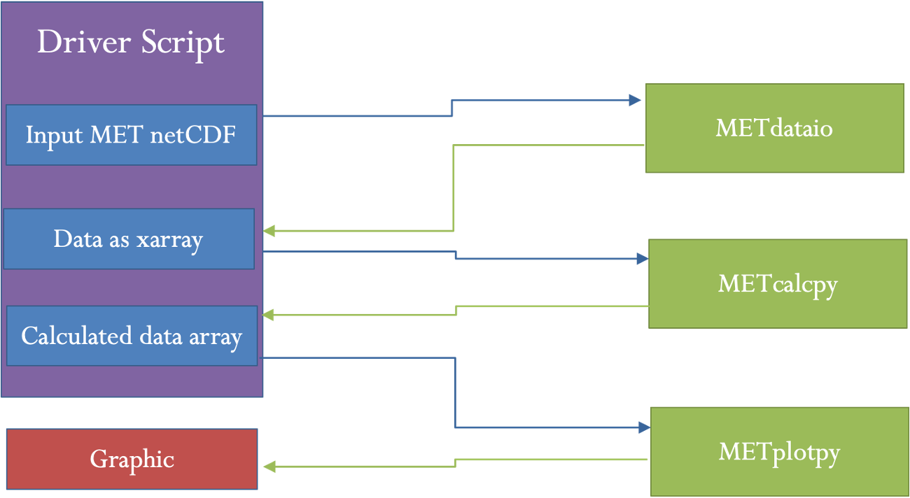
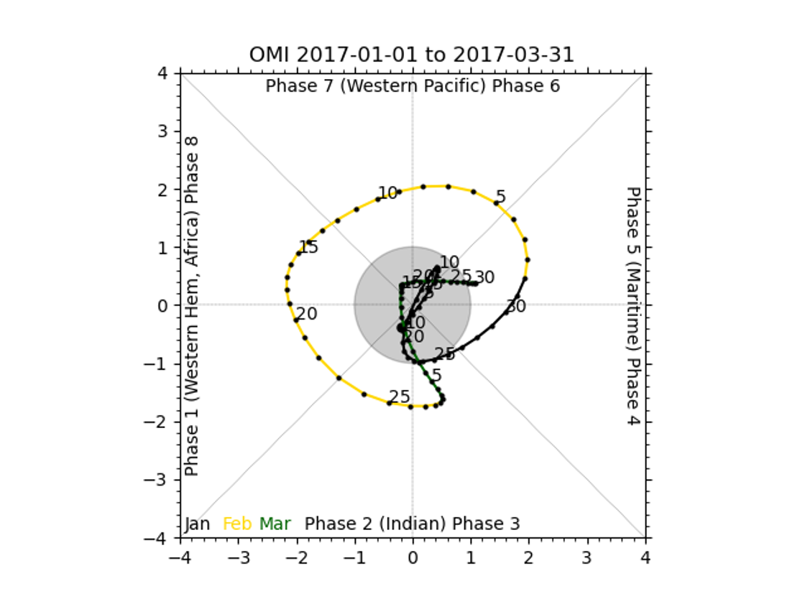
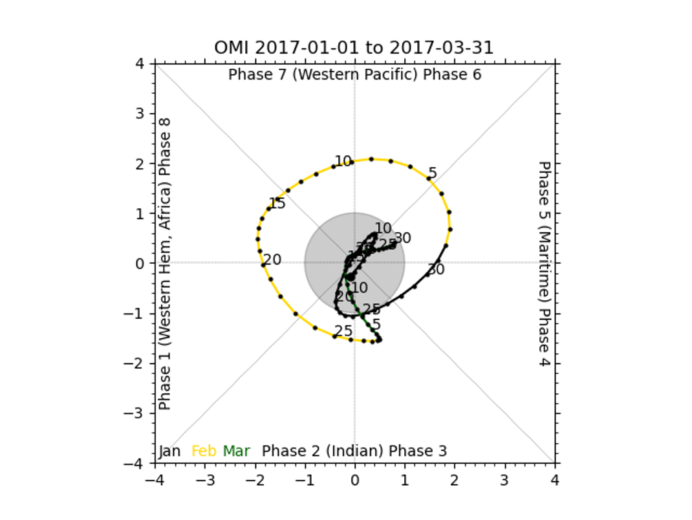

Session 10: Subseasonal to Seasonal (S2S)
=========================================

Session 10: Subseasonal to Seasonal (S2S)

METplus Practical Session 10
----------------------------

Prerequisites: Verify Environment is Set Correctly
--------------------------------------------------

Before running the tutorial instructions, you will need to ensure that you have a few environment variables set up correctly. If they are not set correctly, the tutorial instructions will not work properly.

.. note::

   1: Navigate to your tutorial directory and run the tutorial setup script.

.. important::

   In the following instructions, change "/path/to" to the directory you chose.
   EDIT AFTER COPYING and BEFORE HITTING RETURN!

.. code-block::

   cd /path/to/METplus-5.0.0_Tutorial
   source METplus-5.0.0_TutorialSetup.sh

 

.. note::

   2: Check that you have environment variables set correctly. If any of these variables are not set, navigate back to the METplus Setup section of the tutorial.

.. code-block::

   echo ${METPLUS_TUTORIAL_DIR}
   echo ${METPLUS_BUILD_BASE}
   echo ${MET_BUILD_BASE}
   echo ${METPLUS_DATA}
   ls ${METPLUS_TUTORIAL_DIR}
   ls ${METPLUS_BUILD_BASE}
   ls ${MET_BUILD_BASE}
   ls ${METPLUS_DATA}

.. important::

   METPLUS_TUTORIAL_DIR is the location of all of your tutorial work, including configuration files, output data, and any other notes you'd like to keep.
   METPLUS_BUILD_BASE is the full path to the METplus installation (/path/to/METplus-X.Y)
   MET_BUILD_BASE is the full path to the MET installation (/path/to/met-X.Y)
   METPLUS_DATA is the location of the sample test data directory

 

.. note::

   3: Check that the MET applications are in the path:

.. code-block::

   which point_stat

.. important::

   You should see the usage statement for Point-Stat. The version number listed should correspond to the version listed in MET_BUILD_BASE. If it does not, you will need to either reload the met module, or add ${MET_BUILD_BASE}/bin to your PATH.

 

.. note::

   4: Check that the correct version of run_metplus.py is in your PATH:

.. code-block::

   which run_metplus.py

.. important::

   If you don't see the full path to script from the shared installation, please set it. It should look the same as the output from this command:

.. code-block::

   echo ${METPLUS_BUILD_BASE}/ush/run_metplus.py
   ls ${METPLUS_BUILD_BASE}/ush/run_metplus.py

Besides setting up METplus for this session, you will also want to be sure that you have METcalcpy, METplotpy, and METdataio installed and available. 

If more information is needed, see the instructions in Session 1 for more information.

You are now ready to move on to the next section.

.. important::

   If you discover any typos, error in the run commands, incorrect output listed, or any other issues while completing the tutorial, you are encouraged to submit your findings to the METplus team in a GitHub Discussions. Be sure to provide what session and specific page you encountered the issue on.

S2S (Subseasonal to Seasonal) Metrics General
=============================================

S2S (Subseasonal to Seasonal) Metrics General

Background:
-----------

Specifically, subseasonal refers to a period  which is typically defined as a period of two weeks to 3 months, whereas seasonal may encompass multiple years but typically only includes one season in each of those years (such as December, January, and February).  TheS2S calculations in METplus range range from Indices computed for the Madden-Julien Oscillation (such as the Real-Time Multivariate MJO Index or the OLR Based MJO Index) to calculations for the mid latitude such as weather regime classifications and atmospheric blocking, to stratosphere diagnostics.  However, most of them are formatted similarly.

Format of Subseasonal to Seasonal Metrics:
------------------------------------------

The S2S metrics added to the METplus system differ from other use cases in that these metrics are computed using scripts in multiple repositories (such as METcalcpy, METplotpy, etc), rather than only using the C++ code that is part of the MET verification package (such as Grid-Stat and MODE).  Specifically, the S2S metrics include combinations of pre-processing steps (which use MET tools such as Regrid-Pata-Plane and PCP-Combine), indices and diagnostics computed using python code in METcalcpy, graphics in METplotpy, and statistics computed using Stat-Analysis.  Additionally, the S2S metrics are set up to run with multiple input files, similar to how MODE-Time-Domain or Series-Analysis work.  The indices and diagnostics are set up to be computed separately on the models and observations, and are run using a driver script that’s called with the METplus UserScript option.

A driver script is a python script that differs from the METplus wrappers. This script calls specific programs located in multiple repositories such as METcalcpy, METplotpy and METdataio. It can call scripts from one repository, or from multiple repositories multiple times, with the order and setup varying for each use case. A driver script is unique to the metrics and plots desired, and is different for different use cases. The figure below shows an example of how a driver script handles data for a use case with one call to a script in METdataio, METcalcpy, and METplotpy to produce an output graphic that displays a calculated index.

Basic Information on UserScripts
--------------------------------

A UserScript generates user defined commands that are run from a METplus configuration file. Running a command from a METplus configuration file (as opposed to using a command line) has added benefits. These include access to METplus timing controls and filename templates. Additionally, running a command with a UserScript allows the user to link runs of METplus with other calculations or plotting scripts in any order. For the S2S use cases, UserScripts will typically call a driver script which then processes metrics, diagnostics, and/or graphics depending on the setup of the driver script. More information about the configuration and variables can be found in the `UserScript section of the METplus User’s Guide `_.

 

Configuration Sections
----------------------

Many of the S2S scripts use configuration sections. A configuration section is a part of the file following a label in the format of [my_new_label].  These sections are needed to run the same tool more than once with different settings.  Configuration sections are called from the process list by adding the label in parenthesis after the tool name.  More information about these can be found in the `METplus User’s Guide section of instance names `_.

 

Final Considerations
--------------------

Most of the S2S use cases require input information to the driver scripts.  This information varies by use case and is given in the [user_env_vars] section of the configuration file.  In most cases, this section contains options such as input variable names, directories, and plotting information.  But some use cases have other variables that are needed as input to the calculation.  

Different use cases have different python dependencies.  These are listed in the use case documentation.  The format of input data for these use cases can vary.  Currently, METdataio can read netCDF data.  However, most S2S use cases are set to use netCDF files that are in MET’s format.  This can be achieved through pre-processing steps, typically as output from Regrid-Data-Plane or PCP-Combine.

Run METplus for the OMI use-case
================================

Run METplus for the OMI use-case

Configuring the METplus OMI use case
------------------------------------

The OLR-Based MJO Index (OMI)use case is one of the simplest S2S use cases, so we will start there.  First, we will review the python dependencies to make sure these are available.  Python dependencies for the OMI Use case we are going to run are listed in the `External Dependencies section `_.  For this case, we need to have numpy, netCDF4, datetime, xarray, matplotlib, scipy and pandas available.

This use case also requires the installation and correct environmental settings for METcalcpy and METplotpy. These requirements extend to having both of the respective repositories installed, as well as their corresponding _BASE environmental settings. Assuming that the instructions provided in the `METdataio tutorial section `_ have been followed, and the METcalcpy and METplotpy were installed in your ${METPLUS_TUTORIAL_DIR}, set the following commands:

.. code-block::

   export METPLOTPY_BASE=${METPLUS_TUTORIAL_DIR}/metplotpy/METplotpy
   export METDATAIO_BASE=${METPLUS_TUTORIAL_DIR}/metdataio/METdataio
   export PYTHONPATH=$METDATAIO_BASE:$METCALCPY_BASE:$METPLOTPY_BASE

 

.. note::

   Next, let’s create a directory for the output:

 

.. code-block::

   mkdir -p ${METPLUS_TUTORIAL_DIR}/output/met_output/omi

.. note::

   Then, we will review the configuration file. The command examples show vim, but any text editor could be used in place of vim:

.. code-block::

   vim ${METPLUS_BUILD_BASE}/parm/use_cases/model_applications/s2s_mjo/UserScript_fcstGFS_obsERA_OMI.conf

The file shows 2 PROCESS_LIST variables, one of which is commented out. The commented out version includes pre-processing steps which can take a long time to run due to the amount of data. Those pre-processing steps create daily means of outgoing longwave radiation (OLR) for the forecast data, and then regrid the observation and model OLR. In this example, we will be omitting those steps, running only the last two steps. The last two steps create a listing of EOF input files and then run the OMI computation.

In this case, creating a listing of EOF files is done in a separate step because the EOF files have different timing information than the input OLR files.  Specifically, the EOF input is one file per day of the year, whereas the OMI in this case is computed across 2 years of OLR data.   Settings for creating the list of files is given in the [create_eof_filelist] section.  The command given in UserScript_COMMAND is irrelevant here as it does not affect the creation of the file lists.

Input variables to the OMI calculation are given in the [user_env_vars] section.   The first two variables, OBS_RUN and FCST_RUN are either True or False, and tell the program whether to run model data, observations, or both.  The third variable, SCRIPT_OUTPUT_BASE gives the location of the output graphics.  The next variable tells the program how many observations per day are in the data.   The last set of variables give information about formatting the plotting and output file names.

The information to run the OMI calculation is given in the [script_omi] section.  The variables give the frequency of the run time, location of the model and observation input OLR data, the input template labels, which shouldn’t be changed and then the actual command that is run to calculate OMI.  Here, the command calls the OMI driver script.

Run METplus for the OMI use case
--------------------------------

.. note::

   To run METplus, first change to the tutorial directory:

.. code-block::

   cd ${METPLUS_TUTORIAL_DIR}

.. note::

   Then, run the following command, which uses config.OUTPUT_BASE to change the output location. Alternatively, users could change the OUTPUT_BASE by editing the location in the tutorial.conf file

.. code-block::

   run_metplus.py \
   ${METPLUS_BUILD_BASE}/parm/use_cases/model_applications/s2s_mjo/UserScript_fcstGFS_obsERA_OMI.conf \
   ${METPLUS_TUTORIAL_DIR}/tutorial.conf \
   config.OUTPUT_BASE=${METPLUS_TUTORIAL_DIR}/output/met_output/omi

The script should run and if successful, will say:

.. admonition:: Sample Output

   METplus has successfully finished running

Check the output
----------------

.. note::

   To check the output, first go the output directory:

.. code-block::

   cd output/met_output/omi

Here you should see three directories (logs, s2s_mjo, and tmp) and the METplus configuration file.

.. note::

   To check the output, we need to find the plots:

.. code-block::

   cd s2s_mjo/UserScript_fcstGFS_obsERA_OMI/plots

There should be 2 plots inside this directory, **fcst_OMI_comp_phase.png** and **obs_OMI_comp_phase.png**. The graphics should match those displayed below.

obs_OMI_comp_phase.png

fcst_OMI_comp_phase.png

End of Session 10 and additional Exercises
==========================================

End of Session 10 and additional Exercises

!!!!!!!!!!!!!!!!!!!!!!!!!!!!!!!!!!!!!!!!!!!!!!!!!!!!!!!!!!!!!!!!!!!!!!!!!!!!!!!!!!!!!!!!!!!!!!!!!!!!!!!!!!!!!!!!!!!!!!!!!!!!!!!
-------------------------------------------------------------------------------------------------------------------------------

.. important::

   THE FOLLOWING CONTENT IS STILL IN DEVELOPMENT. RUN COMMANDS MAY NOT WORK AS INTENDED, INSTRUCTIONS MAY NOT BE COMPLETE, AMONG OTHER UNINTENDED EFFECTS. USERS ARE ADVISED NOT TO COMPLETE THIS PAGE'S EXERCISES UNTIL THIS BANNER IS REMOVED.

!!!!!!!!!!!!!!!!!!!!!!!!!!!!!!!!!!!!!!!!!!!!!!!!!!!!!!!!!!!!!!!!!!!!!!!!!!!!!!!!!!!!!!!!!!!!!!!!!!!!!!!!!!!!!!!!!!!!!!!!!!!!!!!
-------------------------------------------------------------------------------------------------------------------------------

Run METplus for the Weather Regime use case
-------------------------------------------

Background on the Weather Regime Use-Case:
^^^^^^^^^^^^^^^^^^^^^^^^^^^^^^^^^^^^^^^^^^

The weather regime use case is more complicated than the OMI use case for several reasons.  The first is that the use case has more pre-processing steps.  The second is that the weather regime calculation has several steps.  Specifically, it has three calculation steps and three optional output graphics for both the model and observations.  Lastly, the use case calls Stat-Analysis on the output to create statistics.  It uses 500mb height over December, January, and February to compute patterns for weather regime classification.

Configure the Weather Regime Use-Case:
^^^^^^^^^^^^^^^^^^^^^^^^^^^^^^^^^^^^^^

To configure the weather regime use case, first check the `python dependencies in the online User's Guide `_.  The required python packages are numpy, netCDF4, datetime, pylab, scipy, sklearn, eofs, and matplotlib.

.. note::

   Then, return to the tutorial directory and create a directory for the output:

.. code-block::

   mkdir -p ${METPLUS_TUTORIAL_DIR}/output/met_output/weather_regime
   cd ${METPLUS_TUTORIAL_DIR}/output/met_output/weather_regime

.. note::

   Next, let's review the configuration file. The command examples show vim, but any text editor could be used in place of vim:

.. code-block::

   vim ${METPLUS_BUILD_BASE}/parm/use_cases/model_applications/s2s_mid_lat/UserScript_fcstGFS_obsERA_WeatherRegime.conf

The file shows 2 PROCESS_LIST variables, one of which is commented out. The commented out version includes pre-processing steps which can take a long time to run due to the amount of data. Here there are 2 pre-processing steps, regridding and creating daily means on the observations. The last three steps run the weather regime calculation and Stat-Analysis twice.

Input variables to the OMI calculation are given in the [user_env_vars] section.  The first two variables, FCST_STEPS and OBS_STEPS are lists of the steps in each calculation that should be performed for the model and observation data.  There are four calculation steps, ELBOW, EOF, KMEANS, and TIMEFREQ.  The first two, ELBOW and EOF, can be omitted or run.  The last step, TIMEFREQ has to be run after KMEANS.  Additionally, the plotting for each step can only be run if the step is run.  For example, PLOTEOF can only be run after EOF is run.  In this example, all steps and plotting are turned on.

The third variable, SCRIPT_OUTPUT_BASE gives the location of the output graphics.  The next variables, NUM_SEASONS and DAYS_PER_SEASON tell the code how many years of data are being input, and how many days are in each year respectively.  The current setup uses data from December, January, and February of each year across 17 years.  OBS_WR_VAR and FCST_WR_VAR give the names of the observation and model variables in their files.  The following 11 variables control settings to the calculation including the number of weather regimes to classify, the number of clusters to use, and the frequency to use in the TIMEFREQ step.  Finally, the last variables control output, including the format of the file listing the weather regime classification for each day and settings for the various plots created.

The information to run the Weather Regime calculation is given in the [script_wr] section.  The variables give the frequency of the run time, location of the model and observation input 500mb height data, the input template labels, which shouldn’t be changed and then the actual command that is run.  Here, the command calls the Weather Regime driver script.  The last two sections [sanal_wrclass] and [sanal_wrfreq] contain the settings for running Stat-Analysis on the output weather regime classification and time frequency.  These runs will not work if the KMEANS and TIMEFREQ steps are not run on both model and observation data.  They produce multi category contingency table statistics on the weather regime classification and continuous statistics on the time frequency.

Run METplus for the Weather Regime use case:
^^^^^^^^^^^^^^^^^^^^^^^^^^^^^^^^^^^^^^^^^^^^

.. note::

   To run METplus, run the following command, which uses config.OUTPUT_BASE to change the output location. Alternatively, users could change the OUTPUT_BASE by editing the location in the tutorial.conf file:

.. code-block::

   run_metplus.py \
   ${METPLUS_BUILD_BASE}/parm/use_cases/model_applications/s2s_mid_lat/UserScript_fcstGFS_obsERA_WeatherRegime.conf \
   ${METPLUS_TUTORIAL_DIR}/tutorial.conf \
   config.OUTPUT_BASE=${METPLUS_TUTORIAL_DIR}/output/met_output/weather_regime

The script should run and if successful, will say:

.. admonition:: Sample Output

   METplus has successfully finished running

Check the output:
^^^^^^^^^^^^^^^^^

In the ${METPLUS_TUTORIAL_DIR}/output/met_output/weather_regime directory, you should see three directories (logs, s2s_mid_lat, and tmp) and the METplus configuration file. Inside the s2s_mid_lat directory, there should be another directory, UserScript_fcstGFS_obsERA_WeatherRegime, that contains four files and two directories. The mpr directory contains output matched pair files for the weather regime classification and time frequency. The plots directory contains eight output plots, fcst_elbow.png fcst_eof.png fcst_freq.png fcst_kmeans.png obs_elbow.png obs_eof.png obs_freq.png obs_kmeans.png. Finally, there are two types of text output files. Fcst_weather_regime_class.txt and obs_weather_regime_class.txt contain text output where each day is classified into one of the six weather regime patterns. The other two files, GFS_ERA_WRClass_240000L_MCTS.stat and GFS_ERA_WRClass_240000L_MCTS.stat, contain output from stat analysis comparing the model and observation weather regime classification and time frequencies.

