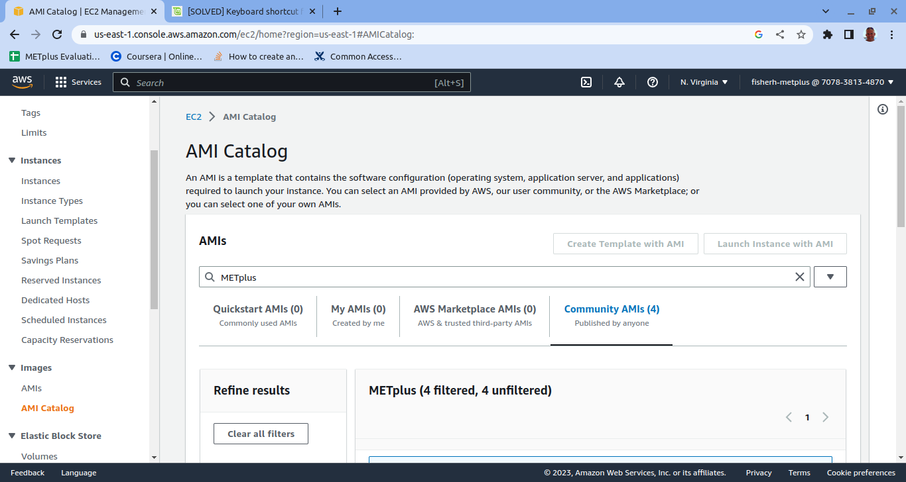
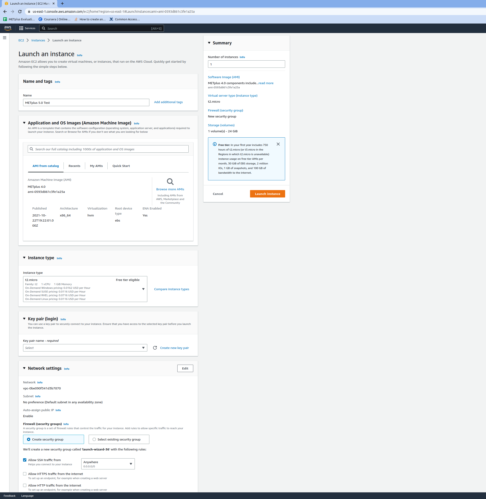
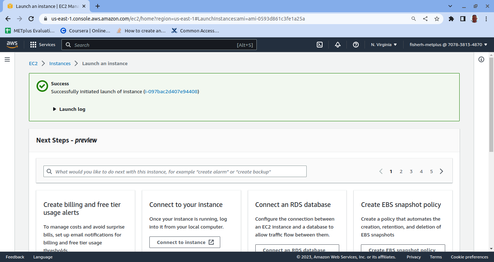
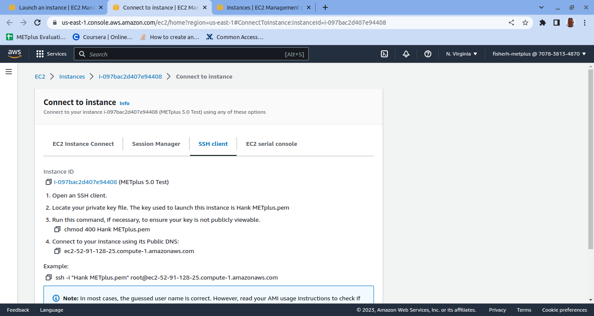
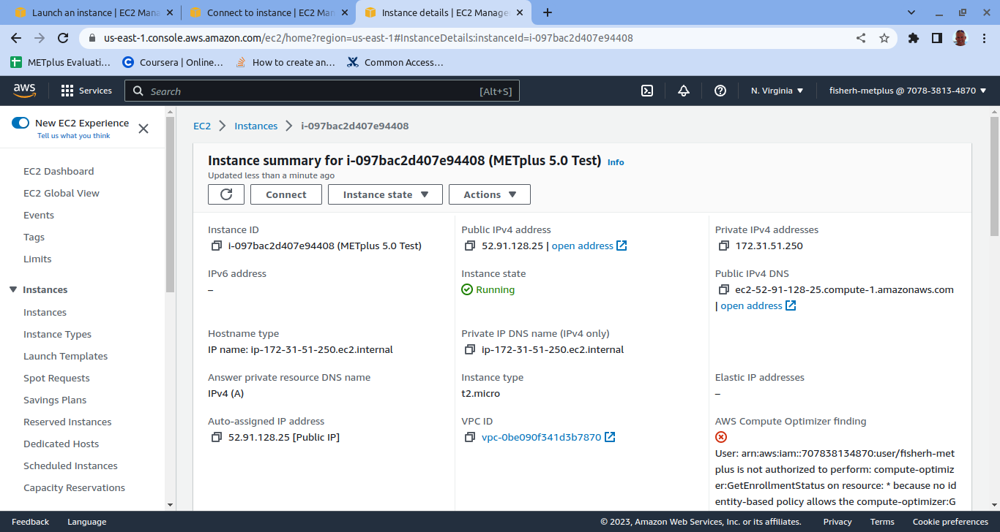

Session 11: METplus Cloud
=========================

**METplus Practical Session 11**

This session will cover two METplus feature relative use cases.

**Prerequisites: Accessing a Guided Tutorial EC2 Instance**

Running the tutorial in the cloud requires a cloud instance. Currently we are only supporting Amazon Web Services tutorial instances.

.. note::

   1. If you are joining a guided tutorial and are using an EC2 instance you will have been given an ip address to that instance that is dedicated uniquely to you. Once you have that IP and the password associated with it you can access it with the following command

.. important::

   In the following instructions change &lt;ip address&gt; with the ip address given to you by the manager of the guided tutorial 

.. important::

   Example: ssh ec2-useer@ec2-3-86-254-5.compute-1.amazonaws.com

 

.. code-block::

   ssh ec2-user@&lt;ip address&gt;

 

.. note::

   2: Check that you have environment variables set correctly. If any of these variables are not set, navigate back to the METplus Setup section of the tutorial.

.. code-block::

   echo ${METPLUS_TUTORIAL_DIR}
   echo ${METPLUS_BUILD_BASE}
   echo ${MET_BUILD_BASE}
   echo ${METPLUS_DATA}
   ls ${METPLUS_TUTORIAL_DIR}
   ls ${METPLUS_BUILD_BASE}
   ls ${MET_BUILD_BASE}
   ls ${METPLUS_DATA}

.. important::

   METPLUS_TUTORIAL_DIR is the location of all of your tutorial work, including configuration files, output data, and any other notes you'd like to keep.
   METPLUS_BUILD_BASE is the full path to the METplus installation (/path/to/METplus-X.Y)
   MET_BUILD_BASE is the full path to the MET installation (/path/to/met-X.Y)
   METPLUS_DATA is the location of the sample test data directory

 

.. note::

   3: Check that the MET applications are in the path:

.. code-block::

   which point_stat

.. code-block::

   point_stat

 

.. important::

   The first command should show you the directory where point_stat lives. In the second command you should see the usage statement for Point-Stat. The version number listed should correspond to the version listed in MET_BUILD_BASE. If it does not, you will need to either reload the met module, or add ${MET_BUILD_BASE}/bin to your PATH.

 

.. note::

   4: Check that the correct version of run_metplus.py is in your PATH:
   
   which run_metplus.py

.. important::

   If you don't see the full path to script from the shared installation, please set it. It should look the same as the output from this command:

.. code-block::

   echo ${METPLUS_BUILD_BASE}/ush/run_metplus.py
   ls ${METPLUS_BUILD_BASE}/ush/run_metplus.py

If more information is needed see the instructions in Session 1 for more information.
The next section describes how to create your own EC2 instance and is optional

.. important::

   If you discover any typos, error in the run commands, incorrect output listed, or any other issues while completing the tutorial, you are encouraged to submit your findings to the METplus team in a GitHub Discussions. Be sure to provide what session and specific page you encountered the issue on.

Create an EC2 Instance
----------------------

You can also create your own EC2 instance if you have access to your own AWS account and space.

.. note::

   Log into your AWS dashboard

.. note::

   Click on the AMI Catalog link in the left column of the dashboard

.. note::

   Change your region in the upper right corner to Us East (N. Virginia)

.. note::

   Type METplus in the search box

In the community AMIs tab there will be a list of prior and current METplus tutorials.

.. note::

   Click on the select button next to METplus 5.0 Tutorial

.. note::

   Click on the button labeled Launch Instance with AMI

You should see a screen similar to the one below.

.. note::

   Fill in the Name and Tags box

You should create a name that is descriptive and unique like METplus 5.0 .

**Pre Filled Fields:**

AMI from catalog – METplus 5.0 Tutorial

Instance type – t2.microo

Configure storage – 24 GIB gp2

fields should all be populated and not necessary to change

**Fields To Edit:**

**The Key pair field** needs to be chosen. You will have already set up a key pair when you created your AWS space which is out of the scope of this tutorial.

.. note::

   Select the drop down menu and pick the key pair you wish to use

**The Network settings field area** can be used as is but we suggest changing the

Allow SSH traffic from:

.. note::

   from Anywhere to either Custom or MY IP

This will limit access to this EC2 instance from much smaller subset than the entire internet.

.. note::

   Click on the “launch instance” button on the right hand column. 

The right hand column should have a summary of the choices you made above.

Once launched you will see a screen similar to below.

There are now two ways to get the ip address to your currently running EC2 instance.

.. note::

   1. Click on the box labeled “Connect to your instance”

Something similar to the image below should pop up and your ip address should be listed.

.. note::

   2. Navigate to the your EC2 dashboard and look at the running instances

.. note::

   Click on the Instance ID link for your newly created instance that hopefully has a descriptive name and you will see the ip address contained in the screen it takes you to.

You may now connect to your EC2 instance the same way as you would if you were given an ip by the tutorial manager.

 

`fisherh `_
(content)

