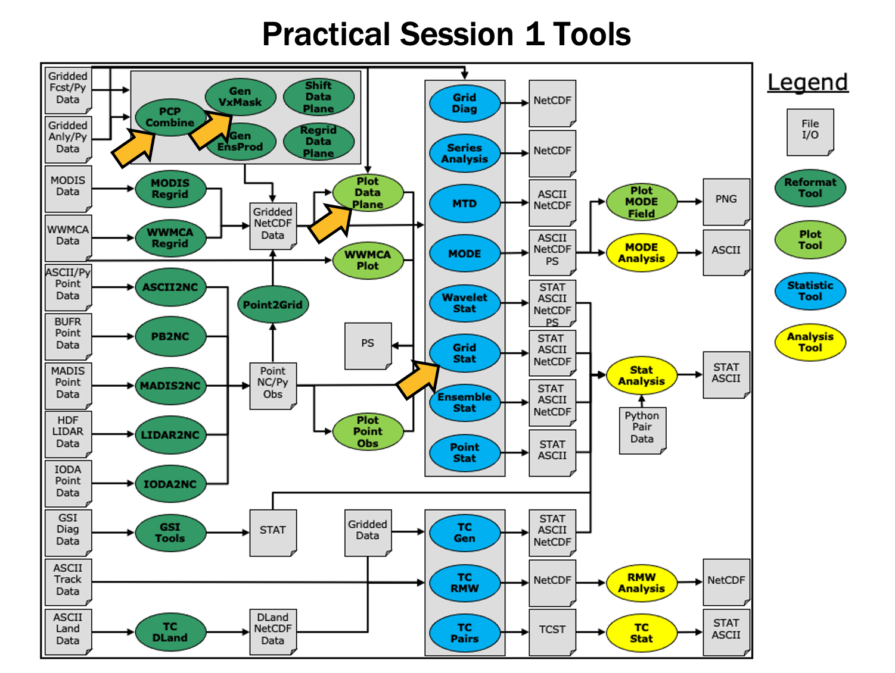

.. _grid_to_grid:

Session 1: Grid-to-Grid
=======================

**METplus Practical Session 1**

During the first METplus practical session, you will run the tools indicated below:

During this practical session, please work on the **Session 1** exercises. 
Proceed through the tutorial exercises by following the navigation links at the bottom of each page.

**TUTORIAL FORMAT**

Throughout this tutorial, code blocks in have green text with a white background 
should be copied from your browser and pasted on the command line, e.g.:

.. code-block:: ini

  echo "Let's Get Started"

.. important::

  Text in **GREEN boxes** contains important information, expert hints or 
  helpful links. Please read carefully.

.. attention::

  Text in **ORANGE boxes** are instructions for the user to perform some action 
  or edit (add or modify) a specific file on your system.

.. note::

  Text in **BLUE boxes** are notes or instructions to be aware of while
  moving through the documentation.

.. admonition:: Sample Output
	   
  Text in **PURPLE boxes** are sample output from a command or contents of a file. 

.. admonition:: File Contents
	   
  Text in **PURPLE boxes** are sample output from a command or contents of a file.
 
  
**TUTORIAL TIPS**

.. important::

  **Please read the instructions carefully!**
  In some cases there are two sets of instructions where only one 
  set of copyable instructions should be executed (i.e. bash vs. csh). 
  Ignoring the information and simply copy/pasting the command line 
  instructions may result in unintended consequences.

.. note::  

  Instructions in this tutorial use **vi** to open and edit files. 
  If you prefer to use a different file editor, feel free to substitute 
  it whenever you see **vi**.

.. note::
   
  Instructions in this tutorial use **okular** to view pdf, ps, and png files. 
  If you prefer to use a different file viewer, feel free to substitute it 
  whenever you see **okular**.

.. note::
   
  If you are running the tutorial inside Docker, you will not have access 
  to the visualization tools described in this tutorial (such as okular, ncview, etc.) 
  inside the Docker container. To run these commands, you will have to mount the 
  output directory inside Docker to your local computer file system and run these tools from there.

.. important::

  If you discover any typos, error in the run commands, incorrect output listed, 
  or any other issues while completing the tutorial, you are encouraged to submit
  your findings to the METplus team in a 
  `GitHub Discussions <https://github.com/dtcenter/METplus/discussions>`_. 
  Be sure to provide what session and specific page you encountered the issue on.

MET Tool: PCP-Combine
---------------------

.. important::

  If you are returning to the tutorial, you must source the tutorial setup script 
  before running the following instructions. If you are unsure if you have done this step, 
  please navigate to the :ref:`Verify Environment is Set Correctly <verif_env_set_correct>` page.

We now shift to a discussion of the MET PCP-Combine tool and will practice running 
it directly on the command line.

**PCP-Combine Functionality**

The PCP-Combine tool is used (if needed) to **add, subtract, sum** or **derive** 
accumulated field values, most commonly precipitation, from several gridded data 
files into a single NetCDF file containing the desired accumulation period. 
Its NetCDF output may be used as input to the MET statistics tools. PCP-Combine 
may be configured to combine any gridded data field you'd like. However, all gridded 
data files being combined must have already been placed on a common grid. The copygb 
utility is recommended for re-gridding GRIB files. In addition, the PCP-Combine 
tool will only sum model files with the same initialization time unless it is 
configured to ignore the initialization time.

**PCP-Combine Usage**

View the usage statement for PCP-Combine by simply typing the following:

.. code-block:: ini

  pcp_combine

.. list-table:: Usage: pcp_combine
  :widths: auto
  :header-rows: 0

  * - **[[-sum] sum_args] | [-add input_files] | [-subtract input_files] | [-derive stat_list input_files]
      (Note: "|" means "or")**
    - 
  * - **[-sum] sum_args**
    - **Data from multiple files containing the same accumulation interval should be summed up using the arguments provided.**
  * - **-add input_files**
    - **Data from one or more files should be added together where the accumulation interval is specified separately for each input file.**
  * - **-subtract input_files**
    - **Data from exactly two files should be subtracted.**
  * - **-derive stat_list input_files**
    - **The comma-separated list of statistics in "stat_list" (sum, min, max, range, mean, stdev, vld_count) should be derived using data from one or more files.**
  * - out_file
    - Output NetCDF file to be written.
  * - [-field string]
    - Overrides the default use of accumulated precipitation (optional).
  * - [-name list]
    - Overrides the default NetCDF variable name(s) to be written (optional).
  * - [-vld_thresh n]
    - Overrides the default required ratio of valid data (1) (optional).
  * - [-log file]
    - Outputs log messages to the specified file
  * - [-v level]
    - Level of logging
  * - [-compress level]
    - NetCDF file compression

Use the **-sum, -add, -subtract**, or **-derive** command line option to indicate 
the operation to be performed. Each operation has its own set of required arguments.

Run Sum Command
^^^^^^^^^^^^^^^

Since PCP-Combine performs a simple operation and reformatting step, no configuration file is needed.

1. Start by making an output directory for PCP-Combine and changing directories:

.. code-block:: ini

  mkdir -p ${METPLUS_TUTORIAL_DIR}/output/met_output/pcp_combine
  cd ${METPLUS_TUTORIAL_DIR}/output/met_output/pcp_combine

2. Now let's run PCP-Combine twice using some sample data that's included with the MET tarball:

.. code-block:: ini

  pcp_combine \
  -sum 20050807_000000 3 20050807_120000 12 \
  sample_fcst_12L_2005080712V_12A.nc \
  -pcpdir ${METPLUS_DATA}/met_test/data/sample_fcst/2005080700

.. code-block:: ini

  pcp_combine \
  -sum 00000000_000000 1 20050807_120000 12 \
  sample_obs_12L_2005080712V_12A.nc \
  -pcpdir ${METPLUS_DATA}/met_test/data/sample_obs/ST2ml

.. note::

  The "**\\**" backslash symbols in the commands above are used for ease of reading. 
  They are line continuation markers enabling us to spread a long command 
  line across multiple lines. They should be followed immediately by "Enter". 
  You may copy and paste the command line OR type in the entire line with or 
  without the "\\".

Both commands run the **sum** command which searches the contents of the **-pcpdir** 
directory for the data required to create the requested accmululation interval.

In the first command, PCP-Combine summed up 4 3-hourly accumulation forecast files 
into a single 12-hour accumulation forecast. In the second command, PCP-Combine 
summed up 12 1-hourly accumulation observation files into a single 12-hour 
accumulation observation. PCP-Combine performs these tasks very quickly.

We'll use these PCP-Combine output files as input for Grid-Stat. 
So make sure that these commands have run successfully!

Output
^^^^^^

When PCP-Combine is finished, you may view the output NetCDF files it wrote using the 
**ncdump** and **ncview** utilities. 
Run the following commands to view contents of the NetCDF files:

.. code-block:: ini

  ncview sample_fcst_12L_2005080712V_12A.nc &
  ncview sample_obs_12L_2005080712V_12A.nc &
  ncdump -h sample_fcst_12L_2005080712V_12A.nc
  ncdump -h sample_obs_12L_2005080712V_12A.nc

The ncview windows display plots of the precipitation data in these files. 
The output of ncdump indicates that the gridded fields are named **APCP_12**,
the GRIB code abbreviation for accumulated precipitation. 
The accumulation interval is 12 hours for both the forecast 
(3-hourly * 4 files = 12 hours) and the observation (1-hourly * 12 files = 12 hours).

Note, if ncview is not found when you run it on your system, you may need to load it first.  
For example, on hera, you can use this command:

.. code-block:: ini

  module load ncview

**Plot-Data-Plane Tool**

The Plot-Data-Plane tool can be run to visualize any gridded data that 
the MET tools can read. It is a very helpful utility for making sure that MET can 
read data from your file, orient it correctly, and plot it at the correct spot on 
the earth. When using new gridded data in MET, it's a great idea to run it 
through Plot-Data-Plane first:

.. code-block:: ini

  plot_data_plane \
  sample_fcst_12L_2005080712V_12A.nc \
  sample_fcst_12L_2005080712V_12A.ps \
  'name="APCP_12"; level="(*,*)";'

.. code-block:: ini

  gv sample_fcst_12L_2005080712V_12A.ps &

.. note::

  Ghostview (gv) can take a little while before it displays.  
  If you don't have gv on your computer, try using display, 
  or any tool that can visualize PostScript files, e.g.:

  .. code-block:: ini

    display sample_fcst_12L_2005080712V_12A.ps &

.. note::

  Another option is to create a PNG file from the PS file, 
  also rotating it to appear the right way:

  .. code-block:: ini

    convert -rotate 90 sample_fcst_12L_2005080712V_12A.ps \
    sample_fcst_12L_2005080712V_12A.png
    display sample_fcst_12L_2005080712V_12A.png

Next try re-running the command list above, but add the **convert(x)=x/25.4;**
function to the config string (*Hint: after the level setting and ; but before 
the last closing tick*) to change units from millimeters to inches. 
What happened to the values in the colorbar?

Now, try re-running again, but add the **censor_thresh=lt1.0; censor_val=0.0;**
options to the config string to reset any data values less 1.0 to a 
value of 0.0. How has your plot changed?

.. note::

  The **convert(x)** and **censor_thresh/censor_val** options can be used in config 
  strings and MET config files to transform your data in simple ways.

Add and Subtract Commands
^^^^^^^^^^^^^^^^^^^^^^^^^

We have run examples of the PCP-Combine **-sum** command, but the tool also 
supports the **-add, -subtract,** and **-derive** commands. While the **-sum** 
command defines a directory to be searched, for **-add, -subtract,** and 
**-derive** we tell PCP-Combine exactly which files to read and what data 
to process. The following command adds together 3-hourly precipitation from 
4 forecast files, just like we did in the previous step with the **-sum** command:

.. code-block:: ini

  pcp_combine -add \
  ${METPLUS_DATA}/met_test/data/sample_fcst/2005080700/wrfprs_ruc13_03.tm00_G212 03 \
  ${METPLUS_DATA}/met_test/data/sample_fcst/2005080700/wrfprs_ruc13_06.tm00_G212 03 \
  ${METPLUS_DATA}/met_test/data/sample_fcst/2005080700/wrfprs_ruc13_09.tm00_G212 03 \
  ${METPLUS_DATA}/met_test/data/sample_fcst/2005080700/wrfprs_ruc13_12.tm00_G212 03 \
  add_APCP_12.nc

By default, PCP-Combine looks for accumulated precipitation, and the **03** 
tells it to look for 3-hourly accumulations. However, that **03** string can be replaced 
with a configuration string describing the data to be processed, which doesn't have to 
be accumulated precipation. The configuration string should be enclosed in single quotes. 
Below, we add together the U and V components of 10-meter wind from the same input file. 
You would not typically want to do this, but this demonstrates the functionality. 
We also use the **-name** command line option to define a descriptive output NetCDF 
variable name:

.. code-block:: ini

  pcp_combine -add \
  ${METPLUS_DATA}/met_test/data/sample_fcst/2005080700/wrfprs_ruc13_03.tm00_G212 'name="UGRD"; level="Z10";' \
  ${METPLUS_DATA}/met_test/data/sample_fcst/2005080700/wrfprs_ruc13_03.tm00_G212 'name="VGRD"; level="Z10";' \
  add_WINDS.nc \
  -name UGRD_PLUS_VGRD

While the **-add** command can be run on one or more input files, the 
**-subtract** command requires *exactly two*. Let's rerun the wind example from 
above but do a subtraction instead:

.. code-block:: ini

  pcp_combine -subtract \
  ${METPLUS_DATA}/met_test/data/sample_fcst/2005080700/wrfprs_ruc13_03.tm00_G212 'name="UGRD"; level="Z10";' \
  ${METPLUS_DATA}/met_test/data/sample_fcst/2005080700/wrfprs_ruc13_03.tm00_G212 'name="VGRD"; level="Z10";' \
  subtract_WINDS.nc \
  -name UGRD_MINUS_VGRD

Now run Plot-Data-Plane to visualize this output. Use the **-plot_range** option 
to specify a the desired plotting range, the **-title** option to add a title, and the 
**-color_table** option to switch from the default color table to one that's good for positive 
and negative values:

.. code-block:: ini

  plot_data_plane \
  subtract_WINDS.nc \
  subtract_WINDS.ps \
  'name="UGRD_MINUS_VGRD"; level="(*,*)";' \
  -plot_range -15 15 \
  -title "10-meter UGRD minus VGRD" \
  -color_table ${MET_BUILD_BASE}/share/met/colortables/NCL_colortables/posneg_2.ctable

Now view the results:

.. code-block:: ini

  gv subtract_WINDS.ps &

Derive Command
^^^^^^^^^^^^^^

While the PCP-Combine **-add** and **-subtract** commands compute exactly one 
output field of data, the **-derive** command can compute multiple output fields 
in a single run. This command reads data from one or more input files and derives 
the output fields requested on the command line (sum, min, max, range, mean, stdev, vld_count).

Run the following command to derive several summary metrics for both the 10-meter U and V wind components:

.. code-block:: ini

  pcp_combine -derive min,max,mean,stdev \
  ${METPLUS_DATA}/met_test/data/sample_fcst/2005080700/wrfprs_ruc13_*.tm00_G212 \
  -field 'name="UGRD"; level="Z10";' \
  -field 'name="VGRD"; level="Z10";' \
  derive_min_max_mean_stdev_WINDS.nc

In the above example, we used a wildcard to list multiple input file names.  And we used 
the **-field** command line option twice to specify two input fields.  For each input field, 
PCP-Combine loops over the input files, derives the requested metrics, and writes them to 
the output NetCDF file.  Run ncview to visualize this output:

.. code-block:: ini

  ncview derive_min_max_mean_stdev_WINDS.nc &

This output file contains 8 variables: 2 input fields * 4 metrics. 
Note the output variable names the tool chose.  
You can still override those names using the **-name** command line argument, 
but you would have to specify a comma-separated list of 8 names, one for each output variable.

MET Tool: Plot-Data-Plane
-------------------------

.. important::

**IMPORTANT NOTE: If you are returning to the tutorial, you must source the tutorial setup script before running the following instructions. If you are unsure if you have done this step, please navigate to the :ref:`verif_env_set_correct` page.**

Whenever getting started with new gridded datasets in MET, users are strongly encouraged to first run the Plot-Data-Plane tool to visualize the data. Doing so confirms that MET can read the input file, extract the desired data, and geolocate and orient it correctly. It is particularly useful in testing the configuration string needed to extract the data from the input file.
.. important::

In MET, the terminology **Data-Plane** means a 2-dimensional field of gridded data.

**Plot-Data-Plane Functionality**

The Plot-Data-Plane tool reads a single 2-dimensional field of gridded data from the specified input file and writes a PostScript output file containing a spatial plot of the data. It plots the data using a configurable color table that is automatically rescaled to the range of values found by default. The `ImageMagick convert <https://imagemagick.org/script/convert.php>`_ utility is recommend for converting the PostScript output file to other image file formats, if needed.

**Plot-Data-Plane Usage**

.. note::

View the usage statement for Plot-Data-Plane by simply typing the following:

.. code-block::

plot_data_plane

Usage: plot_data_plane

input_filename
Input file containing gridded data to be be plotted

output_filename
Output PostScript file to be written

field_string
String defining the data to be plotted

[-color_table name]
Overrides the default color table (optional)

[-plot_range min max]
Specifies the range of data to be plotted (optional)

[-title string]
Specifies the plot title string (optional)

[-log file]
Outputs log messages to the specified file

[-v level]
Level of logging

The Field String
^^^^^^^^^^^^^^^^

**Defining the Field String** 

As you'll see throughout these exercises, the behavior of the MET and METplus tools is controlled using ASCII configuration files, and you will learn more about those options in the coming sessions. The field_string command line argument is actually processed as a miniature configuration file. In fact, that string is written to a temporary file which is then read by MET's configuration file library code.
In general, the name and level entries are required to extract a gridded field of data from a supported input file format. The conventions for specifying them vary based on the input file type:

For GRIB1 or GRIB2 inputs, set name as the abbreviation for the desired variable or data type that appears in the GRIB tables and set level to a single letter (A, Z, P, L, or R) to define the level type followed by a number to define the level value. For example 'name = "TMP"; level = "P500";' extracts 500 millibar temperature from a GRIB file.
For NetCDF inputs, set name as the NetCDF variable name and level to define how to extract a 2-dimensional slice of gridded data from that variable. For example, 'name = "temperature"; level = "(0,1,*,*)";' extracts a 2-dimensional field of data from the last two dimensions of a NetCDF temperature variable using the first two indicies as constant values.
For Python embedding, set name as the python script to be run along with any arguments for that script and do not set level. For example, 'name = "read_my_data.py input.txt";' runs a python script to read data from the specified input file.

Note that all field strings should be enclosed in single quotes, as shown above, so that they are processed on the command line as a single string which may contain embedded whitespace.
Examples for each of these input types are provided in the coming exercises. More details about setting the field string can be found in the Configuration File Overview section of the MET User's Guide. For example, if a field string matches multiple records in an input GRIB file, additional filtering criteria may be specified to further refine them. Additional options exist to explicitly specify the input file_type, define a function to convert the data, or define an operation to censor the data. Each configuration entry should be terminated with a semi-colon (;).
Since the field_string is processed using a temporary file, any syntax errors will produce a parsing error log message similar to the following:
.. admonition:: Sample Output

ERROR  : &lt;br/&gt;
ERROR  : yyerror() -&amp;gt; syntax error in file "/tmp/met_config_61354_1"&lt;br/&gt;
ERROR  :

Error messages like this typically mean there is a problem in a configuration string or configuration file being read by MET.

Plot GRIB Data
^^^^^^^^^^^^^^

Start by creating a directory for our Plot-Data-Plane output:
.. code-block::

mkdir -p ${METPLUS_TUTORIAL_DIR}/output/met_output/plot_data_plane

Next, run Plot-Data-Plane to plot 2-meter temperature from a GRIB1 input file:
.. code-block::

plot_data_plane \&lt;br/&gt;
${METPLUS_DATA}/met_test/data/sample_fcst/2005080700/wrfprs_ruc13_12.tm00_G212 \&lt;br/&gt;
${METPLUS_TUTORIAL_DIR}/output/met_output/plot_data_plane/wrfprs_TMP_2m.ps \&lt;br/&gt;
'name = "TMP"; level = "Z2";'

The default verbosity level of 2 only prints log messages about input and output files.
.. admonition:: Sample Output

DEBUG 1: Opening data file: {...}/wrfprs_ruc13_12.tm00_G212&lt;br/&gt;
DEBUG 1: Creating postscript file: {...}/wrfprs_TMP_2m.ps

Next, re-run at verbosity level 4 to see more detailed log message about the grid being read, timing information, and the range of the data values:
.. code-block::

plot_data_plane \&lt;br/&gt;
${METPLUS_DATA}/met_test/data/sample_fcst/2005080700/wrfprs_ruc13_12.tm00_G212 \&lt;br/&gt;
${METPLUS_TUTORIAL_DIR}/output/met_output/plot_data_plane/wrfprs_TMP_2m.ps \&lt;br/&gt;
'name = "TMP"; level = "Z2";' -v 4

It is a great idea to inspect the log messages to sanity check the metadata. Without needing to understand all the details, does the grid definition look reasonable? Are the range of values reasonable for this variable type? Are the timestamps of the data consistent with the input file name?
Next, open the PostScript output file. On some machines, the ghostview utility (or common gv alias) can display PostScript files. On other, the display command works well. On Macs, simply run open. The example below uses gv which is available in the METplus AMI:
.. code-block::

gv ${METPLUS_TUTORIAL_DIR}/output/met_output/plot_data_plane/wrfprs_TMP_2m.ps

Optionally, if the convert utility is in your path, it can be run to change the image file format. Indicate the desired output file format by specifying the suffix (.png shown below).
.. code-block::

which convert

.. code-block::

convert -rotate 90 \&lt;br/&gt;
${METPLUS_TUTORIAL_DIR}/output/met_output/plot_data_plane/wrfprs_TMP_2m.ps \&lt;br/&gt;
${METPLUS_TUTORIAL_DIR}/output/met_output/plot_data_plane/wrfprs_TMP_2m.png

The plot is created using the default color table (met_default.ctable) and is scaled to the range of valid data (275 to 305). By default, no title is provided and the input file is listed as a sub-title. Does the pattern of the data look reasonable? Does it correspond well to the background map data?
If the plot of the data and the metadata listed in the log messages look reasonable, you can be confident that MET is reading your data well. In addition, the field_string you used to retrieve this data can be used in the configuration strings and configuration files for other MET tools.
While this Plot-Data-Plane validation step is not necessary for every input file, it is very useful when getting started with new input data sources.

Plot NetCDF Data
^^^^^^^^^^^^^^^^

The NetCDF file format is very flexible and enables the creation of self-describing data files. However, that flexibility makes it impossible to write general purpose software to interpret all NetCDF files. For that reason, MET supports a few types of NetCDF file formats, but does not support all NetCDF files, in general. It can ingest NetCDF files that follow the Climate-Forecast Convention, are created by the WRF-Interp utility, or are created by other MET tools. Additional details can be found in the MET Data I/O chapter of the MET User's Guide.
As described in The Field String, set name to the name of the desired NetCDF variable and level to define how to index into the dimensions of that variable. In the NetCDF level strings, use *,* to indicate the two gridded dimensions. For other, non-gridded dimensions, pick a 0-based integer to specify the value to be used for that dimension. For the time dimension, if present, selecting a 0-based integer does work, however you can also specify a time string in YYYYMMDD[_HH[MMSS]] format. The square braces indicate optional elements of the format. So 19770807, 19770807_12, and 19770807_120000 are all valid time strings. It is often easier to specify a time string directly rather than finding the integer index corresponding to that time string.
Run Plot-Data-Plane to plot quantitative precipitation estimate (QPE) data from a CF-compliant NetCDF file. First run ncdump -h to take a look at the header:
.. code-block::

ncdump -h \&lt;br/&gt;
${METPLUS_DATA}/model_applications/precipitation/QPE_Data/20170510/qpe_2017051005.nc

Note the following from the header:
.. admonition:: Sample Output

dimensions:&lt;br/&gt;
time = 1 ;&lt;br/&gt;
y = 689 ;&lt;br/&gt;
x = 1073 ;&lt;br/&gt;
...&lt;br/&gt;
float P06M_NONE(time, y, x) ;&lt;br/&gt;
...&lt;br/&gt;
// global attributes:&lt;br/&gt;
:Conventions = "CF-1.0" ;

The variable P06M_NONE has 3 dimensions, but the time dimension only has length 1. Therefore, setting level = "(0,*,*)"; should do the trick. Also note that the global Conventions attribute identifies this file as being CF-compliant. Let's plot it, this time adding a title:
.. code-block::

plot_data_plane \&lt;br/&gt;
${METPLUS_DATA}/model_applications/precipitation/QPE_Data/20170510/qpe_2017051005.nc \&lt;br/&gt;
${METPLUS_TUTORIAL_DIR}/output/met_output/plot_data_plane/qpe_2017051005.ps \&lt;br/&gt;
'name = "P06M_NONE"; level = "(0,*,*)";' -title "Precipitation Forecast" -v 4

Running at verbosity level 4, we see the range of values:
.. admonition:: Sample Output

DEBUG 4: Data plane information:&lt;br/&gt;
DEBUG 4:       plane min: 0&lt;br/&gt;
DEBUG 4:       plane max: 101.086

If needed, run convert to reformat:
.. code-block::

convert -rotate 90 \&lt;br/&gt;
${METPLUS_TUTORIAL_DIR}/output/met_output/plot_data_plane/qpe_2017051005.ps \&lt;br/&gt;
${METPLUS_TUTORIAL_DIR}/output/met_output/plot_data_plane/qpe_2017051005.png

The next example extracts a specific time string from a precipitation analysis dataset:
.. code-block::

ncdump -h \&lt;br/&gt;
${METPLUS_DATA}/model_applications/precipitation/StageIV/2017050912_st4.nc

Note the following from the header:
.. admonition:: Sample Output

dimensions:&lt;br/&gt;
time = 4 ;&lt;br/&gt;
y = 428 ;&lt;br/&gt;
x = 614 ;&lt;br/&gt;
time1 = 1 ;&lt;br/&gt;
variables:&lt;br/&gt;
float P06M_NONE(time, y, x) ;

Let's request a specific time string, specify a title, and use the same plotting range as above, rather than defaulting to the range of input data values.
.. code-block::

plot_data_plane \&lt;br/&gt;
${METPLUS_DATA}/model_applications/precipitation/StageIV/2017050912_st4.nc \&lt;br/&gt;
${METPLUS_TUTORIAL_DIR}/output/met_output/plot_data_plane/2017050912_st4.ps \&lt;br/&gt;
'name = "P06M_NONE"; level = "(20170510_06,*,*)";' \&lt;br/&gt;
-plot_range 0 101.086 -title "Precipitation Analysis"

If running Plot-Data-Plane for multiple output times or data sources, consider using the -plot_range option to make their color scales comparable.
Lastly, let's plot output a NetCDF mask file that was created by an earlier version of MET's Gen-Vx-Mask tool.
.. code-block::

ncdump -h ${METPLUS_DATA}/met_test/data/poly/NCEP_masks/NCEP_Regions.nc

We will plot the NCEP_Region_ID variable with only 2 dimensions:
.. admonition:: Sample Output

float NCEP_Region_ID(lat, lon) ;

Let's specify a different color table rather than using the default one.
.. code-block::

plot_data_plane \&lt;br/&gt;
${METPLUS_DATA}/met_test/data/poly/NCEP_masks/NCEP_Regions.nc \&lt;br/&gt;
${METPLUS_TUTORIAL_DIR}/output/met_output/plot_data_plane/NCEP_Regions.ps \&lt;br/&gt;
'name = "NCEP_Region_ID"; level = "(*,*)";' \&lt;br/&gt;
-color_table $MET_BUILD_BASE/share/met/colortables/NCL_colortables/rainbow.ctable

.. important::

When working with NetCDF files in MET, running **ncdump -h** is a great way to check their contents.

Python Embedding
^^^^^^^^^^^^^^^^
While the MET tools can read data from a few input gridded data file types, its ability to read data in memory from python greatly enhances its utility. Support for python embedding is optional, and must be enabled at compilation time as described in Appendix F of the MET User's Guide. MET supports three types of python embedding:

Reading a field of gridded data values.
Passing a list of point observations.
Passing a list of matched forecast/observation pair values.

On this page, we'll demonstrate only the first type, reading a field of gridded data values. When getting started with a new dataset via python, validating the logic by running Plot-Data-Plane is crucial. When MET reads data from flat files, important information, like the location and orientation of the data, is defined in the metadata. That is not the case for python embedding, and the responsibility for confirming those details falls to the user. So while python embedding provide extra flexibility, it also requires additional diligence.
Let's run the simplest of examples using sample data included with the MET release. The first step is to confirm that python script runs by itself, outside of MET.
.. code-block::

python3 ${METPLUS_DATA}/met_test/scripts/python/read_ascii_numpy.py \&lt;br/&gt;
${METPLUS_DATA}/met_test/data/python/fcst.txt Forecast

This sample read_ascii_numpy.py script reads data from the input fcst.txt ASCII file and gives it a name, Forecast. Always run new python scripts on the command line first to confirm there aren't any syntax errors in the script itself. The required conventions for the python script are details in the Python Embedding for 2D Data section of the MET User's Guide.
Next, let's run Plot-Data-Plane using this python script to define the input data. As described in The Field String, this is done with the name configuration string and the level string does not apply.
.. code-block::

plot_data_plane \&lt;br/&gt;
PYTHON_NUMPY \&lt;br/&gt;
${METPLUS_TUTORIAL_DIR}/output/met_output/plot_data_plane/python_fcst.ps \&lt;br/&gt;
'name = "${METPLUS_DATA}/met_test/scripts/python/read_ascii_numpy.py ${METPLUS_DATA}/met_test/data/python/fcst.txt Forecast";'

Since there is no input_filename to be specified as the first required argument for Plot-Data-Plane, we provide the constant string PYTHON_NUMPY in that spot. This triggers Plot-Data-Plane to interpret the field string as a python embedding script to be run. Specifying PYTHON_XARRAY also works but requires slightly different conventions in the python embedding script.
When MET is compiled, it links to python libraries that it uses to instantiate a python interpreter at runtime. That compile time instance does have a few required packages, but will likely not include all packages that every user may want to load. You may find that your python script runs fine on the command line, but Plot-Data-Plane's call to python can't load a requested module. In that case, set the ${MET_PYTHON_EXE} environment variable to tell MET which instance of python you'd like to run.
.. important::

${MET_PYTHON_EXE} defines a specific instance of python to be run.

The following command just uses that version of python that is already present in your path:
.. code-block::

export MET_PYTHON_EXE=`which python3`

Rerunning the command from above should produce the same result, but if you look closely at the log messages, you'll see that your custom python version writes a temporary file, and MET's compile time python version reads data from it.
.. code-block::

plot_data_plane \&lt;br/&gt;
PYTHON_NUMPY \&lt;br/&gt;
${METPLUS_TUTORIAL_DIR}/output/met_output/plot_data_plane/python_fcst.ps \&lt;br/&gt;
'name = "${METPLUS_DATA}/met_test/scripts/python/read_ascii_numpy.py ${METPLUS_DATA}/met_test/data/python/fcst.txt Forecast";'

You can find several python embedding examples on the Sample Analysis Scripts page of the MET website. Each example includes both a python script and sample input data file. Please also see METplus Python Embedding use case examples. 

MET Tool: Gen-Vx-Mask
---------------------

.. important::

**IMPORTANT NOTE: If you are returning to the tutorial, you must source the tutorial setup script before running the following instructions. If you are unsure if you have done this step, please navigate to the &lt;a href="https://dtcenter.org/metplus-practical-session-guide-version-4-0/session-1-metplus-setupgrid-grid/metplus-setup/verify-environment-set-correctly" target="_blank"&gt;Verify Environment is Set Correctly&lt;/a&gt; page.**

**Gen-Vx-Mask Functionality**

The Gen-Vx-Mask tool may be run to speed up the execution time of the other MET tools. Gen-Vx-Mask defines a bitmap masking region for your domain. It takes as input a gridded data file defining your domain and a second argument to define the area of interest (varies by masking type). It writes out a NetCDF file containing a bitmap for that masking region. You can run Gen-Vx-Mask iteratively, passing its output back in as input, to define more complex masking regions.
You can then use the output of Gen-Vx-Mask to define masking regions in the MET statistics tools. While those tools can read ASCII lat/lon polyline files directly, they are able to process the output of Gen-Vx-Mask much more quickly than the original polyline. The idea is to define your masking region once for your domain with Gen-Vx-Mask and apply the output many times in the MET statistics tools.

**Gen-Vx-Mask Usage**

View the usage statement for Gen-Vx-Mask by simply typing the following:
.. code-block::

gen_vx_mask

Usage: gen_vx_mask

input_file
Gridded data file defining the domain

mask_file
Defines the masking region and varies by -type

out_file
Output NetCDF mask file to be written

-type string
Masking type: poly, poly_xy, box, circle, track, grid, data, solar_alt, solar_azi, lat, lon, shape

[-input_field string]
Define field from input_file for grid point initialization values, rather than 0.

[-mask_field string]
Define field from mask_file for data masking.

[-complement, -union, -intersection, -symdiff]
Set logic for combining input_field initialization values with the current mask values.

[-thresh string]
Define threshold for circle, track, data, solar_alt, solar_azi, lat, and lon masking types.

[-height n, -width n]
Define dimensions for box masking.

[-shapeno n]
Define the index of the shape for shapefile masking.

[-value n]
Output mask value to be written, rather than 1.

[-name str]
Specifies the name to be used for the mask.

[-log file]
Outputs log messages to the specified file

[-v level]
Level of logging

[-compress level]
NetCDF compression level

At a minimum, the input data_file, the input mask_poly polyline file, the output netcdf_file, and the type must be passed on the command line.

Run Poly Type
^^^^^^^^^^^^^

Start by making an output directory for Gen-Vx-Mask and changing directories:
.. code-block::

mkdir -p ${METPLUS_TUTORIAL_DIR}/output/met_output/gen_vx_mask&lt;br/&gt;
cd ${METPLUS_TUTORIAL_DIR}/output/met_output/gen_vx_mask

Since Gen-Vx-Mask performs a simple masking step, no configuration file is needed.
We'll run the Gen-Vx-Mask tool to apply a polyline for the CONUS (Contiguous United States) to our model domain. Run Gen-Vx-Mask on the command line using the following command:
.. code-block::

gen_vx_mask \&lt;br/&gt;
${METPLUS_DATA}/met_test/data/sample_obs/ST2ml/ST2ml2005080712.Grb_G212 \&lt;br/&gt;
${MET_BUILD_BASE}/share/met/poly/CONUS.poly \&lt;br/&gt;
CONUS_mask.nc \&lt;br/&gt;
-type poly -v 2

Re-run using verbosity level 3 and look closely at the log messages. How many grid points were included in this mask?
Gen-Vx-Mask should run very quickly since the grid is coarse (185x129 points) and there are 243 lat/lon points in the CONUS polyline. The more you increase the grid resolution and number of polyline points, the longer it will take to run. View the NetCDF bitmap file generated by executing the following command:
.. code-block::

ncview CONUS_mask.nc &amp;amp;

Notice that the bitmap has a value of 1 inside the CONUS polyline and 0 everywhere else. We'll use the CONUS mask we just defined in the next step.
You could try running plot_data_plane to create a PostScript image of this masking region. Can you remember how?
Notice that there are several ways that gen_vx_mask can be run to define regions of interest, some of which will be demonstrated over the next few pages.

Run Lat/Lon and Grid Types
^^^^^^^^^^^^^^^^^^^^^^^^^^

.. important::

After running each of the Gen-Vx-Mask commands on this, and following, pages, users are encouraged to inspect the header of the NetCDF output file by running **ncdump -h** and view the masking regions by running **ncview** or **plot_data_plane.**

Using a pre-defined NCEP grid from the NCEP ON388 Grid Identification Table, we'll create a latitude band, using the "lat" masking type, for the tropics region. Run Gen-Vx-Mask on the command line using the following command:
.. code-block::

gen_vx_mask \&lt;br/&gt;
G004 \&lt;br/&gt;
G004 \&lt;br/&gt;
${METPLUS_TUTORIAL_DIR}/output/met_output/gen_vx_mask/G004_Tropics.nc \&lt;br/&gt;
-type lat -thresh 'ge-30 &amp;amp;&amp;amp; le30'

Most of the grids defined in ON388 Table B can be referenced in MET as "GNNN" where NNN is the 3-digit grid number. Run "ncdump -h" on the output file and notice that the mask variable is named "lat_mask":
.. code-block::

ncdump -h ${METPLUS_TUTORIAL_DIR}/output/met_output/gen_vx_mask/G004_Tropics.nc

.. admonition:: Sample Output

float lat_mask(lat, lon) ;&lt;br/&gt;
lat_mask:long_name = "lat_mask masking region" ;&lt;br/&gt;
lat_mask:_FillValue = -9999.f ;&lt;br/&gt;
lat_mask:mask_type = "lat&amp;gt;=-30&amp;amp;&amp;amp;&amp;lt;=30" ;

Use the "-name" command line option, as shown below, to override this default. 
To compute the intersection or union of two masks, use the output from the first run as input to the second. Run Gen-Vx-Mask on the command line using the following command, which uses the "lon" masking type:
.. code-block::

gen_vx_mask \&lt;br/&gt;
${METPLUS_TUTORIAL_DIR}/output/met_output/gen_vx_mask/G004_Tropics.nc \&lt;br/&gt;
${METPLUS_TUTORIAL_DIR}/output/met_output/gen_vx_mask/G004_Tropics.nc \&lt;br/&gt;
${METPLUS_TUTORIAL_DIR}/output/met_output/gen_vx_mask/G004_EastPac.nc \&lt;br/&gt;
-type lon -thresh 'le-70 &amp;amp;&amp;amp; ge-130' -intersection -name EastPac

Compare this intersection output to the union of the two masks, computed below:
.. code-block::

gen_vx_mask \&lt;br/&gt;
${METPLUS_TUTORIAL_DIR}/output/met_output/gen_vx_mask/G004_Tropics.nc \ ${METPLUS_TUTORIAL_DIR}/output/met_output/gen_vx_mask/G004_Tropics.nc \&lt;br/&gt;
${METPLUS_TUTORIAL_DIR}/output/met_output/gen_vx_mask/G004_EastPac.nc \&lt;br/&gt;
-type lon -thresh 'le-70 &amp;amp;&amp;amp; ge-130' -union

Now we'll use the "grid" masking type to select a subgrid from a larger grid. Run Gen-Vx-Mask on the command line using the following command:
.. code-block::

gen_vx_mask \&lt;br/&gt;
G004 \&lt;br/&gt;
${METPLUS_DATA}/met_test/data/sample_obs/ST2ml/ST2ml2005080712.Grb_G212 \&lt;br/&gt;
${METPLUS_TUTORIAL_DIR}/output/met_output/gen_vx_mask/G004_SUBGRID.nc \&lt;br/&gt;
-type grid

On the next page, we'll demonstrate using the "data" and "solar_alt" masking types.

Run Data and Solar Types
^^^^^^^^^^^^^^^^^^^^^^^^

On this page, we provide examples for land/sea mask and also a solar altitude to show where it is daytime on a global grid.
Run Gen-Vx-Mask on the command line using the following command:
.. code-block::

gen_vx_mask \&lt;br/&gt;
${METPLUS_DATA}/model_applications/medium_range/grid_to_obs/gfs/pgbf00.gfs.2017060100 \&lt;br/&gt;
${METPLUS_DATA}/model_applications/medium_range/grid_to_obs/gfs/pgbf00.gfs.2017060100 \&lt;br/&gt;
${METPLUS_TUTORIAL_DIR}/output/met_output/gen_vx_mask/GFS_LAND.nc \&lt;br/&gt;
-type data -mask_field 'name="LAND"; level="L0";' -thresh eq1 -name LAND

A corresponding water mask could be created using two different methods. One way is to simply rerun the land mask command above using the -complement option:
.. code-block::

gen_vx_mask \&lt;br/&gt;
${METPLUS_DATA}/model_applications/medium_range/grid_to_obs/gfs/pgbf00.gfs.2017060100 \&lt;br/&gt;
${METPLUS_DATA}/model_applications/medium_range/grid_to_obs/gfs/pgbf00.gfs.2017060100 \&lt;br/&gt;
${METPLUS_TUTORIAL_DIR}/output/met_output/gen_vx_mask/GFS_LAND_COMP.nc \&lt;br/&gt;
-type data -mask_field 'name="LAND"; level="L0";' -thresh eq1 -name LAND_COMP -complement

Another way is to specify a different threshold (eq1 instead of eq0) rather than taking the complement:
.. code-block::

&lt;span&gt;&lt;span&gt;&lt;span&gt;&lt;span&gt;&lt;span&gt;&lt;span&gt;gen_vx_mask \&lt;br/&gt;
${METPLUS_DATA}/model_applications/medium_range/grid_to_obs/gfs/pgbf00.gfs.2017060100 \&lt;br/&gt;
${METPLUS_DATA}/model_applications/medium_range/grid_to_obs/gfs/pgbf00.gfs.2017060100 \&lt;br/&gt;
${METPLUS_TUTORIAL_DIR}/output/met_output/gen_vx_mask/GFS_WATER.nc \&lt;br/&gt;
-type data -mask_field 'name="LAND"; level="L0";' -thresh eq0 -name WATER&lt;/span&gt;&lt;/span&gt;&lt;/span&gt;&lt;/span&gt;&lt;/span&gt;&lt;/span&gt;

Now we'll run Gen-Vx-Mask to show where it’s daytime on a global grid:
.. code-block::

&lt;span&gt;&lt;span&gt;&lt;span&gt;&lt;span&gt;&lt;span&gt;&lt;span&gt;gen_vx_mask \&lt;br/&gt;
G004 \&lt;br/&gt;
20170601_183000 \&lt;br/&gt;
${METPLUS_TUTORIAL_DIR}/output/met_output/gen_vx_mask/SOLAR_DAY.nc \&lt;br/&gt;
-type solar_alt -thresh ge0 -name DAY&lt;/span&gt;&lt;/span&gt;&lt;/span&gt;&lt;/span&gt;&lt;/span&gt;&lt;/span&gt;

Next, combine the LAND output from the previous run with the solar altitude mask for daytime:
.. code-block::

gen_vx_mask \&lt;br/&gt;
${METPLUS_TUTORIAL_DIR}/output/met_output/gen_vx_mask/GFS_LAND.nc \&lt;br/&gt;
20170601_183000 \&lt;br/&gt;
${METPLUS_TUTORIAL_DIR}/output/met_output/gen_vx_mask/DAYLIGHT_LAND.nc \&lt;br/&gt;
-type solar_alt -thresh ge0 -name DAYLIGHT_LAND -intersection

This creates a mask for grid points on land experiencing daylight at 18:30 UTC on 20170601.
On the next page, we'll demonstrate using the "track" and "circle" masking types.

Run Track and Circle Types
^^^^^^^^^^^^^^^^^^^^^^^^^^

On this page, we provide examples for using the "track" masking type using BEST track hurricane data and "circle" masking type.
Start by extracting the lat/lon locations for Hurricane Dorian:
.. code-block::

&lt;span&gt;&lt;span&gt;&lt;span&gt;&lt;span&gt;&lt;span&gt;&lt;span&gt;&lt;span&gt;echo "DORIAN" &amp;gt; &lt;/span&gt;&lt;/span&gt;&lt;/span&gt;&lt;/span&gt;&lt;/span&gt;&lt;/span&gt;&lt;/span&gt;&lt;span&gt;&lt;span&gt;&lt;span&gt;&lt;span&gt;&lt;span&gt;&lt;span&gt;${METPLUS_TUTORIAL_DIR}/output/met_output/gen_vx_mask/&lt;/span&gt;&lt;/span&gt;&lt;/span&gt;&lt;/span&gt;&lt;/span&gt;&lt;/span&gt;&lt;span&gt;&lt;span&gt;&lt;span&gt;&lt;span&gt;&lt;span&gt;&lt;span&gt;&lt;span&gt;dorian.poly&lt;/span&gt;&lt;/span&gt;&lt;/span&gt;&lt;/span&gt;&lt;/span&gt;&lt;/span&gt;&lt;/span&gt;

.. code-block::

&lt;span&gt;&lt;span&gt;&lt;span&gt;&lt;span&gt;&lt;span&gt;&lt;span&gt;cat &lt;/span&gt;&lt;/span&gt;&lt;/span&gt;&lt;/span&gt;&lt;/span&gt;&lt;/span&gt;&lt;span&gt;&lt;span&gt;&lt;span&gt;&lt;span&gt;&lt;span&gt;&lt;span&gt;${METPLUS_DATA}/&lt;/span&gt;&lt;/span&gt;&lt;/span&gt;&lt;/span&gt;&lt;/span&gt;&lt;/span&gt;&lt;span&gt;&lt;span&gt;&lt;span&gt;&lt;span&gt;&lt;span&gt;&lt;span&gt;model_applications/medium_range/dorian_data/track_data/bal052019.dat | awk '{printf "%d %d\n", $7, $8}' | awk '{printf "%.1f %.1f\n", $1/(10), $2/(-10)}' | uniq &amp;gt;&amp;gt; &lt;/span&gt;&lt;/span&gt;&lt;/span&gt;&lt;/span&gt;&lt;/span&gt;&lt;/span&gt;&lt;span&gt;&lt;span&gt;&lt;span&gt;&lt;span&gt;&lt;span&gt;&lt;span&gt;${METPLUS_TUTORIAL_DIR}/output/met_output/gen_vx_mask/&lt;/span&gt;&lt;/span&gt;&lt;/span&gt;&lt;/span&gt;&lt;/span&gt;&lt;/span&gt;&lt;span&gt;&lt;span&gt;&lt;span&gt;&lt;span&gt;&lt;span&gt;&lt;span&gt;&lt;span&gt;dorian.poly&lt;/span&gt;&lt;/span&gt;&lt;/span&gt;&lt;/span&gt;&lt;/span&gt;&lt;/span&gt;&lt;/span&gt;

Inspect the dorian.poly file that begins with "DORIAN" and has the lat/lon storm locations on subsequent lines.
.. code-block::

cat &lt;span&gt;&lt;span&gt;&lt;span&gt;&lt;span&gt;&lt;span&gt;&lt;span&gt;${METPLUS_TUTORIAL_DIR}/output/met_output/gen_vx_mask/&lt;/span&gt;&lt;/span&gt;&lt;/span&gt;&lt;/span&gt;&lt;/span&gt;&lt;/span&gt;&lt;span&gt;&lt;span&gt;&lt;span&gt;&lt;span&gt;&lt;span&gt;&lt;span&gt;&lt;span&gt;dorian.poly&lt;/span&gt;&lt;/span&gt;&lt;/span&gt;&lt;/span&gt;&lt;/span&gt;&lt;/span&gt;&lt;/span&gt;

Compute a mask for all grid points within 200 km of the Hurricane Dorian track. Run Gen-Vx-Mask using the following command:
.. code-block::

gen_vx_mask \&lt;br/&gt;
G003 \&lt;br/&gt;
${METPLUS_TUTORIAL_DIR}/output/met_output/gen_vx_mask/dorian.poly \&lt;br/&gt;
${METPLUS_TUTORIAL_DIR}/output/met_output/gen_vx_mask/Dorian_Track.nc \&lt;br/&gt;
-type track -name Dorain_Track -thresh le200

Extract the first track point for Dorian and use the circle masking option to select all grid points within 500 km:
.. code-block::

&lt;span&gt;&lt;span&gt;&lt;span&gt;&lt;span&gt;&lt;span&gt;&lt;span&gt;&lt;span&gt;head -2 &lt;/span&gt;&lt;/span&gt;&lt;/span&gt;&lt;/span&gt;&lt;/span&gt;&lt;/span&gt;&lt;/span&gt;&lt;span&gt;&lt;span&gt;&lt;span&gt;&lt;span&gt;&lt;span&gt;&lt;span&gt;${METPLUS_TUTORIAL_DIR}/output/met_output/gen_vx_mask/&lt;/span&gt;&lt;/span&gt;&lt;/span&gt;&lt;/span&gt;&lt;/span&gt;&lt;/span&gt;&lt;span&gt;&lt;span&gt;&lt;span&gt;&lt;span&gt;&lt;span&gt;&lt;span&gt;&lt;span&gt;dorian.poly &amp;gt; &lt;/span&gt;&lt;/span&gt;&lt;/span&gt;&lt;/span&gt;&lt;/span&gt;&lt;/span&gt;&lt;/span&gt;&lt;span&gt;&lt;span&gt;&lt;span&gt;&lt;span&gt;&lt;span&gt;&lt;span&gt;${METPLUS_TUTORIAL_DIR}/output/met_output/gen_vx_mask/&lt;/span&gt;&lt;/span&gt;&lt;/span&gt;&lt;/span&gt;&lt;/span&gt;&lt;/span&gt;&lt;span&gt;&lt;span&gt;&lt;span&gt;&lt;span&gt;&lt;span&gt;&lt;span&gt;&lt;span&gt;dorian_first.poly&lt;/span&gt;&lt;/span&gt;&lt;/span&gt;&lt;/span&gt;&lt;/span&gt;&lt;/span&gt;&lt;/span&gt;

Run Gen-Vx-Mask on the command line using the following command:
.. code-block::

gen_vx_mask \&lt;br/&gt;
G003 \&lt;br/&gt;
${METPLUS_TUTORIAL_DIR}/output/met_output/gen_vx_mask/dorian_first.poly \&lt;br/&gt;
${METPLUS_TUTORIAL_DIR}/output/met_output/gen_vx_mask/Dorian_Origin.nc \&lt;br/&gt;
-type circle -name Dorain_Track -thresh le500

The "circle" mask type draws a circle around each of the lat/lon points in the input poly file. The "circle" option may be useful when verifying within a certain radius of known radar locations. If you rerun without the "-thresh" command line option, Gen-Vx-Mask still runs but prints a warning message:
.. admonition:: Sample Output

WARNING: apply_circle_mask() -&amp;gt; since "-thresh" was not used to specify a threshold in kilometers for circle masking, the minimum distance to the points will be written.

Can you figure out what this output file now contains? Run ncview or plot_data_plane to visualize it.
.. important::

The "-thresh" option can also be omitted from the "track", "data", "solar_alt", and "solar_azi" masking types. If no threshold is specified, a warning message is printed, and the raw, un-thresholded values are written to the output NetCDF file.

Gen-Vx-Mask also supports the "box", "solar_azi", and "shape" masking types, not covered in these exercises. Interested users can download Natural Earth shapefiles and run Gen-Vx-Mask using the "-type shape" option.
Next, we'll take a look at using the "shape" masking type with Gen-Vx-Mask.

Run Shape Type
^^^^^^^^^^^^^^

We will demonstrate the Gen-Vx-Mask "shape" masking type using freely available shapefiles from Natural Earth.  While multiple resolutions are provided, we'll use the coarsest version for this example since it's the smallest in size.
Download the Natural Earth administrative shapefiles for countries boundaries.
.. code-block::

&lt;span&gt;&lt;span&gt;&lt;span&gt;&lt;span&gt;&lt;span&gt;&lt;span&gt;&lt;span&gt;&lt;span&gt;&lt;span&gt;&lt;span&gt;&lt;span&gt;cd ${METPLUS_TUTORIAL_DIR}/output/met_output/gen_vx_mask&lt;/span&gt;&lt;/span&gt;&lt;/span&gt;&lt;/span&gt;&lt;/span&gt;&lt;/span&gt;&lt;/span&gt;&lt;/span&gt;&lt;/span&gt;&lt;/span&gt;&lt;/span&gt;&lt;br/&gt;
&lt;span&gt;&lt;span&gt;&lt;span&gt;&lt;span&gt;&lt;span&gt;&lt;span&gt;&lt;span&gt;&lt;span&gt;&lt;span&gt;&lt;span&gt;&lt;span&gt;&lt;span&gt;mkdir ne_shapefiles; cd ne_shapefiles&lt;/span&gt;&lt;/span&gt;&lt;/span&gt;&lt;/span&gt;&lt;/span&gt;&lt;/span&gt;&lt;/span&gt;&lt;/span&gt;&lt;/span&gt;&lt;/span&gt;&lt;/span&gt;&lt;/span&gt;&lt;br/&gt;
&lt;span&gt;&lt;span&gt;&lt;span&gt;&lt;span&gt;&lt;span&gt;&lt;span&gt;&lt;span&gt;&lt;span&gt;&lt;span&gt;&lt;span&gt;&lt;span&gt;wget &lt;a href="https://www.naturalearthdata.com/http//www.naturalearthdata.com/download/110m/cultural/ne_110m_admin_0_countries.zip" target="_blank"&gt;https://www.naturalearthdata.com/http//www.naturalearthdata.com/download/110m/cultural/ne_110m_admin_0_countries.zip&lt;/a&gt;&lt;/span&gt;&lt;/span&gt;&lt;/span&gt;&lt;/span&gt;&lt;/span&gt;&lt;/span&gt;&lt;/span&gt;&lt;/span&gt;&lt;/span&gt;&lt;/span&gt;&lt;/span&gt;&lt;br/&gt;
&lt;span&gt;&lt;span&gt;&lt;span&gt;&lt;span&gt;&lt;span&gt;&lt;span&gt;&lt;span&gt;&lt;span&gt;&lt;span&gt;&lt;span&gt;&lt;span&gt;unzip ne_110m_admin_0_countries.zip&lt;/span&gt;&lt;/span&gt;&lt;/span&gt;&lt;/span&gt;&lt;/span&gt;&lt;/span&gt;&lt;/span&gt;&lt;/span&gt;&lt;/span&gt;&lt;/span&gt;&lt;/span&gt;

Run gen_vx_mask to define the mask for the USA (index 4).
.. code-block::

gen_vx_mask G004 ne_110m_admin_0_countries.shp G004_USA_mask.nc -name USA -type shape -shapeno 4 -v 3

Re-run to compute the union with Canada (index 3).
.. code-block::

gen_vx_mask G004_USA_mask.nc ne_110m_admin_0_countries.shp G004_USA_Canda_mask.nc -name USA_Canada -type shape -shapeno 3 -union -v 3

Re-run to add Mexico (index 27).
.. code-block::

gen_vx_mask G004_USA_Canda_mask.nc ne_110m_admin_0_countries.shp G004_North_America_mask.nc -name North_America -type shape -shapeno 27 -union -v 3

The result is good but not perfect. There are a few missing grid points along the boundary. But this demonstrates how the tool works. Consider re-running all three commands again, but this time use the "-value" command line option to define the mask value to be written. Just make "-value" match the "-shapeno" option (.e.g. -value 4 for USA, -value 3 for Canada, and -value 27, for Mexico). What impact does that have on the result?
Next, we'll take a look at the functionality that Grid-Stat offers.

MET Tool: Grid-Stat
-------------------

.. important::

**IMPORTANT NOTE: If you are returning to the tutorial, you must source the tutorial setup script before running the following instructions. If you are unsure if you have done this step, please navigate to the &lt;a href="https://dtcenter.org/metplus-practical-session-guide-version-4-0/session-1-metplus-setupgrid-grid/metplus-setup/verify-environment-set-correctly" target="_blank"&gt;Verify Environment is Set Correctly&lt;/a&gt; page.**

**Grid-Stat Functionality**

The Grid-Stat tool provides verification statistics for a matched forecast and observation grid. If the forecast and observation grids do not match, the regrid section of the configuration file controls how the data can be interpolated to a common grid. All of the forecast gridpoints in each spatial verification region of interest are matched to observation gridpoints. The matched gridpoints within each verification region are used to compute the verification statistics.
The output statistics generated by Grid-Stat include continuous partial sums and statistics, vector partial sums and statistics, categorical tables and statistics, probabilistic tables and statistics, neighborhood statistics, and gradient statistics. The computation and output of these various statistics types is controlled by the output_flag in the configuration file.

**Grid-Stat Usage**

View the usage statement for Grid-Stat by simply typing the following:
.. code-block::

grid_stat

Usage: grid_stat

fcst_file
Input gridded forecast file containing the field(s) to be verified.

obs_file
Input gridded observation file containing the verifying field(s).

config_file
GridStatConfig file containing the desired configuration settings.

[-outdir path]
Overrides the default output directory (optional).

[-log file]
Outputs log messages to the specified file (optional).

[-v level]
Level of logging (optional).

[-compress level]
NetCDF compression level (optional).

.. note::

The forecast and observation fields must be on the same grid for verification. You can use **copygb** to regrid GRIB1 files, **wgrib2** to regrid GRIB2 files, or the automated regridding within the **regrid** section of the MET config files.

At a minimum, the input gridded fcst_file, the input gridded obs_file, and the configuration config_file must be passed in on the command line.

Configure
^^^^^^^^^

Start by making an output directory for Grid-Stat and changing directories:
.. code-block::

mkdir -p ${METPLUS_TUTORIAL_DIR}/output/met_output/grid_stat&lt;br/&gt;
cd ${METPLUS_TUTORIAL_DIR}/output/met_output/grid_stat

The behavior of Grid-Stat is controlled by the contents of the configuration file passed to it on the command line. The default Grid-Stat configuration file may be found in the data/config/GridStatConfig_default file. Prior to modifying the configuration file, users are advised to make a copy of the default:
.. code-block::

cp ${MET_BUILD_BASE}/share/met/config/GridStatConfig_default GridStatConfig_tutorial

Open up the GridStatConfig_tutorial file for editing with your preferred text editor.
.. code-block::

vi GridStatConfig_tutorial

The configurable items for Grid-Stat are used to specify how the verification is to be performed. The configurable items include specifications for the following:

The forecast fields to be verified at the specified vertical level or accumulation interval
The threshold values to be applied
The areas over which to aggregate statistics - as predefined grids, configurable lat/lon polylines, or gridded data fields
The confidence interval methods to be used
The smoothing methods to be applied (as opposed to interpolation methods)
The types of verification methods to be used

You may find a complete description of the configurable items in the grid_stat configuration file section of the MET User's Guide. Please take some time to review them.
For this tutorial, we'll configure Grid-Stat to verify the 12-hour accumulated precipitation output of PCP-Combine. We'll be using Grid-Stat to verify a single field using NetCDF input for both the forecast and observation files. However, Grid-Stat may in general be used to verify an arbitrary number of fields. Edit the GridStatConfig_tutorial file as follows:

Set:
.. note::

fcst = {&lt;br/&gt;
field = [&lt;br/&gt;
{&lt;br/&gt;
name       = "APCP_12";&lt;br/&gt;
level      = [ "(*,*)" ];&lt;br/&gt;
cat_thresh = [ &amp;gt;0.0, &amp;gt;=5.0, &amp;gt;=10.0 ];&lt;br/&gt;
}&lt;br/&gt;
];&lt;br/&gt;
}&lt;br/&gt;
obs = fcst;

To verify the field of precipitation accumulated over 12 hours using the 3 thresholds specified.
Set:
.. note::

mask = {&lt;br/&gt;
grid = [];&lt;br/&gt;
poly = [ "../gen_vx_mask/CONUS_mask.nc",&lt;br/&gt;
"MET_BASE/poly/NWC.poly",&lt;br/&gt;
"MET_BASE/poly/SWC.poly",&lt;br/&gt;
"MET_BASE/poly/GRB.poly",&lt;br/&gt;
"MET_BASE/poly/SWD.poly",&lt;br/&gt;
"MET_BASE/poly/NMT.poly",&lt;br/&gt;
"MET_BASE/poly/SMT.poly",&lt;br/&gt;
"MET_BASE/poly/NPL.poly",&lt;br/&gt;
"MET_BASE/poly/SPL.poly",&lt;br/&gt;
"MET_BASE/poly/MDW.poly",&lt;br/&gt;
"MET_BASE/poly/LMV.poly",&lt;br/&gt;
"MET_BASE/poly/GMC.poly",&lt;br/&gt;
"MET_BASE/poly/APL.poly",&lt;br/&gt;
"MET_BASE/poly/NEC.poly",&lt;br/&gt;
"MET_BASE/poly/SEC.poly" ];&lt;br/&gt;
}

To accumulate statistics over the Continental United States (CONUS) and the 14 NCEP verification regions in the United States defined by the polylines specified. To see a plot of these regions, execute the following command:
.. code-block::

gv ${MET_BUILD_BASE}/share/met/poly/ncep_vx_regions.pdf &amp;amp;

In the boot dictionary, set:
.. note::

n_rep = 500;

To turn on the computation of bootstrap confidence intervals using 500 replicates.
In the nbrhd dictionary, set:
.. note::

width          = [ 3, 5 ];&lt;br/&gt;
cov_thresh = [ &amp;gt;=0.5, &amp;gt;=0.75 ];

To define two neighborhood sizes and two fractional coverage field thresholds.
Set:
.. note::

output_flag = {&lt;br/&gt;
fho     = NONE;&lt;br/&gt;
ctc      = BOTH;&lt;br/&gt;
cts      = BOTH;&lt;br/&gt;
mctc   = NONE;&lt;br/&gt;
mcts   = NONE;&lt;br/&gt;
cnt     = BOTH;&lt;br/&gt;
sl1l2   = BOTH;&lt;br/&gt;
sal1l2 = NONE;&lt;br/&gt;
vl1l2   = NONE;&lt;br/&gt;
val1l2 = NONE;&lt;br/&gt;
vcnt = NONE;&lt;br/&gt;
pct     = NONE;&lt;br/&gt;
pstd   = NONE;&lt;br/&gt;
pjc     = NONE;&lt;br/&gt;
prc     = NONE;&lt;br/&gt;
eclv    = NONE;&lt;br/&gt;
nbrctc = BOTH;&lt;br/&gt;
nbrcts = BOTH;&lt;br/&gt;
nbrcnt = BOTH;&lt;br/&gt;
grad    = BOTH;&lt;br/&gt;
dmap  = NONE;&lt;br/&gt;
seeps  = NONE;&lt;br/&gt;
}

To compute contingency table counts (CTC), contingency table statistics (CTS), continuous statistics (CNT), scalar partial sums (SL1L2), neighborhood contingency table counts (NBRCTC), neighborhood contingency table statistics (NBRCTS), and neighborhood continuous statistics (NBRCNT).

Run
^^^

Next, run Grid-Stat on the command line using the following command:
.. code-block::

grid_stat \&lt;br/&gt;
${METPLUS_TUTORIAL_DIR}/output/met_output/pcp_combine/sample_fcst_12L_2005080712V_12A.nc \&lt;br/&gt;
${METPLUS_TUTORIAL_DIR}/output/met_output/pcp_combine/sample_obs_12L_2005080712V_12A.nc \&lt;br/&gt;
${METPLUS_TUTORIAL_DIR}/output/met_output/grid_stat/GridStatConfig_tutorial \&lt;br/&gt;
-outdir ${METPLUS_TUTORIAL_DIR}/output/met_output/grid_stat \&lt;br/&gt;
-v 2

Grid-Stat is now performing the verification tasks we requested in the configuration file. It should take a minute or two to run. The status messages written to the screen indicate progress.
In this example, Grid-Stat performs several verification tasks in evaluating the 12-hour accumulated precipiation field:

For continuous statistics and partial sums (CNT and SL1L2), 15 output lines each:
(1 field * 15 masking regions)
For contingency table counts and statistics (CTC and CTS), 45 output lines each:
(1 field * 3 raw thresholds * 15 masking regions)
For neighborhood methods (NBRCNT, NBRCTC, and NBRCTS), 90 output lines each:
(1 field * 3 raw thresholds * 2 neighborhood sizes * 15 masking regions)

To greatly increase the runtime performance of Grid-Stat, you could disable the computation of bootstrap confidence intervals in the configuration file. Edit the GridStatConfig_tutorial file as follows:
.. code-block::

vi GridStatConfig_tutorial

In the boot dictionary, set:
.. note::

n_rep = 0;

To disable the computation of bootstrap confidence intervals.

Now, try rerunning the Grid-Stat command listed above and notice how much faster it runs. While bootstrap confidence intervals are nice to have, they take a long time to compute, especially for gridded data.

Output
^^^^^^

The output of Grid-Stat is one or more ASCII files containing statistics summarizing the verification performed and a NetCDF file containing difference fields. In this example, the output is written to the current directory, as we requested on the command line. It should now contain 10 Grid-Stat output files beginning with the grid_stat_ prefix, one each for the CTC, CTS, CNT, SL1L2, GRAD, NBRCTC, NBRCTS, and NBRCNT ASCII files, a STAT file, and a NetCDF matched pairs file.
The format of the CTC, CTS, CNT, and SL1L2 ASCII files will be covered for the Point-Stat tool. The neighborhood method and gradient output are unique to the Grid-Stat tool.

Rather than comparing forecast/observation values at individual grid points, the neighborhood method compares areas of forecast values to areas of observation values. At each grid box, a fractional coverage value is computed for each field as the number of grid points within the neighborhood (centered on the current grid point) that exceed the specified raw threshold value. The forecast/observation fractional coverage values are then compared rather than the raw values themselves.
Gradient statistics are computed on the forecast and observation gradients in the X and Y directions.

.. note::

Since the lines of data in these ASCII files are so long, we strongly rec

ommend configuring your text editor to NOT use dynamic word wrapping. The files will be much easier to read that way.
Execute the following command to view the NetCDF output of Grid-Stat:
.. code-block::

ncview grid_stat_120000L_20050807_120000V_pairs.nc &amp;amp;

Click through the 2d vars variable names in the ncview window to see plots of the forecast, observation, and difference fields for each masking region. If you see a warning message about the min/max values being zero, just click OK.
Now dump the NetCDF header:
.. code-block::

ncdump -h grid_stat_120000L_20050807_120000V_pairs.nc

View the NetCDF header to see how the variable names are defined.
Notice how *MANY* variables there are, separate output for each of the masking regions defined. Try editing the config file again by setting apply_mask = FALSE; and gradient = TRUE; in the nc_pairs_flag dictionary. Re-run Grid-Stat and inspect the output NetCDF file. What affect did these changes have?

METplus Motivation
^^^^^^^^^^^^^^^^^^

We have now successfully run the PCP-Combine and Grid-Stat tools to verify 12-hourly accumulated preciptation for a single output time. We did the following steps:

Identified our forecast and observation datasets.
Constructed PCP-Combine commands to put them into a common accumulation interval.
Configured and ran Grid-Stat to compute our desired verification statistics.

Now that we've defined the logic for a single run, the next step would be writing a script to automate these steps for many model initializations and forecast lead times. Rather than every MET user rewriting the same type of scripts, use METplus to automate these steps in a use case!

METplus Use Case: GridStat
--------------------------

.. important::

**IMPORTANT NOTE: If you are returning to the tutorial, you must source the tutorial setup script before running the following instructions. If you are unsure if you have done this step, please navigate to the &lt;a href="https://dtcenter.org/metplus-practical-session-guide-version-4-0/session-1-metplus-setupgrid-grid/metplus-setup/verify-environment-set-correctly" target="_blank"&gt;Verify Environment is Set Correctly&lt;/a&gt; page.**

The GridStat use case utilizes the MET Grid-Stat tool.
Optional: Refer to the MET Users Guide for a description of the MET tools used in this use case.
Optional: Refer to the METplus Config Glossary section of the METplus Users Guide for a reference to METplus variables used in this use case.
Change to the ${METPLUS_TUTORIAL_DIR}
.. code-block::

cd ${METPLUS_TUTORIAL_DIR}

Review the use case configuration file: GridStat.conf

Open the file and look at all of the configuration variables that are defined. This use-case shows a simple example of running Grid-Stat on 3-hour accumulated precipitation forecasts from WRF to Stage II quantitative precipitation estimates.
.. code-block::

less ${METPLUS_BUILD_BASE}/parm/use_cases/met_tool_wrapper/GridStat/GridStat.conf

In METplus configuration files, the forecast and observation variables are referred to individually, including reference to both the NAMES and LEVELS.

.. note::

FCST_VAR1_NAME = APCP&lt;br/&gt;
FCST_VAR1_LEVELS = A03&lt;p&gt;&lt;/p&gt;
&lt;p&gt;OBS_VAR1_NAME = APCP_03&lt;br/&gt;
OBS_VAR1_LEVELS = "(*,*)"&lt;/p&gt;

These relate to the following fields in the MET configuration file
.. note::

fcst = {&lt;br/&gt;
field = [&lt;br/&gt;
{&lt;br/&gt;
name = "APCP";&lt;br/&gt;
level = [ "A03" ];&lt;br/&gt;
}&lt;br/&gt;
];&lt;br/&gt;
}&lt;br/&gt;
obs = {&lt;br/&gt;
field = [&lt;br/&gt;
{&lt;br/&gt;
name = "APCP_03";&lt;br/&gt;
level = [ "(*,*)" ];&lt;br/&gt;
}&lt;br/&gt;
];&lt;br/&gt;
}

Paths in GridStat.conf may reference other config options defined in a different configuration file. For example:
.. note::

FCST_GRID_STAT_INPUT_DIR = {INPUT_BASE}/met_test/data/sample_fcst

where INPUT_BASE which is set in the tutorial.conf configuration file. METplus config variables can reference other config variables even if they are defined in a config file that is read afterwards.

Run the use case:

.. code-block::

run_metplus.py \&lt;br/&gt;
${METPLUS_BUILD_BASE}/parm/use_cases/met_tool_wrapper/GridStat/GridStat.conf \&lt;br/&gt;
${METPLUS_TUTORIAL_DIR}/tutorial.conf \&lt;br/&gt;
config.OUTPUT_BASE=${METPLUS_TUTORIAL_DIR}/output/GridStat

METplus is finished running when control returns to your terminal console and you see the following text:
.. note::

INFO: METplus has successfully finished running for user your_name.

Review the output files: 

You should have output files in the following directories:
.. code-block::

ls ${METPLUS_TUTORIAL_DIR}/output/GridStat/met_tool_wrapper/GridStat/GridStat/2005080700

.. note::

&lt;ul&gt;
&lt;li&gt;
&lt;p&gt;grid_stat_WRF_APCP_vs_MC_PCP_APCP_03_120000L_20050807_120000V_eclv.txt&lt;/p&gt;
&lt;/li&gt;
&lt;li&gt;
&lt;p&gt;grid_stat_WRF_APCP_vs_MC_PCP_APCP_03_120000L_20050807_120000V.stat&lt;/p&gt;
&lt;/li&gt;
&lt;li&gt;
&lt;p&gt;grid_stat_WRF_APCP_vs_MC_PCP_APCP_03_120000L_20050807_120000V_grad.txt&lt;/p&gt;
&lt;/li&gt;
&lt;/ul&gt;

Take a look at some of the files to see what was generated.  Beyond the .stat file, the Economic Cost/Loss Value (eclv) and Gradient (grad) line types were also written to separate .txt files.  If you inspect ${METPLUS_BUILD_BASE}/parm/met_config/GridStatConfig_wrapped, you will notice that the ctc and cts line type settings are "STAT" while eclv and grad line types are set to "BOTH".
.. code-block::

less ${METPLUS_TUTORIAL_DIR}/output/GridStat/met_tool_wrapper/GridStat/GridStat/2005080700/grid_stat_WRF_APCP_vs_MC_PCP_APCP_03_120000L_20050807_120000V.stat

Review the log output:

Log files for this run are found in ${METPLUS_TUTORIAL_DIR}/output/GridStat/logs. The filename contains a timestamp of the current day.
.. code-block::

ls -1 ${METPLUS_TUTORIAL_DIR}/output/GridStat/logs/metplus.log.*

Review the Final Configuration File

The final configuration files are found in ${METPLUS_TUTORIAL_DIR}/output/GridStat. Like the log output, the final configuration file will contain a timestamp of the time that the METplus command was executed. These configuration files will contain all of the configuration variables used in the run.
.. code-block::

ls -1 ${METPLUS_TUTORIAL_DIR}/output/GridStat/metplus_final.conf.*

End of Session 1 and Additional Exercises
-----------------------------------------

Congratulations! You have completed Session 1!
If you have extra time, you may want to try these additional MET exercises:

Run Gen-Vx-Mask to create a mask for Eastern or Western United States using the polyline files in the data/poly directory. Re-run Grid-Stat using the output of Gen-Vx-Mask.

Run Gen-Vx-Mask to exercise all the other masking types available.

Reconfigure and re-run Grid-Stat with the distance-map (dmap) dictionary defined, the dmap output line type enabled, and the distance_map flag is "TRUE" in the nc_pairs_flag dictionary.

If you have extra time, you may want to try these additional METplus exercises. The answers are found on the next page.

EXERCISE 1.1: Run a Model_Application Use-Case

Instructions:

Explore the types of model_applications available

.. code-block::

ls ${METPLUS_BUILD_BASE}/parm/use_cases/model_applications/*

You will see many subdirectories with multiple files ending in .conf. The naming convention for these files are intended to provide enough meta-data to allow the user to identify an example to start from. The convention includes the [MET-Statistical-Tools]_fcstType_obsTypo_climatologyType_GeneralDescriptors_FileFormats.
.. note::

e.g. ${METPLUS_BUILD_BASE}/parm/use_cases/model_applications/medium_range/GridStat_fcstGFS_obsGFS_climoNCEP_MultiField.conf&lt;br/&gt;
is running Grid-Stat on GFS forecasts and GFS analysis files and using NCEP climatology to compute statistics for multiple fields.

Review the configuration file.

Note how the use of BOTH to specify the forecast field and observation/analysis field are configured the same. Also note how there are 4 fields specified at varying levels, which will result in evaluation of 10 unique fields.
.. code-block::

less ${METPLUS_BUILD_BASE}/parm/use_cases/model_applications/medium_range/GridStat_fcstGFS_obsGFS_climoNCEP_MultiField.conf

.. note::

BOTH_VAR1_NAME = TMP&lt;br/&gt;
BOTH_VAR1_LEVELS = P850, P500, P250&lt;br/&gt;
BOTH_VAR2_NAME = UGRD&lt;br/&gt;
BOTH_VAR2_LEVELS = P850, P500, P250&lt;br/&gt;
BOTH_VAR3_NAME = VGRD&lt;br/&gt;
BOTH_VAR3_LEVELS = P850, P500, P250&lt;br/&gt;
BOTH_VAR4_NAME = PRMSL&lt;br/&gt;
BOTH_VAR4_LEVELS = Z0

Run run_metplus.py on this use-case

.. code-block::

run_metplus.py \&lt;br/&gt;
${METPLUS_BUILD_BASE}/parm/use_cases/model_applications/medium_range/GridStat_fcstGFS_obsGFS_climoNCEP_MultiField.conf \&lt;br/&gt;
${METPLUS_TUTORIAL_DIR}/tutorial.conf \&lt;br/&gt;
config.OUTPUT_BASE=${METPLUS_TUTORIAL_DIR}/output/GridStat_climo

Inspect the output. Note metplus_final.conf indicates the subdirectories under ${METPLUS_TUTORIAL_DIR} where the data were written out.

.. code-block::

ls ${METPLUS_TUTORIAL_DIR}/output/GridStat_climo

EXERCISE 1.2: Add_RH - Add another field to grid_stat

Instructions: Modify the METplus configuration files to add relative humidity (RH) at pressure levels 500 and 250 (P500 and P250) to the output.

Copy the GridStat.conf configuration file and rename it to GridStat_add_rh.conf for this exercise.

.. code-block::

cp ${METPLUS_BUILD_BASE}/parm/use_cases/model_applications/medium_range/GridStat_fcstGFS_obsGFS_climoNCEP_MultiField.conf ${METPLUS_TUTORIAL_DIR}/user_config/GridStat_add_rh.conf

Open GridStat_add_rh.conf with an editor and add the extra information.

.. code-block::

vi ${METPLUS_TUTORIAL_DIR}/user_config/GridStat_add_rh.conf

.. note::

Hint: The variables that you need to add must go under the **[config]** section.

.. note::

Hint:

Since the RH data has no climatology, you must also add an additional output line type.  Both of the specified output line types (SAL1L2 and VAL1L2) require climatology.  An example of an additional output line type is to add the following:  GRID_STAT_OUTPUT_FLAG_SL1L2 = STAT

Rerun METplus passing in your new custom config file for this exercise

.. code-block::

run_metplus.py \&lt;br/&gt;
${METPLUS_TUTORIAL_DIR}/user_config/GridStat_add_rh.conf \&lt;br/&gt;
${METPLUS_TUTORIAL_DIR}/tutorial.conf \&lt;br/&gt;
config.OUTPUT_BASE=${METPLUS_TUTORIAL_DIR}/output/exercises/add_rh

You should see the relative humidity field appear in the log output from grid_stat.
.. code-block::

ls -1 ${METPLUS_TUTORIAL_DIR}/output/exercises/add_rh/logs/metplus.log.*

Look for:
.. note::

DEBUG 2: Processing RH/P500 versus RH/P500, for smoothing method NEAREST(1), over region FULL, using 10512 pairs.&lt;br/&gt;
DEBUG 2: Computing Scalar Partial Sums.&lt;br/&gt;
DEBUG 2: Processing RH/P500 versus RH/P500, for smoothing method NEAREST(1), over region NHX, using 3600 pairs.&lt;br/&gt;
DEBUG 2: Computing Scalar Partial Sums.&lt;br/&gt;
DEBUG 2: Processing RH/P500 versus RH/P500, for smoothing method NEAREST(1), over region SHX, using 3600 pairs.&lt;br/&gt;
DEBUG 2: Computing Scalar Partial Sums.&lt;br/&gt;
DEBUG 2: Processing RH/P500 versus RH/P500, for smoothing method NEAREST(1), over region TRO, using 2448 pairs.&lt;br/&gt;
DEBUG 2: Computing Scalar Partial Sums.&lt;br/&gt;
DEBUG 2: Processing RH/P500 versus RH/P500, for smoothing method NEAREST(1), over region PNA, using 1311 pairs.&lt;br/&gt;
DEBUG 2: Computing Scalar Partial Sums.&lt;br/&gt;
DEBUG 1: Regridding field RH/P250 to the verification grid.&lt;br/&gt;
DEBUG 1: Regridding field RH/P250 to the verification grid.&lt;br/&gt;
DEBUG 2:&lt;br/&gt;
DEBUG 2: --------------------------------------------------------------------------------&lt;br/&gt;
DEBUG 2:&lt;br/&gt;
DEBUG 2: Processing RH/P250 versus RH/P250, for smoothing method NEAREST(1), over region FULL, using 10512 pairs.&lt;br/&gt;
DEBUG 2: Computing Scalar Partial Sums.&lt;br/&gt;
DEBUG 2: Processing RH/P250 versus RH/P250, for smoothing method NEAREST(1), over region NHX, using 3600 pairs.&lt;br/&gt;
DEBUG 2: Computing Scalar Partial Sums.&lt;br/&gt;
DEBUG 2: Processing RH/P250 versus RH/P250, for smoothing method NEAREST(1), over region SHX, using 3600 pairs.&lt;br/&gt;
DEBUG 2: Computing Scalar Partial Sums.&lt;br/&gt;
DEBUG 2: Processing RH/P250 versus RH/P250, for smoothing method NEAREST(1), over region TRO, using 2448 pairs.&lt;br/&gt;
DEBUG 2: Computing Scalar Partial Sums.&lt;br/&gt;
DEBUG 2: Processing RH/P250 versus RH/P250, for smoothing method NEAREST(1), over region PNA, using 1311 pairs.&lt;br/&gt;
DEBUG 2: Computing Scalar Partial Sums.

Navigate to the next page for the solution to see if you were right!

EXERCISE 1.3: log_boost - Change the Logging Settings

Instructions: Modify the METplus configuration files to change the logging settings to see what is available.

Copy the tutorial.conf file to create a new custom configuration file and name it tutorial_logging.conf for this exercise.

.. code-block::

cp ${METPLUS_TUTORIAL_DIR}/tutorial.conf ${METPLUS_TUTORIAL_DIR}/user_config/tutorial_logging.conf

Set OUTPUT_BASE to a new location so you can keep it separate from the other runs.
.. note::

[config]&lt;br/&gt;
OUTPUT_BASE = {ENV[METPLUS_TUTORIAL_DIR]}/output/exercises/log_boost

The sections at the bottom of this page describe different logging configurations you can change. Play around with changing these settings and see how it affects the log output. You can refer to ${METPLUS_BUILD_BASE}/parm/metplus_config/defaults.conf to see all possible configurations that affect logging.

Rerun the GridStat.conf use case passing in your new custom config file

.. code-block::

run_metplus.py \&lt;br/&gt;
${METPLUS_BUILD_BASE}/parm/use_cases/met_tool_wrapper/GridStat/GridStat.conf \&lt;br/&gt;
${METPLUS_TUTORIAL_DIR}/user_config/tutorial_logging.conf

Review the log output to see how things have changed from these settings

.. code-block::

e.g. less ${METPLUS_TUTORIAL_DIR}/output/exercises/log_boost/logs/metplus.log.YYYYMMDDHHMMSS

For example, override LOG_METPLUS and add more text to the filename (or even use another METplus config variable).
Log Configurations
------------------

Separate METplus Logs from MET Logs
^^^^^^^^^^^^^^^^^^^^^^^^^^^^^^^^^^^

Setting [config] LOG_MET_OUTPUT_TO_METPLUS to no will create a separate log file for each MET application.
.. note::

[config]&lt;br/&gt;
LOG_MET_OUTPUT_TO_METPLUS = no

For this use case, two log files will be created: metplus.log.YYYYMMDDHHMMSS and grid_stat.log.YYYYMMDDHHMMSS. If you don't see two files, make sure you put the LOG_MET_OUTPUT_TO_METPLUS setting AFTER a line with [config] on it.
Increase Log Output Level for MET Applications
^^^^^^^^^^^^^^^^^^^^^^^^^^^^^^^^^^^^^^^^^^^^^^

Setting [config] LOG_MET_VERBOSITY to a number between 1 and 10 will change the logging level for the MET applications logs. Increasing the number results in more log output. The default value is 2.
.. note::

[config]&lt;br/&gt;
LOG_MET_VERBOSITY = 3

You can also set [config] LOG_GRID_STAT_VERBOSITY to change the logging level for the GridStat log only. If set, the wrapper-specific value takes precedence over the generic LOG_MET_VERBOSITY value.
.. note::

[config]&lt;br/&gt;
LOG_GRID_STAT_VERBOSITY = 5

Increase Log Output Level for METplus Wrappers
^^^^^^^^^^^^^^^^^^^^^^^^^^^^^^^^^^^^^^^^^^^^^^

Setting [config] LOG_LEVEL will change the logging level for the METplus logs. Valid values are NOTSET, DEBUG, INFO, WARNING, ERROR, CRITICAL. Logs will contain all information of the desired logging level and higher. The default value is INFO.
.. note::

[config]&lt;br/&gt;
LOG_LEVEL = DEBUG

.. note::

When an error occurs, boosting the log level to DEBUG will provide you with more information to help resolve the issue.

Change Format of Time in Logfile Names
^^^^^^^^^^^^^^^^^^^^^^^^^^^^^^^^^^^^^^

Setting LOG_TIMESTAMP_TEMPLATE to %Y%m%d will remove hours, minutes, and seconds from the log file time. The default value is %Y%m%d%H%M%S which results in the format YYYYMMDDHHMMSS.
.. note::

[config]&lt;br/&gt;
LOG_TIMESTAMP_TEMPLATE = %Y%m%d

For this use case, the log files will have the format: metplus.log.YYYYMMDD
Use Time of Data Instead of Current Time
^^^^^^^^^^^^^^^^^^^^^^^^^^^^^^^^^^^^^^^^

Setting LOG_TIMESTAMP_USE_DATATIME to yes will use the first time of your data instead of the current time.
.. note::

[config]&lt;br/&gt;
LOG_TIMESTAMP_USE_DATATIME = yes

For this use case, INIT_BEG = 2005080700, so the log files will have the format: metplus.log.20050807 instead of using today's date (if LOG_TIMESTAMP_TEMPLATE = %Y%m%d)

EXERCISE 1.4: Set Timing Control and Filename Templates to Find Files

Instructions: Review the list of file paths and configure a Example wrapper use case to loop over all of the files.
File Paths
^^^^^^^^^^

/scratch1/NCEPDEV/rstprod/com/gfs/prod/gfs.20220112/00/atmos/gfs.t00z.pgrb2.0p25.f000
/scratch1/NCEPDEV/rstprod/com/gfs/prod/gfs.20220112/00/atmos/gfs.t00z.pgrb2.0p25.f001
/scratch1/NCEPDEV/rstprod/com/gfs/prod/gfs.20220112/00/atmos/gfs.t00z.pgrb2.0p25.f002
/scratch1/NCEPDEV/rstprod/com/gfs/prod/gfs.20220112/00/atmos/gfs.t00z.pgrb2.0p25.f003
/scratch1/NCEPDEV/rstprod/com/gfs/prod/gfs.20220112/06/atmos/gfs.t06z.pgrb2.0p25.f000
/scratch1/NCEPDEV/rstprod/com/gfs/prod/gfs.20220112/06/atmos/gfs.t06z.pgrb2.0p25.f001
/scratch1/NCEPDEV/rstprod/com/gfs/prod/gfs.20220112/06/atmos/gfs.t06z.pgrb2.0p25.f002
/scratch1/NCEPDEV/rstprod/com/gfs/prod/gfs.20220112/06/atmos/gfs.t06z.pgrb2.0p25.f003
/scratch1/NCEPDEV/rstprod/com/gfs/prod/gfs.20220112/12/atmos/gfs.t12z.pgrb2.0p25.f000
/scratch1/NCEPDEV/rstprod/com/gfs/prod/gfs.20220112/12/atmos/gfs.t12z.pgrb2.0p25.f001
/scratch1/NCEPDEV/rstprod/com/gfs/prod/gfs.20220112/12/atmos/gfs.t12z.pgrb2.0p25.f002
/scratch1/NCEPDEV/rstprod/com/gfs/prod/gfs.20220112/12/atmos/gfs.t12z.pgrb2.0p25.f003

Copy the Example_timing.conf you created in "Modify Timing Control in Example.conf" and modify it to set the appropriate settings.

.. code-block::

cp ${METPLUS_TUTORIAL_DIR}/user_config/Example_timing.conf \&lt;br/&gt;
${METPLUS_TUTORIAL_DIR}/user_config/Example_exercise1.4.conf

.. code-block::

vi ${METPLUS_TUTORIAL_DIR}/user_config/Example_exercise1.4.conf

.. important::

Hints:&lt;p&gt;&lt;/p&gt;
&lt;ul&gt;
&lt;li&gt;The use case should loop by initialization time (**LOOP_BY = INIT**).&lt;/li&gt;
&lt;li&gt;Filename template tags, i.e. {init?fmt=%Y%m%d}, should not go in the **EXAMPLE_INPUT_DIR**. Alternatively, the entire path can be set in **EXAMPLE_INPUT_TEMPLATE **and exclude **EXAMPLE_INPUT_DIR**.&lt;/li&gt;
&lt;li&gt;Identify the text that varies between file paths and replace them with filename template tags.&lt;/li&gt;
&lt;li&gt;The forecast lead hour in the file names contain 3 digits. Use **%3H** as the format (**fmt**) to force at least 3 digits.&lt;/li&gt;
&lt;li&gt;Refer to another use case configuration file or the METplus User's Guide if needed.&lt;/li&gt;
&lt;/ul&gt;

Run the use case and verify that the results are as expected.

.. code-block::

run_metplus.py \&lt;br/&gt;
${METPLUS_TUTORIAL_DIR}/user_config/Example_exercise1.4.conf \&lt;br/&gt;
${METPLUS_TUTORIAL_DIR}/user_config/tutorial.conf

Navigate to the next page for the solution to see if you were right!

Answers to Exercises from Session 1
^^^^^^^^^^^^^^^^^^^^^^^^^^^^^^^^^^^

These are the answers to the exercises from the previous page. Feel free to ask a MET representative if you have any questions!

ANSWER 1.2: add_rh - Add another field to grid_stat

Instructions: Modify the METplus configuration files to add relative humidity (RH) at pressure levels 500 and 250 (P500 and P250) to the output.
Answer: In the GridStat_add_rh.conf param file, add the following variables to the [config] section.
.. note::

BOTH_VAR5_NAME = RH&lt;br/&gt;
BOTH_VAR5_LEVELS = P500, P250

.. note::

GRID_STAT_OUTPUT_FLAG_SL1L2 = STAT

ANSWER 1.4: Set Timing Control and Filename Templates to Find Files

Instructions: Review the list of file paths and configure a Example wrapper use case to loop over all of the files.
File Paths (for reference)
^^^^^^^^^^^^^^^^^^^^^^^^^^

/scratch1/NCEPDEV/rstprod/com/gfs/prod/gfs.20220112/00/atmos/gfs.t00z.pgrb2.0p25.f000
/scratch1/NCEPDEV/rstprod/com/gfs/prod/gfs.20220112/00/atmos/gfs.t00z.pgrb2.0p25.f001
/scratch1/NCEPDEV/rstprod/com/gfs/prod/gfs.20220112/00/atmos/gfs.t00z.pgrb2.0p25.f002
/scratch1/NCEPDEV/rstprod/com/gfs/prod/gfs.20220112/00/atmos/gfs.t00z.pgrb2.0p25.f003
/scratch1/NCEPDEV/rstprod/com/gfs/prod/gfs.20220112/06/atmos/gfs.t06z.pgrb2.0p25.f000
/scratch1/NCEPDEV/rstprod/com/gfs/prod/gfs.20220112/06/atmos/gfs.t06z.pgrb2.0p25.f001
/scratch1/NCEPDEV/rstprod/com/gfs/prod/gfs.20220112/06/atmos/gfs.t06z.pgrb2.0p25.f002
/scratch1/NCEPDEV/rstprod/com/gfs/prod/gfs.20220112/06/atmos/gfs.t06z.pgrb2.0p25.f003
/scratch1/NCEPDEV/rstprod/com/gfs/prod/gfs.20220112/12/atmos/gfs.t12z.pgrb2.0p25.f000
/scratch1/NCEPDEV/rstprod/com/gfs/prod/gfs.20220112/12/atmos/gfs.t12z.pgrb2.0p25.f001
/scratch1/NCEPDEV/rstprod/com/gfs/prod/gfs.20220112/12/atmos/gfs.t12z.pgrb2.0p25.f002
/scratch1/NCEPDEV/rstprod/com/gfs/prod/gfs.20220112/12/atmos/gfs.t12z.pgrb2.0p25.f003

Answer:The configuration file you created should look something like this:
.. code-block::

[config]&lt;p&gt;&lt;/p&gt;
&lt;p&gt;PROCESS_LIST = Example&lt;/p&gt;
&lt;p&gt;LOOP_BY = INIT&lt;/p&gt;
&lt;p&gt;INIT_TIME_FMT = %Y%m%d%H&lt;br/&gt;
INIT_BEG = 2022011200&lt;br/&gt;
INIT_END = 2022011212&lt;br/&gt;
INIT_INCREMENT = 6H&lt;/p&gt;
&lt;p&gt;LEAD_SEQ = 0,1,2,3&lt;/p&gt;
&lt;p&gt;EXAMPLE_INPUT_DIR = /scratch1/NCEPDEV/rstprod/com/gfs/prod&lt;br/&gt;
EXAMPLE_INPUT_TEMPLATE = gfs.{init?fmt=%Y%m%d}/{init?fmt=%H}/atmos/gfs.t{init?fmt=%H}z.pgrb2.0p25.f{lead?fmt=%3H}&lt;/p&gt;

.. important::

The forecast lead sequence could use the begin_end_incr syntax to generate a list of values:

.. code-block::

LEAD_SEQ = begin_end_incr(0,3,1)

.. important::

The full path could be specified in the template variable instead of using the directory variable:

.. code-block::

EXAMPLE_INPUT_TEMPLATE = /scratch1/NCEPDEV/rstprod/com/gfs/prod/gfs.{init?fmt=%Y%m%d}/{init?fmt=%H}/atmos/gfs.t{init?fmt=%H}z.pgrb2.0p25.f{lead?fmt=%3H}

