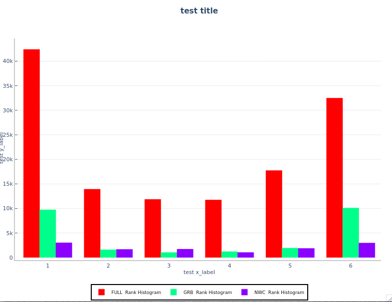
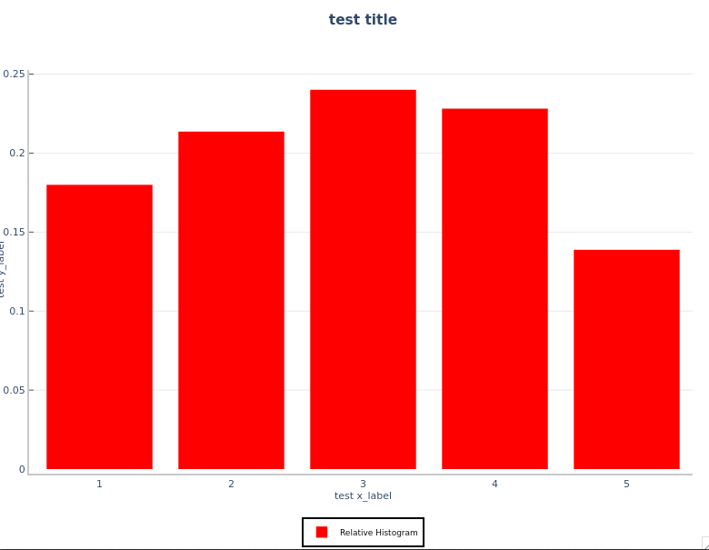
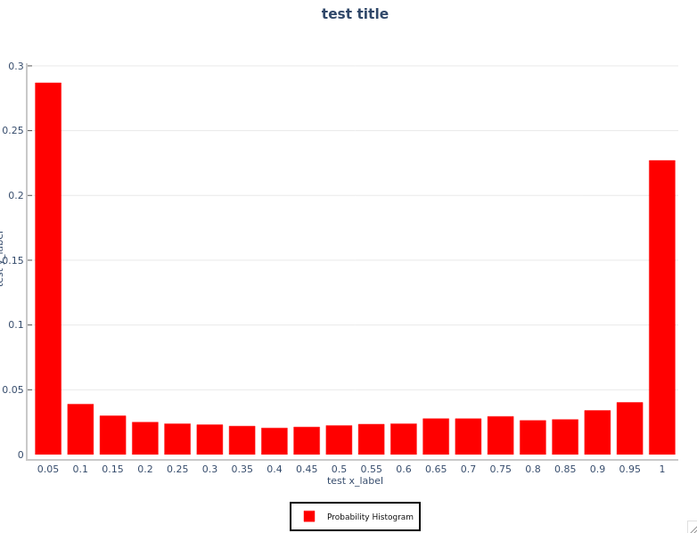
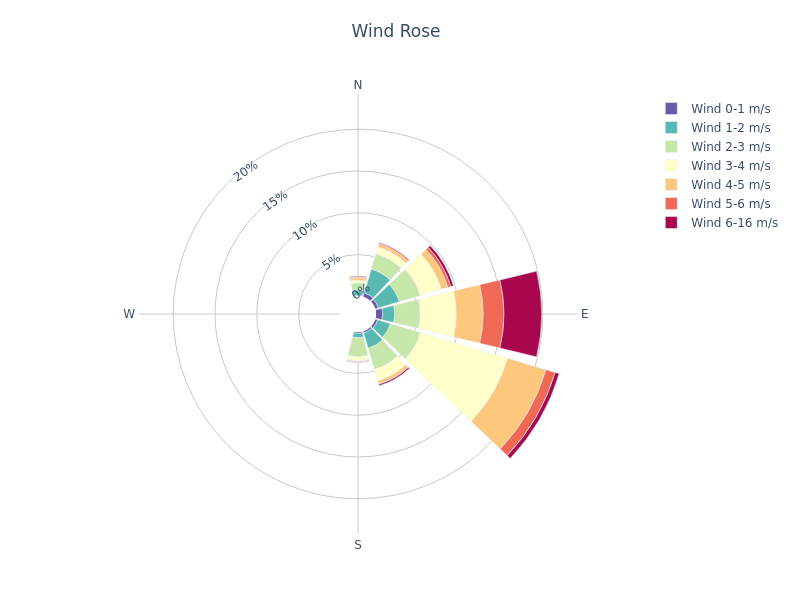
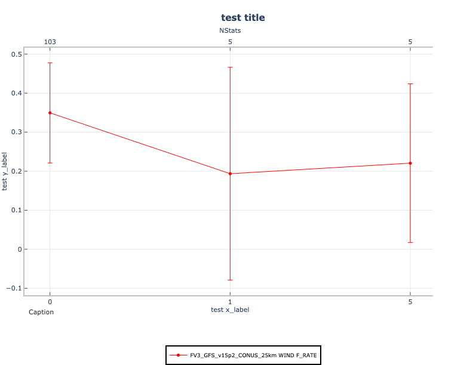

Session 8: METplus Analysis Tools
=================================

Session 8: METplus Analysis Tools

METplus Practical Session 8
---------------------------

This session will cover METplus analysis tools. Click on an item below to get started.

.. important::

   If you discover any typos, error in the run commands, incorrect output listed, or any other issues while completing the tutorial, you are encouraged to submit your findings to the METplus team in a GitHub Discussions. Be sure to provide what session and specific page you encountered the issue on.

METviewer
=========

METviewer

METviewer: General
------------------

METviewer Overview
^^^^^^^^^^^^^^^^^^

METviewer is a database and display system for storing and plotting data from the MET **.stat** and MODE **_obj.txt** files. It is used heavily within the DTC and by NOAA-GSD and NOAA-EMC. While its distribution is limited, it is available to the community through a Docker container. For more information, please see:

* Numerical Weather Prediction (NWP) Containers DTC tutorial to run WPS, GSI, WRF, UPP, MET, and METviewer with containers.
* METviewer Source Code GitHub repository (https://github.com/dtcenter/metviewer)
* METviewer Container GitHub repository (https://github.com/dtcenter/container-dtc-metviewer)

Here, we will use the publicly available version of METviewer running at NCAR to demonstrate the METviewer webapp.

METviewer reads MET verification statistics from a database and creates plots using the R statistical package. The tool includes a web application that can be accessed from a web browser to create a single plot. The specification for each plot is built using a series of controls and then serialized into XML. For each plot, METviewer generates a SQL query, an R script to create the plot, a flat file containing the data that will be plotted and the plot itself.

METviewer Web Application
^^^^^^^^^^^^^^^^^^^^^^^^^

The following example can be run using the METviewer instance located at the link below. It is recommended to move the new tab into a new browser window, so that you can view both the example instructions and the METviewer web application side-by-side.

* METviewer Web App

The following pages have instructions for generating two different types of plots:

* A threshold series plot of Accuracy (ACC) and Critical Success Index (CSI)
* A forecast lead time box plot series of MODE object area distributions

**Please be sure to follow these instructions in order.**

Time Series of Categorical Statistics Plot
==========================================

Time Series of Categorical Statistics Plot

METviewer: Time Series of Categorical Statistics Plot
^^^^^^^^^^^^^^^^^^^^^^^^^^^^^^^^^^^^^^^^^^^^^^^^^^^^^

The following list shows the setting name and the setting value for each of the controls on the web application. Please go through them in order, starting at the top, setting and checking the controls as suggested. The settings that you need to change are marked in **blue**. The settings are grouped according to the areas on the web app. If you need more information about the controls, please click the little **i** in a circle to the right of **METviewer X.Y** at the very top of the page. This will take you to the METviewer documentation.

* Database: Click on the box named Select databases and from the Verification group, select mv_met_tutorial to make a plot with sample tutorial data.
* Tab: Series - Create a time-series (as we will do here) or threshold-series line plot. The different tabs correspond to the types of plots that METviewer can generate, such as box plots, bar plots, histograms, and ensemble plots.
* Plot Data: Stat - Plot traditional statistics as opposed to MODE object attributes.
* Y1 Axis variables - These controls specify the statistics and curves for the Y1 axis of the plot.

Y1 Dependent (Forecast) Variables - pairs of forecast variables and statistics to be plotted

Click the dropdown list and select: APCP_03 to select 3-hourly Accumulated Precipitation
Click Select attribute stat dropdown list and select: ACC and CSI to plot Accuracy and Critical Success Index

Y1 Series Variables - specifies the lines on the plot for each dependent variable

Click the dropdown list and select: MODEL
Click the Select value dropdown list and select: QPF to output the one model present
Next, click the + Series Variable button, click the dropdown list, and select: FCST_THRESH
Click the Select value dropdown list and select: &gt;0.0, &gt;2.54, and &gt;6.35 to plot statistics for 3 categorical thresholds

* Y2 Axis Tab - these controls specify the statistics and curves for the Y2 axis of the plot; it is not used in this demonstration
* Fixed Values - field/value pairs that are held constant for all data on the plot

Click the + Fixed Value button - to add a fixed value selection option
Click the dropdown list and select VX_MASK
Click the Select value dropdown list and select: FULL to plot data for FULL model domain (the only one present in this dataset)

* Independent Variable - the x-axis field and values over which the data are displayed on the plot

Click the dropdown list and select FCST_LEAD
Click the Select value dropdown list and click the Check all option to select all items

* Statistics

The Summary radio button tells MET to plot the mean or median of the statistics pulled directly from the database. 
The Aggregation statistics radio button tells METviewer to aggregate contingency table counts or partial sums and compute aggregate summary statistics and confidence intervals.
Use the default Summary radio button selection

* Series Formatting - settings to control colors, line types, plotting symbols, and confidence intervals

There should be settings for 6 lines: 3 lines for ACC followed by 3 lines for CSI 
In the Line Color column:

Set the 1st and 4th lines to the same RED color
Set the 2nd and 5th lines to the same GREEN color
Set the 3rd and 6th lines to the same BLUE color

In the Line Type column:

Set the 4th, 5th, and 6th lines to dashed

* Plot Formatting - settings that control the appearance of the plot, along with several miscellaneous features

On the Titles &amp; Labels tab

set Plot Title to ACC / CSI vs. Lead Time
set X label to Forecast Lead
set Y1 label to ACC / CSI

On the Common tab, select Display Number of Stats

* Click the Generate Plot button at the top of the page to submit your plot request to the METviewer plotting engine.

Time Series of Categorical Statistics Plot Output
=================================================

Time Series of Categorical Statistics Plot Output

METviewer: Time Series of Categorical Statistics Plot Output
^^^^^^^^^^^^^^^^^^^^^^^^^^^^^^^^^^^^^^^^^^^^^^^^^^^^^^^^^^^^

If you successfully followed the instructions on the previous page, you should see a plot appear in the in the **plot** tab of the METviewer window. Your plot should look like this `**PNG IMAGE** `_. And here is the corresponding plot **XML File**.

Studying the plot shows that the Critical Success Index (CSI) decreases for higher thresholds, as if often the case. This suggests that the forecast models have more skill at lower precipitation thresholds. This contrasts with the story told by the accuracy statistic, which increases as the threshold increases. This can be explained by the simplicity of the accuracy statistic, and the effect that always predicting no event can have for extreme events.

The following section discusses the output that METviewer generates for each plot. Click through the tabs above the METviewer plot to examine each:

* XML Tab: When the Generate Plot button is clicked, the web application serializes the information in the web page controls into an XML document and sends it across the internet to METviewer. This XML document can be used to generate a plot directly from METviewer using the command line interface, also called the batch engine. The batch engine can create many plots from a single XML document, using only small changes. Thus, a good way to use the METviewer web application is to "design" plots and then take the XML for the plot and extend it to create many different plots.

* Log Tab: The METviewer plot engine generates status output as it runs, and this information can be useful for finding problems.

* R script Tab: METviewer uses the R statistics package to generate plots by constructing an R script and running it in R. The R script that is constructed can be saved and modified if the users would like to make changes to the plot that are not supported in METviewer.

* R data Tab: Along with the R script generated by METviewer for the plot, the plot data is stored in a file that is read when the plot is generated in R. This file can be useful for problem solving, since it shows all of the data used in the plot and can be loaded directly into R for analysis.

* SQL Tab: All of the MET verification statistics output is stored in a database, which METviewer searches when it generates a plot. The SQL generated by METviewer to gather the data for a plot can be viewed, in case the user wants to explore or debug using the SQL directly.

Object Based Attribute Area Box Plot
====================================

Object Based Attribute Area Box Plot

METviewer: Object Based Attribute Area Box Plot
^^^^^^^^^^^^^^^^^^^^^^^^^^^^^^^^^^^^^^^^^^^^^^^

For the next plot, you'll try out the XML upload feature. Each plot created by METviewer corresponds to an XML file that defines the plot. In this example, you'll load the XML from a previous plot and regenerate it.

* Right click on this XML file, select the Save Link As option, and save the file to your machine.
* In the METviewer window, click on the Load XML button in the top-right corner.
* In the Upload plot XML file dialog box, click the Browse button, and navigate the location of the XML file.
* Select the XML file, click the Open button, and then the OK button.
* METviewer will now populate all of the selections with those specified in that XML file.
* Lastly, click the Generate Plot button at the top of the page to create the image. Your plot should look like this PNG Image.

This plot shows the area of MODE objects defined for 1-hourly accumulated precipitation thresholded at 0.1 inch. The data has been filtered down to the 00Z initialization and the areas are plotted by lead time. Each lead time has 3 boxplots: **core1** in red, **core2** in blue, and the **observations** in gray. The numbers in black across the top show the number of objects plotted for each lead time.

Note that we have only plotted the observations *once* since they should be the same for both models. Look in the **Series Formatting** section at the bottom of the METviewer webapp in the **Hide** column to see that we're hiding the 4th series titled **core2_hwt APCP_01 AREA_OSA**. Also note that in the **Legend Text** column, we've specified our own strings rather than using the METviewer defaults.

The **XML Upload** feature of METviewer is very powerful and has saved users a lot of time by uploading previous work rather than starting from scratch each time.

Feel free to experiment with METviewer and make additional plots.

End of Practical Session 5
==========================

End of Practical Session 5

End of Practical Session 5
^^^^^^^^^^^^^^^^^^^^^^^^^^

Congratulations! You have completed Session 5!

METplotpy
=========

METplotpy

Histogram
=========

Histogram

Histogram Overview:
-------------------

The histogram source code is located in the https://github.com/dtcenter/METplotpy repository, under the METplotpy/metplotpy/plots/histogram directory.  Custom configuration files and sample data are located under the METplotpy/test/histogram directory.  

There are three specialized histogram plots available:

* Rank Histogram
* Relative Frequency Histogram
* Probability Histogram

Detailed information about these plots is available from Read the Docs:

`https://metplotpy.readthedocs.io/en/latest/Users_Guide/histogram.html `_

These instructions are relevant for generating the rank histogram from the command line.  For METplotpy version 2.0, development was performed with Python 3.8 and related third-party packages (i.e. Python packages outside the Python standard library).  

Each histogram plot requires two configuration files, a default and custom configuration file in YAML (https://yaml.org/).  One default configuration file is used for all three histogram plots: *histogram_defaults.yaml*.  This default configuration file is automatically loaded by the source code.  The custom configuration file is useful for overriding the default settings in the histogram_defaults.yaml configuration file.  If the user chooses to use all the settings in the default configuration file, an empty custom configuration file can be provided (however, the user will have the sample data and output plot located in the specified directories set in the default configuration file- some users may not have permission to do this) .   The custom configuration files and sample data are located in the METplotpy/test/histogram directory of the downloaded/cloned source code.

Set up pre-requisites:
----------------------

The Python requirements for METplotpy are found in the User's Guide, under the `Installation section `_

METcalcpy is a requirement for METplotpy.  The following description is one of numerous methods to set up the working environment to utilize METcalcpy from the METplotpy source code.   These instructions are suitable for users that are not working within a conda environment:

.. note::

   Clone the METcalcpy repository to a directory where you have read/write permissions (replace /path/to/code with the full path to where you are saving the METcalcpy source code):

.. code-block::

   mkdir /path/to/code

.. code-block::

   cd /path/to/code

.. code-block::

   git clone https://github.com/dtcenter/METcalcpy

.. note::

   The following instructions are for users who have permission to create, modify, and use conda environments (skip if you already set the PYTHONPATH above).  Select either Method 1 or Method 2:

* Method 1: Follow instructions in Section 1.1.2 of the Installation section of the METplotpy User's Guide
* Method 2: Using using PyPI (Python Package Index) enter the following:

.. code-block::

   pip install metcalcpy==2.0.1

.. note::

   Clone the METplotpy repository to a directory where you have read/write permissions (replace /path/to/code with the full path to where you are saving the METplotpy source code):

.. code-block::

   cd /path/to/code

.. code-block::

   git clone https://github.com/dtcenter/METplotpy

Create the Rank Histogram plot:
-------------------------------

Overview of steps:
^^^^^^^^^^^^^^^^^^

* .. important::

   create a WORKING_DIR where you have read/write permissions
* .. important::

   set the PYTHONPATH, WORKING_DIR, and METPLOTPY_BASE environments
* .. important::

   copy the histogram data to the WORKING_DIR
* .. important::

   copy the custom configuration for the rank histogram to the WORKING_DIR
* .. important::

   modify the location of the input data and output plot in the custom configuration file
* .. important::

   run the Python script to generate the rank histogram plot

.. note::

   Create the working directory where you have read/write permissions:

.. code-block::

   mkdir -p /path/to/working_dir/histogram

replace /path/to/working_dir with the path leading to the working directory.

 

.. note::

   Set the PYTHONPATH, METPLOTPY_BASE, and WORKING_DIR environment variables. If you used Method 1 above:

**csh:**

.. code-block::

   setenv PYTHONPATH /path/to/METcalcpy:/path/to/METcalcpy/metcalcpy:/path/to/METplotpy:/path/to/METplotpy/metplotpy:/path/to/METplotpy/metplotpy/plots

.. code-block::

   setenv METPLOTPY_BASE /path/to/METplotpy

.. code-block::

   setenv WORKING_DIR  /path/to/working_dir/histogram

**bash:**

.. code-block::

   export PYTHONPATH=/path/to/METcalcpy:/path/to/METcalcpy/metcalcpy:/path/to/METplotpy:/path/to/METplotpy/metplotpy:/path/to/METplotpy/metplotpy/plots

.. code-block::

   export METPLOTPY_BASE=/path/to/METplotpy

.. code-block::

   export WORKING_DIR=/path/to/working_dir/histogram

 

 

.. note::

   If you installed METcalcpy using Method 2 above (i.e. PyPI and pip), then set the PYTHONPATH without the METcalcpy paths:

**csh:**

.. code-block::

   setenv /path/to/METplotpy:/path/to/METplotpy/metplotpy:/path/to/METplotpy/metplotpy/plots

.. code-block::

   setenv METPLOTPY_BASE /path/to/METplotpy

.. code-block::

   setenv WORKING_DIR /path/to/working_dir/histogram

**bash:**

.. code-block::

   export PYTHONPATH=/path/to/METplotpy:/path/to/METplotpy/metplotpy:/path/to/METplotpy/metplotpy/plots

.. code-block::

   export METPLOTPY_BASE=/path/to/METplotpy

.. code-block::

   export WORKING_DIR=/path/to/working_dir/histogram

.. note::

   Copy data and custom config file to WORKING_DIR:

.. code-block::

   cp $METPLOTPY_BASE/test/histogram/rank_hist.data $WORKING_DIR

.. code-block::

   cp $METPLOTPY_BASE/test/histogram/rank_hist.yaml $WORKING_DIR

.. code-block::

   cd $WORKING_DIR

Modify custom configuration file:

.. note::

   Open the rank_hist.yaml file in a text editor of your choice.  Modify the stat_input and plot_filename to point explicitly to the location of the input data you copied and the name and location of the output plot:

.. admonition:: Sample Output

   stat_input: /path/to/working_dir/histogram/rank_hist.data

.. admonition:: Sample Output

   plot_filename: /path/to/working_dir/histogram/rank_hist.png

Save and close the rank_hist.yaml file. 

.. note::

   Generate the rank histogram plot:

.. code-block::

   python $METPLOTPY_BASE/metplotpy/plots/histogram/rank_hist.py $WORKING_DIR/rank_hist.yaml

 

In your WORKING_DIR, you will now see a rank_hist.png file.  You can view the png file using an appropriate viewer, such as 'display' if on a Linux/Unix host:

.. code-block::

   cd $WORKING_DIR

.. code-block::

   display rank_hist.png

 

**Your histogram will look like the following:**

 

 

 

 

 

Create the Relative Frequency Histogram and Probability Histogram
-----------------------------------------------------------------

 

.. note::

   Repeat the steps for the rank histogram, except copy the following to the WORKING_DIR:

**Relative frequency histogram**:

.. code-block::

   cp $METPLOTPY_BASE/test/histogram/rel_hist.data $WORKING_DIR

.. code-block::

   cp $METPLOTPY_BASE/test/histogram/rel_hist.yaml $WORKING_DIR

 

**Probability histogram**:

.. code-block::

   cp $METPLOTPY_BASE/test/histogram/prob_hist.data $WORKING_DIR

.. code-block::

   cp $METPLOTPY_BASE/test/histogram/prob_hist.yaml $WORKING_DIR

 

.. note::

   Make the same modifications in the rel_hist.yaml and prob_hist.yaml files to the stat_input and plot_filename settings.

**Relative frequency histogram**:

.. important::

   stat_input: /path/to/working_dir/histogram/rel_hist.data

.. important::

   plot_filename: /path/to/working_dir/histogram/rel_hist.png

 

**Probability histogram:**

.. admonition:: Sample Output

   stat_input: /path/to/working_dir/histogram/prob_hist.data

.. admonition:: Sample Output

   plot_filename: /path/to/working_dir/histogram/prob_hist.png

 

.. note::

   Generate the Relative Frequency and Probability Histogram plots using these Python scripts:

**Relative frequency histogram:**

.. code-block::

   python $METPLOTPY_BASE/metplotpy/plots/histogram/rel_hist.py $WORKING_DIR/rel_hist.yaml

**Probability histogram:**

.. code-block::

   python $METPLOTPY_BASE/metplotpy/plots/histogram/prob_hist.py $WORKING_DIR/prob_hist.yaml

You will see the rel_hist.png and prob_hist.png files in your WORKING_DIR. Your plots will look like the following:

**Relative Frequency Histogram:**

 

**Probability Histogram:**

 

 

 

 

 

 

Wind Rose
=========

Wind Rose

Wind Rose Overview
------------------

 

The wind rose diagram source code is located in the https://github.com/dtcenter/METplotpy repository, under the METplotpy/metplotpy/plots/wind_rose directory.  Custom configuration files and sample data are located under the METplotpy/test/wind_rose directory.  

Detailed information about the wind rose diagram is available from Read the Docs:

`https://metplotpy.readthedocs.io/en/latest/Users_Guide/wind_rose.html `_

These instructions are relevant for generating the wind rose diagram from the command line.  For METplotpy version 2.0, development was performed with Python 3.8 and related third-party packages (i.e. Python packages outside the Python standard library).  

The wind rose diagram requires **two** configuration files, a *default* and *custom* configuration file in YAML (https://yaml.org/).   The default configuration file is automatically loaded by the source code.  The custom configuration file is useful for overriding the default settings in the wind_rose_defaults.yaml configuration file.  If the user chooses to use all the settings in the default configuration file, an empty custom configuration file can be provided (however, the user will have the sample data and output plot located in the directories specified in the default configuration file.  Some users may not have permission to do this) .  The custom configuration files and sample data are located in the METplotpy/test/wind_rose directory of the downloaded/cloned source code.  The default configuration file, wind_rose_defaults.yml is located in the METplotpy/metplotpy/plots/config directory. 

 

Set up pre-requisites:
----------------------

The Python requirements for METplotpy are found in the User's Guide, under the `Installation section `_

METcalcpy is a requirement for METplotpy.  The following description is one of numerous methods to set up the working environment to utilize METcalcpy from the METplotpy source code.   These instructions are suitable for users that are not working within a conda environment:

.. note::

   Clone the METcalcpy repository to a directory where you have read/write permissions (replace /path/to/code with the full path to where you are saving the METcalcpy source code):

.. code-block::

   mkdir /path/to/code

.. code-block::

   cd /path/to/code

.. code-block::

   git clone https://github.com/dtcenter/METcalcpy

 

.. note::

   The following instructions are for users who have permission to create, modify, and use conda environments (skip if you already set the PYTHONPATH above).  Select either Method 1 or Method 2:

* Method 1: Follow instructions in Section 1.1.2 of the Installation section of the METplotpy User's Guide
* Method 2: Using using PyPI (Python Package Index) enter the following:

.. code-block::

   pip install metcalcpy==2.0.1

 

.. note::

   Clone the METplotpy repository to a directory where you have read/write permissions (replace /path/to/code with the full path to where you are saving the METplotpy source code):

.. code-block::

   cd /path/to/code

.. code-block::

   git clone https://github.com/dtcenter/METplotpy

Create the Wind Rose diagram:
-----------------------------

Overview of steps:
^^^^^^^^^^^^^^^^^^

* .. important::

   create a WORKING_DIR where you have read/write permissions
* .. important::

   set the PYTHONPATH, WORKING_DIR, and METPLOTPY_BASE environments
* .. important::

   copy the wind rose sample data to the WORKING_DIR
* .. important::

   copy the wind rose custom configuration file to the WORKING_DIR
* .. important::

   modify the location of the input data and output plot in the custom configuration file
* .. important::

   run the Python script to generate the wind rose diagram

 

.. note::

   Create the working directory where you have read/write permissions:

.. code-block::

   mkdir -p /path/to/working_dir/wind_rose

Replace */path/to/working_dir* with the full path to the working directory.

 

.. note::

   Set the PYTHONPATH, METPLOTPY_BASE, and WORKING_DIR environment variables. If you used Method 1 above:

**csh:**

.. code-block::

   setenv PYTHONPATH /path/to/METcalcpy:/path/to/METcalcpy/metcalcpy:/path/to/METplotpy:/path/to/METplotpy/metplotpy:/path/to/METplotpy/metplotpy/plots

.. code-block::

   setenv METPLOTPY_BASE/path/to/METplotpy

.. code-block::

   setenv WORKING_DIR /path/to/working_dir/wind_rose

**bash:**

.. code-block::

   export PYTHONPATH=/path/to/METcalcpy:/path/to/METcalcpy/metcalcpy:/path/to/METplotpy:/path/to/METplotpy/metplotpy:/path/to/METplotpy/metplotpy/plots

.. code-block::

   export METPLOTPY_BASE=/path/to/METplotpy

.. code-block::

   export WORKING_DIR=/path/to/working_dir

 

.. note::

   If you installed METcalcpy using Method 2 above (i.e. PyPI and pip), then set the PYTHONPATH without the METcalcpy paths:

**csh:**

.. code-block::

   setenv PYTHONPATH /path/to/METplotpy:/path/to/METplotpy/metplotpy:/path/to/METplotpy/metplotpy/plots

.. code-block::

   setenv METPLOTPY_BASE /path/to/METplotpy

.. code-block::

   setenv WORKING_DIR /path/to/working_dir/wind_rose

**bash:**

.. code-block::

   export PYTHONPATH=/path/to/METplotpy:/path/to/METplotpy/metplotpy:/path/to/METplotpy/metplotpy/plots

.. code-block::

   export METPLOTPY_BASE=/path/to/METplotpy

.. code-block::

   export WORKING_DIR=/path/to/working_dir/wind_rose

.. note::

   Copy data and custom config file to WORKING_DIR:

.. code-block::

   cp $METPLOTPY_BASE/test/wind_rose/point_stat_mpr.txt $WORKING_DIR

.. code-block::

   cp $METPLOTPY_BASE/test/wind_rose/wind_rose_custom.yaml $WORKING_DIR

.. code-block::

   cd $WORKING_DIR

 

Modify the custom configuration file:

.. note::

   Open the wind_rose_custom.yaml file in a text editor of your choice.  Modify the stat_input and plot_filename to point explicitly to the location of the input data you copied and the name and location of the output plot:

.. admonition:: Sample Output

   stat_input: /path/to/working_dir/wind_rose/point_stats_mpr.txt

.. admonition:: Sample Output

   plot_filename: /path/to/working_dir/wind_rose/wind_rose_custom.png

Save and close the wind_rose_custom.yaml file. 

.. note::

   Generate the wind rose diagram:

.. code-block::

   python $METPLOTPY_BASE/metplotpy/plots/wind_rose/wind_rose.py $WORKING_DIR/wind_rose_custom.yaml

 

.. note::

   In your WORKING_DIR, you will now see a wind_rose_custom.png file.  You can view the png file using an appropriate viewer, such as 'display' if on a Linux/Unix host:

.. code-block::

   cd $WORKING_DIR

.. code-block::

   display wind_rose_custom.png

 

**Your wind rose diagram will look like the following:**

METdataio
=========

METdataio

METreformat Overview:
---------------------

The METreformat Python package was developed to assist in the generation of METplotpy line plots using MET Point-Stat .stat files. METreformat is located in the `METdataio repository `_ and utilizes the METdbLoad package for reading Point-Stat files.

The initial versions of the METviewer tool read MET verification statistics output from a database and created plots using R script for statistics and plotting. METplotpy and METcalcpy Python packages were developed to remove the dependency on R for plotting and statistics. METviewer now utilizes METplotpy Python scripts. The METplotpy plots that are available in METviewer are located in the `/metplotpy/plots `_ directory of the METplotpy repository. The METplotpy repository also hosts contributed plots that are not available through the METviewer tool. These plots are located in a different directory in the METplotpy repository.

METviewer generates plots based on the database "view" of the input data. Reformatting the MET Point-Stat **.stat** files into the same format used by METviewer bypasses the need for METviewer and its database. For additional information about METviewer, please refer to the `METviewer User's Guide `_.

The MET Point-Stat data consists of numerous columns with each statistic represented by a column. The various normal and bootstrap confidence limits are each represented by corresponding columns. Upon inspection of a Point-Stat .stat file, there are numerous columns, many of which may be lacking a column label. For additional information about the line types in MET Point-Stat, please refer to all of the **tables** in the `MET User's Guide for Point-Stat `_.

The METviewer database "view" consists of individual statistics that are collected into the **stat_name** and the **stat_value** columns. The normal and bootstrap confidence levels are collected into one of four columns:

* stat_ncl
* stat_ncu
* stat_bcl
* stat_bcu

The METreformat package replicates this format.

Generic instructions for reformatting a sample MET Point-Stat .stat file are available on Read the Docs: `METdataio User's Guide `_.

The Point-Stat line types that are currently supported in METreformat are as follows:

* FHO
* CNT
* CTS
* CTC
* SL1L2

*Support for additional line types will be added in the future.*

METreformat Components:
-----------------------

The METreformat package utilizes the METdataio METdbLoad package to read .stat files, label columns, and create an intermediate data structure (pandas dataframe). The METreformat package uses this data structure to reformat the data into a single file.

The reformatting requires a** yaml** configuration file and an **xml** specification file (from METdbLoad). The xml specification file is used to define the paths to the input data and the type of MET output (i.e. Point-Stat, Grid-Stat, MODE, Stat-Analysis, and Wavelet-Stat). The yaml configuration file indicates the location of the xml specification file and the name and location of the output file.

Example of running METreformat
------------------------------

Set up the prerequisites:
^^^^^^^^^^^^^^^^^^^^^^^^^

Set up the environment by following the `instructions for METplus initial set up `_. Make sure to follow the relevant instructions for **either** the **Pre-configured Environments** or **User Configured Environments, **based on your host computer. Finish by following the **Verify Environment Is Set Correctly **instructions.

The Python requirements for METdataio are:

* Python 3.8.6 or above
* pymysql (not needed for this tutorial)
* pandas (1.5 or above)
* numpy (1.22 or above)
* pyyaml
* lxml

 

Make sure you have activated the conda environment for METdataio if you are working on your own host or on host 'seneca':

https://dtcenter.org/metplus-practical-session-guide-version-5-0/session-1-metplus-setupgrid-grid/metplus-setup/metplus-initial-setup/setting-tutorial-environment-seneca

 

Please refer to the `METdataio User's Guide `_ for more information on METdataio.

.. note::

   Clone the METdataio repository to a local directory:

.. code-block::

   mkdir -p ${METPLUS_TUTORIAL_DIR}/metdataio
   cd ${METPLUS_TUTORIAL_DIR}/metdataio
   git clone https://github.com/dtcenter/METdataio

Reformat MET Point-Stat .stat files
^^^^^^^^^^^^^^^^^^^^^^^^^^^^^^^^^^^

An overview of the steps for running this example are:

* Set the PYTHONPATH and METDATAIO_BASE environments
* Copy the yaml configuration and xml specification file to the user_config directory
* Modify the yaml configuration and xml specification files in the user_config directory
* Run the Python script to reformat the sample data

.. note::

   Set the METDATAIO_BASE and PYTHONPATH environment variables, using only the commands appropriate to your environment.

 

Work in bash shell, at the command line, enter the following:

 

.. code-block::

   bash

 

**bash:**

.. code-block::

   export METDATAIO_BASE=${METPLUS_TUTORIAL_DIR}/metdataio/METdataio

.. code-block::

   export PYTHONPATH=$METDATAIO_BASE:$METDATAIO_BASE/METdbLoad:$METDATAIO_BASE/METdbLoad/ush

.. note::

   Copy the yaml configuration and xml specification files to the new directory:

.. code-block::

   mkdir -p ${METPLUS_TUTORIAL_DIR}/metdataio/user_config
   cp $METDATAIO_BASE/METreformat/point_stat.yaml ${METPLUS_TUTORIAL_DIR}/metdataio/user_config
   cp $METDATAIO_BASE/METreformat/point_stat.xml ${METPLUS_TUTORIAL_DIR}/metdataio/user_config

Next, we need to modify the **point_stat.xml** file to include the correct directory path to the input data. In order to do this, we need to obtain a full path to where the input data is, copy it, and paste that path inside the .xml file.

.. important::

   NOTE: You cannot use environment values to pass in the input data path, you must use the full path.

.. note::

   To get the full path to the METPLUS_DATA environment variable, enter the following on the command line:

.. code-block::

   echo $METPLUS_DATA

That command should return a path similar to the following example:

.. admonition:: Sample Output

   /d1/projects/METplus/METplus_Data.v5.0

.. note::

   Using the appropriate keyboard shortcuts and/or mouse click options for your operating system, copy this path into computer memory. (So for windows, this would be a ctrl+C and on a Mac this would be cmd+C.)

Alternatively, you can open a text file and copy and paste the directory path into the text file for easy use.

.. note::

   Now, modify point_stat.xml, using the output from the echo command to fill the path to the Point-Stat data. Be sure to add met_reformat/point_stat path at the end:

.. code-block::

   vi ${METPLUS_TUTORIAL_DIR}/metdataio/user_config/point_stat.xml

.. admonition:: Sample Output

   &lt;load_spec&gt;
           &lt;folder_tmpl&gt;/d1/projects/METplus/METplus_Data.v5.0/met_reformat/point_stat&lt;/folder_tmpl&gt;
           &lt;verbose&gt;true&lt;/verbose&gt;
           &lt;load_val&gt;
                   &lt;field name="met_tool"&gt;
                           &lt;val&gt;point_stat&lt;/val&gt;
                   &lt;/field&gt;
           &lt;/load_val&gt;
           &lt;description&gt;MET output &lt;/description&gt;
   &lt;/load_spec&gt;

All we have done in the file is replace the content between the   with the full path to the data, complete with the **met_reformat/point_stat** subdirectories.

.. note::

   Save your changes and close the file.

Now we need to modify the **point_stat.yaml** file in a similar way to the **point_stat.xml** file. In order to do this, we need to obtain a full path to the **$METPLUS_TUTORIAL_DIR**, copy it, and paste that path inside the .yaml file in multiple areas.

.. important::

   NOTE: You cannot use environment variables to pass directory paths, you must use the full path.

.. note::

   To get the full path to the METPLUS_TUTORIAL_DIR environment variable, enter the following on the command line:

.. code-block::

   echo $METPLUS_TUTORIAL_DIR

That command should return a path similar to the following example:

.. admonition:: Sample Output

   /d1/personal/user/METplus-5.0.0_Tutorial

.. note::

   Using the appropriate keyboard shortcuts and/or mouse click options for your software version, copy this path into computer memory. (So for windows, this would be a ctrl+C or on a Mac this would be would be cmd+C.)

.. note::

   Modify the yaml configuration file in the $METPLUS_TUTORIAL_DIR/metdataio/user_config directory with the following updates:

.. code-block::

   vi ${METPLUS_TUTORIAL_DIR}/metdataio/user_config/point_stat.yaml

.. admonition:: Sample Output

   output_dir: /d1/personal/user/METplus-5.0.0_Tutorial/metdataio
       output_filename: point_stat_reformatted.txt
       xml_spec_file: /d1/personal/user/METplus-5.0.0_Tutorial/metdataio/user_config/point_stat.xml

In the above example, the **output_dir** entry of **/path/to/output_dir** was replaced with the full path of the **METPLUS_TUTORIAL_DIR/metdataio**. The **xml_spec_file** entry replaced **/path/to/xml_file** with the full path of the **METPLUS_TUTORIAL_DIR/metdataio/user_config** along with the **point_stat file name. NOTE: make sure you have one space between the colon (:) and your settings.**

.. note::

   Save your changes and close the file.

We are now ready to generate the reformatted file from the sample Point-Stat files in the **METPLUS_DATA/met_reformat/point_stat** directory. To understand how the file changes, we will look at a .stat file that has not been reformatted.

.. note::

   Open one of the .stat files

.. code-block::

   vi $METPLUS_DATA/met_reformat/point_stat/point_stat_FV3_GFS_v15p2_CONUS_25km_NDAS_ADPSFC_010000L_20190615_010000V.stat

Observe how there are numerous columns of data, some of which are lacking descriptive names (i.e. 'MODEL', 'FCST_LEV', etc.). This can be a confusing file to read for users that are unfamiliar with .stat file layouts.

.. note::

   Close the file by entering the following:

.. code-block::

   :q!

.. note::

   From any directory, run the following from the command line:

.. code-block::

   python $METDATAIO_BASE/METreformat/write_stat_ascii.py ${METPLUS_TUTORIAL_DIR}/metdataio/user_config/point_stat.yaml

The following will be sent to the terminal and are generated by METdbLoad (the warning message can be safely ignored):

.. admonition:: Sample Output

   WARNING:root:!!! ALPHA line_type has ALPHA value of NA:
    51      VCNT
   150     VCNT
   244     VCNT
   518     VCNT
   525     VCNT
   532     VCNT
   539     VCNT
   546     VCNT
   553     VCNT
   560     VCNT
   567     VCNT
   574     VCNT
   581     VCNT
   588     VCNT
   595     VCNT
   602     VCNT
   609     VCNT
   1238    VCNT
   1245    VCNT
   1252    VCNT
   1259    VCNT
   1266    VCNT
   1273    VCNT
   1280    VCNT
   1287    VCNT
   1294    VCNT
   1301    VCNT
   1308    VCNT
   1723    VCNT
   1822    VCNT
   1921    VCNT
   2015    VCNT
   Name: line_type, dtype: object

A text file will be created in the **$METPLUS_TUTORIAL_DIR/metdataio** directory named **point_stat_reformatted.txt** (as specified in the **point_stat.yaml **config file).

.. note::

   Open the point_stat_reformatted.txt file.

.. code-block::

   vi ${METPLUS_TUTORIAL_DIR}/metdataio/point_stat_reformatted.txt

You will notice that the data has been reformatted where the statistics are now under stat_name and stat_value, and the presence of the stat_bcl, stat_bcu, stat_ncl, and stat_ncu columns. All columns have names.

.. note::

   Close the file.

Generate a METplotpy line plot
------------------------------

METplotpy Set Up Prerequisites:
^^^^^^^^^^^^^^^^^^^^^^^^^^^^^^^

The Python requirements for METplotpy are found in the User's Guide, under the `Installation section `_.

If you are working on a host that does not have the necessary Python packages installed, create your own conda environment using the instructions provided by the `Seneca host instructions `_ as guidance.

Continue working in the bash shell.

METcalcpy is a requirement for METplotpy. The following description is one of numerous methods to set up the working environment to utilize METcalcpy from the METplotpy source code. These instructions are suitable for users that are not working within a conda environment:

.. note::

   Clone the METcalcpy repository to a local directory:

.. code-block::

   mkdir -p ${METPLUS_TUTORIAL_DIR}/metcalcpy
   cd ${METPLUS_TUTORIAL_DIR}/metcalcpy
   git clone https://github.com/dtcenter/METcalcpy

.. note::

   If you have access to conda environments, select one of the two following methods to install METplotpy:

* Method 1: Follow instructions in the Installation section of the METplotpy User's Guide: Install METcalcpy in the conda environment.
* Method 2: Using using PyPI (Python Package Index) enter the following:

.. code-block::

   pip install metcalcpy==2.0.1

.. note::

   Clone the METplotpy repository to a local directory:

.. code-block::

   mkdir -p ${METPLUS_TUTORIAL_DIR}/metplotpy
   cd ${METPLUS_TUTORIAL_DIR}/metplotpy
   git clone https://github.com/dtcenter/METplotpy

An overview of the steps for creating this plot are:

* Set the PYTHONPATH and METPLOTPY_BASE environments
* Copy the yaml configuration file to the user_config directory
* Modify the yaml configuration file in the user_config directory
* Run the Python script to create a line plot

Set the PYTHONPATH and METPLOTPY_BASE environment variables
^^^^^^^^^^^^^^^^^^^^^^^^^^^^^^^^^^^^^^^^^^^^^^^^^^^^^^^^^^^

For this step, you'll need to choose the appropriate command depending on how you installed METcalcpy. Read both blue instruction blocks, and proceed with the one relevant to you.

.. note::

   If you used Method 1 above:

 

**bash:**

.. code-block::

   export METPLOTPY_BASE=${METPLUS_TUTORIAL_DIR}/metplotpy/METplotpy

.. code-block::

   export METCALCPY_BASE=${METPLUS_TUTORIAL_DIR}/metcalcpy/METcalcpy

.. code-block::

   export PYTHONPATH=$METCALCPY_BASE:$METCALCPY_BASE/metcalcpy:$METPLOTPY_BASE:$METPLOTPY_BASE/metplotpy:$METPLOTPY_BASE/metplotpy/plots

.. note::

   If you installed METcalcpy using Method 2 above (i.e. PyPI and pip), then set the PYTHONPATH without the METcalcpy paths:

 

**bash:**

.. code-block::

   export METPLOTPY_BASE=${METPLUS_TUTORIAL_DIR}/metplotpy/METplotpy

.. code-block::

   export PYTHONPATH=$METPLOTPY_BASE:$METPLOTPY_BASE/metplotpy:$METPLOTPY_BASE/metplotpy/plots

Copy custom config file to user_config
^^^^^^^^^^^^^^^^^^^^^^^^^^^^^^^^^^^^^^

To get this started, we need to create a **user_config** directory.

.. note::

   Create a new user_config directory by entering the following command:

.. code-block::

   mkdir -p ${METPLUS_TUTORIAL_DIR}/metplotpy/user_config

.. note::

   Now copy the .yaml file to the user_config directory.

.. code-block::

   cp $METPLOTPY_BASE/test/line/custom_line.yaml ${METPLUS_TUTORIAL_DIR}/metplotpy/user_config

Modify the custom configuration file
^^^^^^^^^^^^^^^^^^^^^^^^^^^^^^^^^^^^

.. note::

   Change directory to the user_config directory.

.. code-block::

   cd ${METPLUS_TUTORIAL_DIR}/metplotpy/user_config

We will need to modify the output directory in the file with a full path to where we curerntly are, **${METPLUS_TUTORIAL_DIR}/metplotpy/user_config**. In order to do this, we need to copy the full path, and paste that path inside the .yaml file.

.. important::

   NOTE: You cannot use environment variables to pass directory paths, you must use the full path.

.. note::

   To get the full path to the current location, enter the following on the command line:

.. code-block::

   pwd

That command should return a path similar to the following example:

.. admonition:: Sample Output

   /d1/personal/user/METplus-5.0.0_Tutorial/metplotpy/user_config

.. note::

   Using the appropriate keyboard shortcuts and/or mouse click options for your software version, copy this path into computer memory. (So for windows, this would be a ctrl+C on on a Mac this would be cmd+C.)

.. important::

   The sample data only contains one model, therefore only one line can be created on the line plot. Many of the following file edits will reflect this.

.. note::

   Open the custom_line.yaml file.

.. code-block::

   vi ${METPLUS_TUTORIAL_DIR}/metplotpy/user_config/custom_line.yaml

.. note::

   Use the first color in the list and delete the rest.

.. admonition:: Sample Output

   colors:
   - '#ff0000'
   con_series:

The above change will produce a red line on the final graph.

.. note::

   Set up the series ordering (con_series) by removing four settings, leaving only one setting:

.. admonition:: Sample Output

   con_series:
   - 1
   create_html: 'False'

.. note::

   Comment out the derived_series_1 and derived_series2 by placing a # at the beginning of the line.

.. admonition:: Sample Output

   #derived_series_1:
   #- - CONTROL RH MAE
   # - GTS RH MAE
   # - DIFF
   #derived_series_2: []

.. note::

   Set event_equal to 'False'.

.. admonition:: Sample Output

   event_equal: 'False'

There is only one model in the sample data and event equalization is not needed.

.. note::

   Edit the fcst variable fcst_var_val_1 from RH to WIND, and statistic MAE to F_RATE.

.. admonition:: Sample Output

   fcst_var_val_1:
   WIND:
   - F_RATE

.. note::

   Comment out the fcst_var_val_2 and its settings by placing a # at the beginning of the line.

.. admonition:: Sample Output

   #fcst_var_val_2:
   # TMP:
   # - ME

.. note::

   Edit the fcst_level (fcst_lev_0) under the fixed_vars_vals_input setting from Z02 to Z10.

.. admonition:: Sample Output

   fixed_vars_vals_input:
      fcst_lev:
        fcst_lev_0:
         - Z10

.. note::

   Change the indy_labels to '0', '1', and '5':

.. admonition:: Sample Output

   indy_label:
   - '0'
   - '1'
   - '5'

.. note::

   Change the indy_vals values to '0', '10000', and '50000' to plot the 0, 10000, and 50000 fcst lead points.

.. admonition:: Sample Output

   indy_vals:
   - '0'
   - '10000'
   - '50000'

 

.. note::

   Change the list_stat_1 statistics value from MAE to F_RATE and remove the -ME from the list_stat_2 setting.

.. admonition:: Sample Output

   list_stat_1:
   - F_RATE
   list_stat_2:
   list_static_val:

 

.. note::

   Under the plot_ci setting, keep only one of the -std values and delete the remaining four.

.. admonition:: Sample Output

   plot_ci:
   - std
   plot_disp:

 

.. note::

   Remove four of the - 'True' entries under the plot_ci so only one value of - 'True' remains.

.. admonition:: Sample Output

   plot_disp:
   - 'True'
   plot_filename: ./line.png

 

.. note::

   Set the path to the output plot file, replacing path-to with the path that was copied prior to editing this file:

.. admonition:: Sample Output

   plot_filename: /d1/personal/user/METplus-5.0.0_Tutorial/metplotpy/user_config/line.png

 

.. note::

   Remove four of the values under each of the following entries series_line_style, keeping only one:

.. admonition:: Sample Output

   series_line_style:
   - '-'
   series_line_width:
   - 1
   series_order:
   - 1
   series_symbols:
   - .
   series_type:
   - b
   series_val_1:

.. note::

   Change the model setting under series_val_1 to FV3_GFS_v15p2_CONUS_25km and comment out the settings for series_val_2 (or remove them).

.. admonition:: Sample Output

   series_val_1:
   model:
   - FV3_GFS_v15p2_CONUS_25km
   #series_val_2:
   # model:
   # - CONTROL
   # - GTS

.. note::

   Remove four of the settings under show_signif, keeping one setting:

.. admonition:: Sample Output

   show_signif:
   - 'False'
   stat_input: ./line.data

.. note::

   Modify the stat_input setting.  This is the name of the reformatted file. Replace path-to with the full path to the METplus-5.0.0_Tutorial (working) directory. Do NOT use environment variables, use actual paths.

.. admonition:: Sample Output

   stat_input: path-to/METplus-5.0.0_Tutorial/metdataio/point_stat_reformatted.txt

 

.. note::

   Comment out or remove the lines settings at the end of the config file.

.. admonition:: Sample Output

   #lines:
   #- color:
   '#8000ff'
   # line_width: '2'
   # position: '11'
   # type: horiz_line
   # line_style: '--'
   #- line_style: '-'
   # color: '#000000'
   # line_width: 1
   # position: "18"
   # type: vert_line

 

.. note::

   Save and close the custom_line.yaml file.

Generate the line plot:
^^^^^^^^^^^^^^^^^^^^^^^

.. note::

   From any directory, enter the following from the command line:

.. code-block::

   python $METPLOTPY_BASE/metplotpy/plots/line/line.py $METPLUS_TUTORIAL_DIR/metplotpy/user_config/custom_line.yaml

 

.. note::

   In your $METPLUS_TUTORIAL_DIR/output directory, you will now see a line.png file.  You can view the png file using an appropriate viewer, such as 'display' if on a Linux/Unix host:

.. code-block::

   cd $METPLUS_TUTORIAL_DIR/metplotpy/user_config

.. code-block::

   display line.png

 

**Your line plot will look like the following:**

 

End of Session 8
================

End of Session 8

End of Session 8
----------------

Congratulations! You have completed Session 8!

