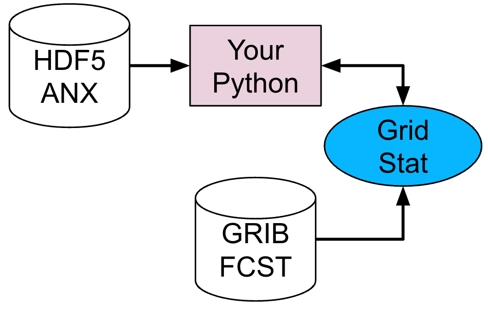
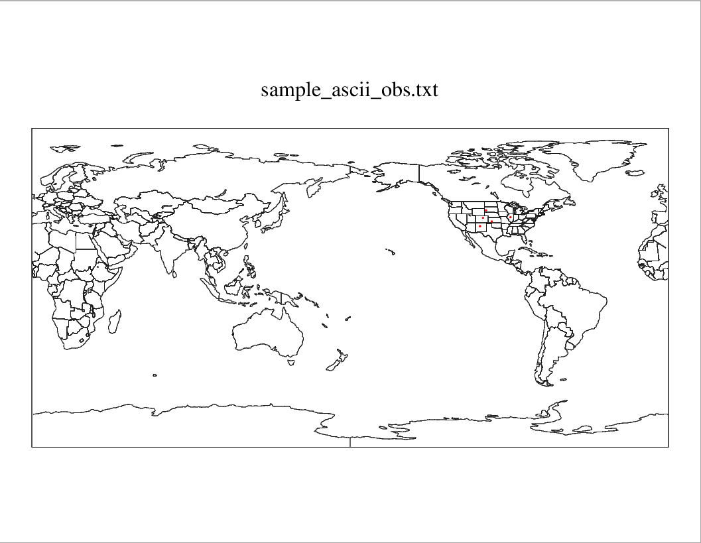
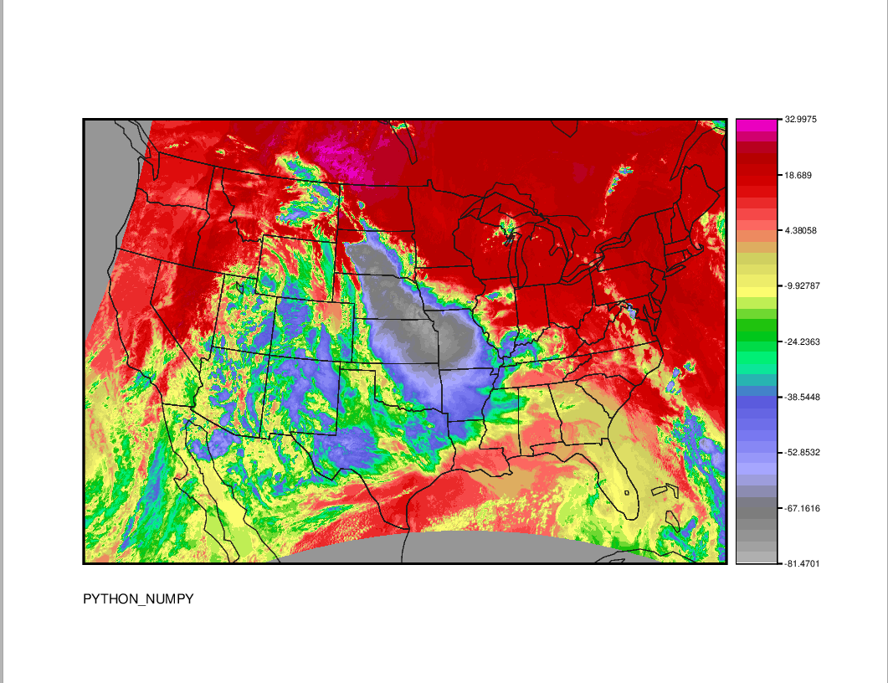

Session 9: Python Embedding
===========================

**METplus Practical Session 9**

**IN THIS SESSION, USERS WILL LEARN**

1. What Python Embedding is
2. How Python Embedding works for both point and gridded data with MET tools
3. How to construct a Python script for Python Embedding
4. How to use your Python script with MET tools
5. How to use your Python script with METplus Wrappers

**WHAT IS PYTHON EMBEDDING?**

Put simply, Python Embedding is a way to allow users to write their own Python scripts which can be integrated into workflows that use MET tools and METplus Wrappers. The primary ways that Python Embedding is leveraged by MET users are reading data from a format that MET tools do not support, and deriving intermediate fields within a workflow that cannot be calculated by MET tools. A simplified workflow using the MET Grid-Stat tool with Python Embedding is shown below:

In this example, the user has a gridded analysis dataset in an HDF-5 file format ("HDF5 ANX") and a gridded forecast dataset in GRIB format ("GRIB FCST"). Grid-Stat has support to read the GRIB forecast data, but cannot read the HDF-5 data. Therefore, the user writes a Python script to open the HDF-5 file and prepare it for Grid-Stat. When Grid-Stat runs, the Python script is called and the data is handed off from the users' Python script directly to Grid-Stat in memory without writing a physical output file. There are cases when MET will write a physical file, which will be covered in the next chapter of this session along with other details of Python Embedding.

.. important::

   If you discover any typos, error in the run commands, incorrect output listed, or any other issues while completing the tutorial, you are encouraged to submit your findings to the METplus team in a GitHub Discussions. Be sure to provide what session and specific page you encountered the issue on.

Python Embedding Overview
-------------------------

General MET Python Embedding Elements
^^^^^^^^^^^^^^^^^^^^^^^^^^^^^^^^^^^^^

The MET tools support Python Embedding for both 2D planes of gridded data and point data. Both gridded data and point data have some specific requirements which are covered below. More generally, Python Embedding can be broken down into **three key elements** that are required by MET tools.

The first is a **Python installation** that is used by the MET tools when Python Embedding is requested. When MET is installed, the **--enable-python** compile flag must be used, which requires a local Python installation. After the MET tools are installed, the version of Python provided with the **--enable-python** compile flag is the version of Python that will be used by default when a user requests Python Embedding. Any Python packages installed in the version of Python that MET was compiled against are available to a user when using Python Embedding.

The second element of Python embedding is a **Python Embedding Keyword**. These keywords are used to instruct the MET tools that Python Embedding is being requested:

.. important::

   PYTHON_NUMPY is used when passing 2D planes of data in a NumPy N-dimensional array object, or when using point data
   PYTHON_XARRAY is used when passing 2D planes of data in an Xarray DataArray object only

The third element of Python embedding is the **absolute path to your Python script** along with any command line arguments that the script requires. These three elements enable the user to invoke Python Embedding within the MET tools.

Details for Python Embedding Scripts with 2D Gridded Data
"""""""""""""""""""""""""""""""""""""""""""""""""""""""""

In your Python Embedding script, be sure to adhere to the following requirements:

1. Your variable containing the 2D dataplane of gridded data must be named met_data. This applies to both NumPy N-dimensional array objects (for PYTHON_NUMPY), and Xarray DataArray objects (for PYTHON_XARRAY).
2. For PYTHON_NUMPY, you must define a Python variable that is a dictionary named attrs in your script that contains the following keys and their respective values :

valid
init
lead
accum
name
long_name
level
units
grid

12. For PYTHON_XARRAY, your Xarray DataArray must have a dictionary of attributes attached to it (accessible via the .attrs method of the DataArray object), and the keys must match the keys listed about for PYTHON_NUMPY.

.. important::

   In a later section, the demonstration of writing your own Python Embedding script will go into more details of constructing the required attributes.

Details for Python Embedding Scripts with Point Data
""""""""""""""""""""""""""""""""""""""""""""""""""""

In your Python Embedding script, be sure to adhere to the following requirements:

1. If you are using Python Embedding with ascii2nc, your data must be in a nested list (i.e. "list of lists") representation of the MET 11-column point data format where each list is one of the 11 columns. The fastest way to achieve this is to use the Python package Pandas, and use the method to_list() on the Pandas DataFrame object. Additionally, the nested list variable must be named point_data.
2. If you are using Python Embedding with other MET tools for point data such as plot_point_obs, point_stat, ensemble_stat, or point2grid, you must provide the point data in a special format that can be created from the MET 11-column format. This can be accomplished by creating a nested list (i.e. "list of lists") of the MET 11-column point data format and then using the helper Python function called convert_point_data(), which can be found in the met_point_obs class in ${MET_BUILD_BASE}/scripts/python/met_point_obs.py. Additionally, the variable that is returned from convert_point_data() must be named met_point_data which differs from using ascii2nc.

.. important::

   In the example for Python Embedding with point data later in this session, plot_point_obs is used. By inspecting the Python Embedding script used in that example, the details described above may become clearer.

Advanced Python Requirements
^^^^^^^^^^^^^^^^^^^^^^^^^^^^

In some cases, a user may require one or more Python packages that are not installed in the version of Python that was used when installing the MET tools. In this case, the user can set a special environment variable called **MET_PYTHON_EXE**, which contains the relative path to the "/bin" directory where the Python executable is that contains the Python packages the user requires.

.. important::

   NOTE: using MET_PYTHON_EXE will force MET to write data files to a temporary area and then read them in again, instead of receiving data directly from within memory. This may negatively effect (increase) workflow run time. In some cases this cannot be avoided (i.e. multiple users sharing a single MET installation), and allows users maximum accessibility to the Python ecosystem, but users should be aware it could increase run time.

Setup for Python Embedding Practice
^^^^^^^^^^^^^^^^^^^^^^^^^^^^^^^^^^^

In the next two sections, you will practice using Python Embedding for both gridded and point data using MET tools directly and also via METplus Wrappers. To prepare for those sections, please follow the setup instructions below:

.. note::

   In your tutorial directory, make a new directory to hold Python scripts that you will use to demonstrate Python Embedding:

.. code-block::

   mkdir ${METPLUS_TUTORIAL_DIR}/python_embed

.. note::

   Change to the directory you just created:

.. code-block::

   cd ${METPLUS_TUTORIAL_DIR}/python_embed

.. note::

   Copy and rename the read_ascii_numpy.py example script included with the MET software to your directory:

.. code-block::

   cp ${MET_BUILD_BASE}/share/met/python/read_ascii_numpy.py ./my_gridded_pyembed.py

.. note::

   Copy and rename the read_ascii_point.py example script included with the MET software to your directory:

.. code-block::

   cp ${MET_BUILD_BASE}/share/met/python/read_ascii_point.py ./my_point_pyembed.py

.. note::

   Set your PYTHONPATH variable to include a required Python module to demonstrate Python Embedding with point data:

csh:

.. code-block::

   setenv PYTHONPATH ${MET_BUILD_BASE}/share/met/python:${PYTHONPATH}

bash:

.. code-block::

   export PYTHONPATH=${MET_BUILD_BASE}/share/met/python:${PYTHONPATH}

.. important::

   You are now prepared to practice Python Embedding! Proceed to the next section to get started.

Python Embedding for Gridded Data
---------------------------------

Simple Gridded Data Example with MET Tools
^^^^^^^^^^^^^^^^^^^^^^^^^^^^^^^^^^^^^^^^^^

To demonstrate how to use Python Embedding for gridded data, you will use some test data included with the MET installation, the MET **plot_data_plane** tool, and the sample Python Embedding script named **my_gridded_pyembed.py** that you created earlier in this session. There are four required elements to the command for using Python Embedding with **plot_data_plane:**

1. The path to the plot_data_plane MET executable
2. The Python Embedding keyword
3. The plot_data_plane output_filename argument
4. The plot_data_plane field_string argument, modified for Python Embedding

**LET'S BUILD THE COMMAND!**

**Element 1**: Use your tutorial environment variable **MET_BUILD_BASE** to access **plot_data_plane**:

.. important::

   ${MET_BUILD_BASE}/bin/plot_data_plane

**Element 2**: For this exercise, we are using **plot_data_plane** which uses gridded data as input, so the keyword will be **PYTHON_NUMPY**. The data are not contained in an Xarray object, so we will not use PYTHON_XARRAY.

.. important::

   PYTHON_NUMPY

**Element 3**: Choose your own output filename. The **plot_data_plane** tool outputs an image in PostScript format so typically the filename will end with ".ps":

.. important::

   my_gridded_pyembed_plot.ps

**Element 4**: The field_string argument for **plot_data_plane**. The field_string argument contains the name of the field being plotted, and optionally the level. For Python Embedding, the name of the field will be replaced with your Python Embedding script including any arguments that the Python Embedding script uses. The Python Embedding script being used here takes two arguments; the path to the input data file and any string you wish to represent the name of the data in the input file. No level information is used for Python Embedding:

.. important::

   'name="my_gridded_pyembed.py ${MET_BUILD_BASE}/data/python/fcst.txt FCST_DATA";'

**LET'S RUN THE COMMAND!**

Verify you are in the Python Embedding practice directory:

.. code-block::

   cd ${METPLUS_TUTORIAL_DIR}/python_embed

Copy each of the four elements from above to construct the full Python Embedding command for **plot_data_plane**:

.. code-block::

   ${MET_BUILD_BASE}/bin/plot_data_plane PYTHON_NUMPY my_gridded_pyembed_plot.ps 'name="my_gridded_pyembed.py ${METPLUS_DATA}/met_test/data/python/fcst.txt FCST_DATA";'

**VIEW THE OUTPUT IMAGE**

The output file is a PostScript graphic file that typically can only be viewed with certain software. If you do not have a display tool that can view PostScript files, you can use the **ImageMagick** convert command to convert to a PNG file type which may be easier to view:

.. code-block::

   convert -rotate 90 -background white my_gridded_pyembed_plot.ps my_gridded_pyembed_plot.png

Simple Gridded Data Example with METplus Wrappers
^^^^^^^^^^^^^^^^^^^^^^^^^^^^^^^^^^^^^^^^^^^^^^^^^

Now instead of using **plot_data_plane** directly, you will practice the above example using the METplus Wrappers. For each of the four elements shown above, the equivalent configuration items for METplus Wrappers will be described. But first, you will need to set up a basic METplus Wrappers configuration file:

Verify you are in the Python Embedding practice directory:

.. code-block::

   cd ${METPLUS_TUTORIAL_DIR}/python_embed

Open a new file named **my_gridded_pyembed.conf** with a text editor:

.. code-block::

   vi my_gridded_pyembed.conf

Copy the following METplus configuration items into the file and save it when complete. Some basic elements are required to get the METplus wrappers to run. For this example, you need to provide some time looping information despite not actually looping over those times. You also need to provide a top-level output directory (**OUTPUT_BASE**):

.. code-block::

   [config]
   LOOP_BY=VALID
   VALID_BEG=20230101
   VALID_END=20230101
   VALID_TIME_FMT=%Y%m%d
   OUTPUT_BASE={ENV[METPLUS_TUTORIAL_DIR]}/python_embed/wrappers_gridded_output

For **Element 1** above, the METplus Wrappers will find **plot_data_plane** through the **MET_INSTALL_DIR** and **PROCESS_LIST** configuration items. We also need the Wrappers to find the data through the **METPLUS_DATA**:

.. code-block::

   MET_INSTALL_DIR={ENV[MET_BUILD_BASE]}
   PROCESS_LIST=PlotDataPlane
   METPLUS_DATA={ENV[METPLUS_DATA]}

For **Element 2** above, we will use the **PLOT_DATA_PLANE_INPUT_TEMPLATE** configuration item:

.. code-block::

   PLOT_DATA_PLANE_INPUT_TEMPLATE=PYTHON_NUMPY

For **Element 3** above, we will use the **PLOT_DATA_PLANE_OUTPUT_TEMPLATE** configuration item, which includes the **OUTPUT_BASE** configuration item:

.. code-block::

   PLOT_DATA_PLANE_OUTPUT_TEMPLATE={OUTPUT_BASE}/my_gridded_pyembed_wrappers_plot.ps

For **Element 4** above, we will use the **PLOT_DATA_PLANE_FIELD_NAME** configuration item:

.. code-block::

   PLOT_DATA_PLANE_FIELD_NAME={ENV[METPLUS_TUTORIAL_DIR]}/python_embed/my_gridded_pyembed.py {METPLUS_DATA}/met_test/data/python/fcst.txt FCST_DATA

Now save the file, and run METplus wrappers:

.. code-block::

   run_metplus.py -c my_gridded_pyembed.conf

You can verify that the output image **my_gridded_pyembed_wrappers_plot.ps** (which is found in your METplus **OUTPUT_BASE**) directory, exactly matches the image above when using **plot_data_plane** directly.

.. important::

   Congratulations! You've run Python Embedding for gridded data using MET tools directly and with METplus Wrappers. Continue to the next section to practice Python Embedding for point data.

Python Embedding for Point Data
-------------------------------

Simple Gridded Data Example with MET Tools
^^^^^^^^^^^^^^^^^^^^^^^^^^^^^^^^^^^^^^^^^^

To demonstrate how to use Python Embedding for point data, you will use some test data included with the MET installation, the MET **plot_point_obs** tool, and the sample Python Embedding script named **my_point_pyembed.py** that you created earlier in this session. There are three required elements to the command for using Python Embedding with **plot_point_obs:**

1. The path to the plot_point_obs MET executable
2. The plot_point_obs nc_file argument, modified for Python Embedding
3. The plot_point_obs ps_file argument

**LET'S BUILD THE COMMAND!**

**Element 1**: Use your tutorial environment variable **MET_BUILD_BASE** to access **plot_point_obs**:

.. important::

   ${MET_BUILD_BASE}/bin/plot_point_obs

**Element 2**: The nc_file argument for **plot_point_obs**. The nc_file argument is typically the path to a netCDF data file containing point observations in a specific MET format created by a MET tool like **pb2nc**. However, you can also replace this argument with the path to a Python Embedding script. Unlike the gridded data example above, the Python Embedding keyword is included with the Python Embedding script rather than as a separate command line element. Since you are using point data, you will use **PYTHON_NUMPY** as the Python Embedding keyword. The Python Embedding script being used here only takes a single argument that is the path to the input data file:

.. important::

   "PYTHON_NUMPY=my_point_pyembed.py {METPLUS_DATA}/met_test/data/sample_obs/ascii/sample_ascii_obs.txt"

**Element 3**: Choose your own output filename. The **plot_point_obs** tool outputs an image in PostScript format so typically the filename will end with ".ps":

.. important::

   my_point_pyembed_plot.ps

**LET'S RUN THE COMMAND!**

Verify you are in the Python Embedding practice directory:

.. code-block::

   cd ${METPLUS_TUTORIAL_DIR}/python_embed

Copy each of the four elements from above to construct the full Python Embedding command for **plot_data_plane**:

.. code-block::

   ${MET_BUILD_BASE}/bin/plot_point_obs "PYTHON_NUMPY=${METPLUS_TUTORIAL_DIR}/python_embed/my_point_pyembed.py ${METPLUS_DATA}/met_test/data/sample_obs/ascii/sample_ascii_obs.txt" my_point_pyembed_plot.ps

**VIEW THE OUTPUT IMAGE**

The output file is a PostScript graphic file that typically can only be viewed with certain software. If you do not have a display tool that can view PostScript files, you can use the **ImageMagick** convert command to convert to a PNG file type which may be easier to view:

.. code-block::

   convert -rotate 90 -background white my_point_pyembed_plot.ps my_point_pyembed_plot.png

Simple Gridded Data Example with METplus Wrappers
^^^^^^^^^^^^^^^^^^^^^^^^^^^^^^^^^^^^^^^^^^^^^^^^^

Now instead of using **plot_point_obs** directly, you will practice the above example using the METplus Wrappers. For each of the three elements shown above, the equivalent configuration items for METplus Wrappers will be described. But first, you will need to set up a basic METplus Wrappers configuration file:

Verify you are in the Python Embedding practice directory:

.. code-block::

   cd ${METPLUS_TUTORIAL_DIR}/python_embed

Open a new file named **my_point_pyembed.conf** with a text editor:

.. code-block::

   vi my_point_pyembed.conf

Some basic elements are required to get the METplus wrappers to run. For this example, you need to provide some time looping information despite not actually looping over those times. You also need to provide a top-level output directory (**OUTPUT_BASE**):

.. code-block::

   [config]
   LOOP_BY=VALID
   VALID_BEG=20230101
   VALID_END=20230101
   VALID_TIME_FMT=%Y%m%d
   OUTPUT_BASE={ENV[METPLUS_TUTORIAL_DIR]}/python_embed/wrappers_point_output

For **Element 1** above, the METplus Wrappers will find **plot_point_obs** through the **MET_INSTALL_DIR** and **PROCESS_LIST** configuration items:

.. code-block::

   MET_INSTALL_DIR={ENV[MET_BUILD_BASE]}
   PROCESS_LIST=PlotPointObs

For **Element 2** above, we will use the **PLOT_POINT_OBS_INPUT_TEMPLATE** configuration item:

.. code-block::

   PLOT_POINT_OBS_INPUT_TEMPLATE=PYTHON_NUMPY={ENV[METPLUS_TUTORIAL_DIR]}/python_embed/my_point_pyembed.py {ENV[METPLUS_DATA]}/met_test/data/sample_obs/ascii/sample_ascii_obs.txt

For **Element 3** above, we will use the **PLOT_POINT_OBS_OUTPUT_TEMPLATE** configuration item:

.. code-block::

   PLOT_POINT_OBS_OUTPUT_TEMPLATE={OUTPUT_BASE}/my_point_pyembed_wrappers_plot.ps

Now save the file, and run METplus wrappers:

.. note::

   run_metplus.py -c my_point_pyembed.conf

You can verify that the output image **my_point_pyembed_wrappers_plot.ps** (which is found in your METplus **OUTPUT_BASE**) directory, exactly matches the image above when using **plot_point_obs** directly.

.. important::

   Congratulations! You've run Python Embedding for point data using MET tools directly and with METplus Wrappers. Continue to the next section to practice writing your own Python Embedding script.

Writing a Python Script for Python Embedding
--------------------------------------------

In this section, you will use Python Embedding to open a NetCDF file containing weather satellite brightness temperature data, and use **plot_data_plane** to create an image of this field. The reason you will use Python Embedding is because the brightness temperature data have units of degrees Kelvin, but you need to create an image with data plotted in degrees Celsius, so the Python Embedding script will perform the following functions:

1. Open the NetCDF data file
2. Convert the units of the gridded data from degrees Kelvin to degrees Celsius
3. Construct the required data attributes
4. Prepare the data for plot_data_plane

Verify you are in the Python Embedding practice directory:

.. code-block::

   cd ${METPLUS_TUTORIAL_DIR}/python_embed

Open an empty text file with the name **practice_gridded_pyembed.py**with a text editor of your choice:

.. code-block::

   vi practice_gridded_pyembed.py

Now copy and paste each of the following code snippets into the file, then save it:

 

First, we will add the necessary modules:

.. admonition:: Sample Output

   import xarray as xr
   import os
   import sys

Obtain the command line argument controlling whether we will use a NUMPY or XARRAY object for Python Embedding:

.. admonition:: Sample Output

   numpy_or_xarray = sys.argv[1]

Next, add the path to the input file:

.. admonition:: Sample Output

   input_file = os.path.join(os.environ['METPLUS_DATA'],'model_applications/short_range/brightness_temperature/2019_05_21_141/remap_GOES-16.20190521.010000.nc')

Open the file with Xarray:

.. admonition:: Sample Output

   satellite_temperature = xr.open_dataset(input_file)

Construct a Python dictionary named **attrs** that contains the required attributes needed for Python Embedding:

.. admonition:: Sample Output

   attrs = {}
   attrs['valid'] = '20190521_010000'
   attrs['init'] = '20190521_010000'
   attrs['lead'] = '000000'                     
   attrs['accum'] = '000000'
   attrs['name'] = 'Temperature'
   attrs['long_name'] = 'Brightness Temperature in Celsius'
   attrs['level'] = 'Surface'
   attrs['units'] = 'Celsius'

Construct a Python dictionary named **grid_info** that contains the required grid information needed for Python Embedding. In this example, some of these attributes are included in the sample file being read, so we will re-use those attributes where possible:

.. admonition:: Sample Output

   grid_info = {}
   grid_info['type'] = satellite_temperature.attrs['Projection']
   grid_info['hemisphere'] = satellite_temperature.attrs['hemisphere']
   grid_info['name'] = 'GOES-16'
   grid_info['scale_lat_1'] = float(satellite_temperature.attrs['scale_lat_1'])
   grid_info['scale_lat_2'] = float(satellite_temperature.attrs['scale_lat_2'])
   grid_info['lat_pin'] = float(satellite_temperature.attrs['lat_pin'])
   grid_info['lon_pin'] = float(satellite_temperature.attrs['lon_pin'])
   grid_info['x_pin'] = float(satellite_temperature.attrs['x_pin'])
   grid_info['y_pin'] = float(satellite_temperature.attrs['y_pin'])
   grid_info['lon_orient'] = float(satellite_temperature.attrs['lon_orient'])
   grid_info['d_km'] = float(satellite_temperature.attrs['d_km'])
   grid_info['r_km'] = float(satellite_temperature.attrs['r_km'])
   grid_info['nx'] = float(1620)
   grid_info['ny'] = float(1120)

.. important::

   NOTE: Constructing the grid attributes is a manual process, and requires understanding of what attributes are required by MET for the type of grid your data are on. Please refer to the MET user's guide for more information about which attributes to include based upon the grid you are using since they vary from grid to grid.

Add the **grid_info** to the **attrs** dictionary:

.. admonition:: Sample Output

   attrs['grid'] = grid_info

Add an if/else block to change between **PYTHON_NUMPY** and **PYTHON_XARRAY**. If **PYTHON_XARRAY** is requested. then the Xarray DataArray is subset so a single variable is selected, and those data are converted to Celsius and renamed to **met_data**, and then the **attrs** are added to the Xarray DataArray object. If **PYTHON_NUMPY** is requested, then the Xarray DataArray is subset so a single variable is selected, and a NumPy N-dimensional array representation is requested from Xarray using **.values** on the DataArray, and it is renamed to **met_data**. Note that for **PYTHON_NUMPY**, no **attrs** are attached to **met_data** in any manner, it is simply enough for **attrs** to exist as a variable in your Python script:

.. admonition:: Sample Output

   if numpy_or_xarray=='xarray':
     met_data = satellite_temperature['channel_14_brightness_temperature']-273.15
     met_data.attrs = attrs
   elif numpy_or_xarray=='numpy':
     met_data = satellite_temperature['channel_14_brightness_temperature'].values-273.15
   else:
     print("FATAL! MUST PROVIDE EITHER xarray OR numpy AS AN ARGUMENT TO practice_gridded_pyembed.py")
     sys.exit(1)

**Congratulations, you just wrote a Python embedding script!**

.. important::

   Save the file before exiting, and then advance to either the next section to practice calling your script directly with MET tools, or the final section to practice calling your script with METplus Wrappers, or practice both!

Use Your Python Embedding Script with MET Tools  ??? Julie, is this a header or not???
===============================================

Use Your Python Embedding Script with MET Tools

Using Your Python Embedding Script with MET Tools
-------------------------------------------------

This section will largely follow the instructions in section titled "Python Embedding for Gridded Data", except you will be using your own Python Embedding script.

Recall the four **Required Elements** for Python Embedding with gridded data:

1. The path to the MET tool executable you will be using
2. The Python Embedding keyword
3. The required argument for the MET tool you are using that must be modified for Python Embedding
4. Any additional required arguments for the MET tool you are using

In this section, you will use **plot_data_plane** to run your Python Embedding script. The script you wrote in the "Writing A Python Script For Python Embedding" section supports both **PYTHON_NUMPY** and **PYTHON_XARRAY**.

First, verify you are in the Python Embedding practice directory:

.. code-block::

   cd ${METPLUS_TUTORIAL_DIR}/python_embed

Now try both of the sample commands below to run your Python Embedding script:

PYTHON_NUMPY
^^^^^^^^^^^^

.. note::

   ${MET_BUILD_BASE}/bin/plot_data_plane PYTHON_NUMPY numpy.ps 'name="practice_gridded_pyembed.py numpy";'

PYTHON_XARRAY
^^^^^^^^^^^^^

.. note::

   ${MET_BUILD_BASE}/bin/plot_data_plane PYTHON_XARRAY xarray.ps 'name="practice_gridded_pyembed.py xarray";'

The resulting image, regardless of which approach you take (except for the string annotation which will change), should look like the following:

.. important::

   Great work! Proceed to the next section to configure METplus Wrappers to run your Python Embedding script.

Using Your Python Embedding Script With METplus Wrappers
--------------------------------------------------------

This section will largely follow the instructions in section titled "Python Embedding for Gridded Data", except you will be using your own Python Embedding script.

In this section, you will use **METplus Wrappers** to run **plot_data_plane** with your Python Embedding script. The script you wrote in the "Writing A Python Script For Python Embedding" section supports both **PYTHON_NUMPY** and **PYTHON_XARRAY**, so sample METplus wrappers configuration files are shown for both approaches below.

First, verify you are in the Python Embedding practice directory:

.. code-block::

   cd ${METPLUS_TUTORIAL_DIR}/python_embed

PYTHON_NUMPY
^^^^^^^^^^^^

Open a new file named **practice_gridded_pyembed_NUMPY.conf** with a text editor.

.. code-block::

   vi practice_gridded_pyembed_NUMPY.conf

Copy the following METplus Wrappers configuration items into the file and save it when complete. Recall there are some basic required elements that METplus wrappers needs to run including some time looping information that is not used for this example, as well as the top-level output directory:

.. admonition:: Sample Output

   [config]
   LOOP_BY=VALID
   VALID_BEG=20230101
   VALID_END=20230101
   VALID_TIME_FMT=%Y%m%d
   OUTPUT_BASE={ENV[METPLUS_TUTORIAL_DIR]}/python_embed/practice_pyembed_wrappers_output
   MET_INSTALL_DIR={ENV[MET_BUILD_BASE]}
   PROCESS_LIST=PlotDataPlane
   PLOT_DATA_PLANE_INPUT_TEMPLATE=PYTHON_NUMPY
   PLOT_DATA_PLANE_OUTPUT_TEMPLATE={OUTPUT_BASE}/practice_pyembed_wrappers_numpy_plot.ps
   PLOT_DATA_PLANE_FIELD_NAME={ENV[METPLUS_TUTORIAL_DIR]}/python_embed/practice_gridded_pyembed.py numpy

.. note::

   Now save the file, and run METplus wrappers:

.. code-block::

   run_metplus.py -c practice_gridded_pyembed_NUMPY.conf

PYTHON_XARRAY
^^^^^^^^^^^^^

Open a new file named **practice_gridded_pyembed_XARRAY.conf** with a text editor.

.. code-block::

   vi practice_gridded_pyembed_XARRAY.conf

Copy the following METplus Wrappers configuration items into the file and save it when complete. Recall there are some basic required elements that METplus wrappers needs to run including some time looping information that is not used for this example, as well as the top-level output directory:

.. admonition:: Sample Output

   [config]
   LOOP_BY=VALID
   VALID_BEG=20230101
   VALID_END=20230101
   VALID_TIME_FMT=%Y%m%d
   OUTPUT_BASE={ENV[METPLUS_TUTORIAL_DIR]}/python_embed/practice_pyembed_wrappers_output
   MET_INSTALL_DIR={ENV[MET_BUILD_BASE]}
   PROCESS_LIST=PlotDataPlane
   PLOT_DATA_PLANE_INPUT_TEMPLATE=PYTHON_XARRAY
   PLOT_DATA_PLANE_OUTPUT_TEMPLATE={OUTPUT_BASE}/practice_pyembed_wrappers_xarray_plot.ps
   PLOT_DATA_PLANE_FIELD_NAME={ENV[METPLUS_TUTORIAL_DIR]}/python_embed/practice_gridded_pyembed.py xarray

.. note::

   Now save the file, and run METplus wrappers:

.. code-block::

   run_metplus.py -c practice_gridded_pyembed_XARRAY.conf

If you completed the previous section using your Python Embedding script directly with **plot_data_plane**, then the image you generated from either of the approaches above should identically match that and look like this:

.. important::

   Well done! You successfully used your Python Embedding script with METplus Wrappers!

End of Session 9
----------------

Congratulations! You have completed Session 9!
